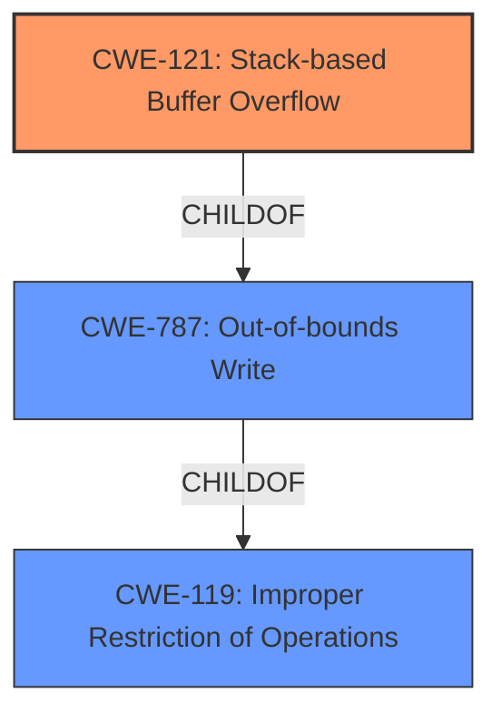

# Enhanced Analysis for CVE-2021-42782

# Summary
| CWE ID  | CWE Name                                                                  | Confidence | CWE Abstraction Level | CWE Vulnerability Mapping Label | CWE-Vulnerability Mapping Notes |
| :-------- | :------------------------------------------------------------------------ | :--------- | :---------------------- | :------------------------------ | :------------------------------ |
| CWE-121   | Stack-based Buffer Overflow                                               | 1          | Variant                 | Primary CWE                     | Allowed                       |
| CWE-119   | Improper Restriction of Operations within the Bounds of a Memory Buffer | 0.7        | Class                   | Secondary Candidate             | Discouraged                    |

## Evidence and Confidence

*   **Confidence Score:** 1
*   **Evidence Strength:** HIGH

## Relationship Analysis
The primary CWE selected is CWE-121, Stack-based Buffer Overflow, which is a variant of CWE-787 (Out-of-bounds Write). CWE-121 is also a child of CWE-119, Improper Restriction of Operations within the Bounds of a Memory Buffer, which is a more general class. The selection of CWE-121 is driven by the explicit mention of "stack buffer overflow" in the vulnerability description and the associated commit messages. The relationships confirm the hierarchical structure, with CWE-121 being a specific type of buffer overflow.



## Vulnerability Chain
The vulnerability chain starts with the processing of specially crafted smart card data, leading to a **stack buffer overflow**, and ultimately resulting in a program crash. The root cause is the **lack of proper bounds checking** when handling input, which allows writing beyond the allocated buffer on the stack.

## Summary of Analysis
The initial assessment identified CWE-121 as the primary candidate due to the direct mention of "stack buffer overflow" in the vulnerability description. The supporting evidence from the CVE Reference Links Content Summary confirms that multiple commit messages address **stack buffer overflow** issues. The relationship graph shows that CWE-121 is a specific variant of CWE-787 (Out-of-bounds Write), which is a child of the more general CWE-119. This hierarchical structure reinforces the selection of CWE-121 as the most specific and accurate representation of the vulnerability. The confidence score is high (1) due to the explicit evidence and clear relationships.

The selection of CWE-121 is based on the following evidence from the vulnerability description and CVE Reference Links Content Summary:

*   "**weakness:** **stack buffer overflow**" (Vulnerability Description Key Phrases)
*   "Stack buffer overflow issues were found in Opensc before version 0.22.0 in various places that could potentially crash programs using the library." (CVE Reference Links Content Summary - bugzilla.redhat.com)
*   "This commit prevents a **stack buffer overflow** in card-iasecc.c when an empty ACL is returned. It was found via oss-fuzz." (CVE Reference Links Content Summary - github.com_8df480e5)

These direct references to "**stack buffer overflow**" strongly support the selection of CWE-121.

Relevant CWE Information:

# Enhanced Context (25 CWEs)

## CWE-191: Integer Underflow (Wrap or Wraparound)
**Abstraction Level**: Base
**Similarity Score**: 0.77
**Source**: dense

## CWE-126: Buffer Over-read
**Abstraction Level**: Variant
**Similarity Score**: 0.77
**Source**: dense

## CWE-805: Buffer Access with Incorrect Length Value
**Abstraction Level**: Base
**Similarity Score**: 0.77
**Source**: dense

## CWE-131: Incorrect Calculation of Buffer Size
**Abstraction Level**: Base
**Similarity Score**: 0.77
**Source**: dense

## CWE-125: Out-of-bounds Read
**Abstraction Level**: Base
**Similarity Score**: 0.76
**Source**: dense

## CWE-124: Buffer Underwrite ('Buffer Underflow')
**Abstraction Level**: Base
**Similarity Score**: 0.75
**Source**: dense

## CWE-190: Integer Overflow or Wraparound
**Abstraction Level**: Base
**Similarity Score**: 0.75
**Source**: dense

## CWE-127: Buffer Under-read
**Abstraction Level**: Variant
**Similarity Score**: 0.75
**Source**: dense

## CWE-197: Numeric Truncation Error
**Abstraction Level**: Base
**Similarity Score**: 0.75
**Source**: dense

## CWE-193: Off-by-one Error
**Abstraction Level**: Base
**Similarity Score**: 0.74
**Source**: dense

## CWE-190: Integer Overflow or Wraparound
**Abstraction Level**: Base
**Similarity Score**: 7388.67
**Source**: sparse

## CWE-125: Out-of-bounds Read
**Abstraction Level**: Base
**Similarity Score**: 7183.29
**Source**: sparse

## CWE-1284: Improper Validation of Specified Quantity in Input
**Abstraction Level**: Base
**Similarity Score**: 6802.70
**Source**: sparse

## CWE-193: Off-by-one Error
**Abstraction Level**: Base
**Similarity Score**: 6584.12
**Source**: sparse

## CWE-119: Improper Restriction of Operations within the Bounds of a Memory Buffer
**Abstraction Level**: Class
**Similarity Score**: 6565.39
**Source**: sparse

## CWE-128: Wrap-around Error
**Abstraction Level**: base
**Similarity Score**: 5.03
**Source**: graph

## CWE-170: Improper Null Termination
**Abstraction Level**: base
**Similarity Score**: 5.03
**Source**: graph

## CWE-1284: Improper Validation of Specified Quantity in Input
**Abstraction Level**: base
**Similarity Score**: 4.33
**Source**: graph

## CWE-123: Write-what-where Condition
**Abstraction Level**: base
**Similarity Score**: 3.89
**Source**: graph

## CWE-195: Signed to Unsigned Conversion Error
**Abstraction Level**: variant
**Similarity Score**: 3.88
**Source**: graph

## CWE-463: Deletion of Data Structure Sentinel
**Abstraction Level**: base
**Similarity Score**: 3.64
**Source**: graph

## CWE-1339: Insufficient Precision or Accuracy of a Real Number
**Abstraction Level**: base
**Similarity Score**: 3.57
**Source**: graph

## CWE-190: Integer Overflow or Wraparound
**Abstraction Level**: Base
**Similarity Score**: 3.32
**Source**: graph

## CWE-787: Out-of-bounds Write
**Abstraction Level**: base
**Similarity Score**: 3.30
**Source**: graph

## CWE-416: Use After Free
**Abstraction Level**: variant
**Similarity Score**: 3.00
**Source**: graph

CWE-119 was considered because buffer overflows are mentioned, but it is too general. The description refers to a stack buffer overflow, making CWE-121 a better fit. CWE-787 was also considered, as CWE-121 is a child of CWE-787, but CWE-121 is more specific. Other CWEs, such as those related to integer overflows or out-of-bounds reads, were deemed less relevant as the primary issue is writing beyond the buffer's boundaries on the stack.


## CWE Relationship Analysis

Current CWEs represent these abstraction levels: .


### Vulnerability Chain Analysis

**Chain starting from CWE-121:**
- 121 (Stack-based Buffer Overflow) - ROOT


**Chain starting from CWE-119:**
- 119 (Improper Restriction of Operations within the Bounds of a Memory Buffer) - ROOT


### CWE Relationship Diagram

```mermaid
graph TD
    classDef primary fill:#f96,stroke:#333,stroke-width:2px
    classDef secondary fill:#69f,stroke:#333
    classDef tertiary fill:#9e9,stroke:#333
```