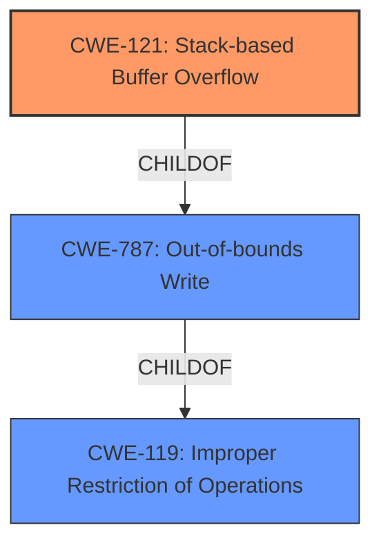

# Analysis for CVE-2021-42782

# Summary
| CWE ID  | CWE Name                                                                  | Confidence | CWE Abstraction Level | CWE Vulnerability Mapping Label | CWE-Vulnerability Mapping Notes |
| :-------- | :------------------------------------------------------------------------ | :--------- | :---------------------- | :------------------------------ | :------------------------------ |
| CWE-121   | Stack-based Buffer Overflow                                               | 1          | Variant                 | Primary CWE                     | Allowed                       |
| CWE-119   | Improper Restriction of Operations within the Bounds of a Memory Buffer | 0.7        | Class                   | Secondary Candidate             | Discouraged                    |

## Evidence and Confidence

*   **Confidence Score:** 1
*   **Evidence Strength:** HIGH

## Relationship Analysis
The primary CWE selected is CWE-121, Stack-based Buffer Overflow, which is a variant of CWE-787 (Out-of-bounds Write). CWE-121 is also a child of CWE-119, Improper Restriction of Operations within the Bounds of a Memory Buffer, which is a more general class. The selection of CWE-121 is driven by the explicit mention of "stack buffer overflow" in the vulnerability description and the associated commit messages. The relationships confirm the hierarchical structure, with CWE-121 being a specific type of buffer overflow.



## Vulnerability Chain
The vulnerability chain starts with the processing of specially crafted smart card data, leading to a **stack buffer overflow**, and ultimately resulting in a program crash. The root cause is the **lack of proper bounds checking** when handling input, which allows writing beyond the allocated buffer on the stack.

## Summary of Analysis
The initial assessment identified CWE-121 as the primary candidate due to the direct mention of "stack buffer overflow" in the vulnerability description. The supporting evidence from the CVE Reference Links Content Summary confirms that multiple commit messages address **stack buffer overflow** issues. The relationship graph shows that CWE-121 is a specific variant of CWE-787 (Out-of-bounds Write), which is a child of the more general CWE-119. This hierarchical structure reinforces the selection of CWE-121 as the most specific and accurate representation of the vulnerability. The confidence score is high (1) due to the explicit evidence and clear relationships.

The selection of CWE-121 is based on the following evidence from the vulnerability description and CVE Reference Links Content Summary:

*   "**weakness:** **stack buffer overflow**" (Vulnerability Description Key Phrases)
*   "Stack buffer overflow issues were found in Opensc before version 0.22.0 in various places that could potentially crash programs using the library." (CVE Reference Links Content Summary - bugzilla.redhat.com)
*   "This commit prevents a **stack buffer overflow** in card-iasecc.c when an empty ACL is returned. It was found via oss-fuzz." (CVE Reference Links Content Summary - github.com_8df480e5)

These direct references to "**stack buffer overflow**" strongly support the selection of CWE-121.

Relevant CWE Information:

# Enhanced Context (25 CWEs)

## CWE-191: Integer Underflow (Wrap or Wraparound)
**Abstraction Level**: Base
**Similarity Score**: 0.77
**Source**: dense

## CWE-126: Buffer Over-read
**Abstraction Level**: Variant
**Similarity Score**: 0.77
**Source**: dense

## CWE-805: Buffer Access with Incorrect Length Value
**Abstraction Level**: Base
**Similarity Score**: 0.77
**Source**: dense

## CWE-131: Incorrect Calculation of Buffer Size
**Abstraction Level**: Base
**Similarity Score**: 0.77
**Source**: dense

## CWE-125: Out-of-bounds Read
**Abstraction Level**: Base
**Similarity Score**: 0.76
**Source**: dense

## CWE-124: Buffer Underwrite ('Buffer Underflow')
**Abstraction Level**: Base
**Similarity Score**: 0.75
**Source**: dense

## CWE-190: Integer Overflow or Wraparound
**Abstraction Level**: Base
**Similarity Score**: 0.75
**Source**: dense

## CWE-127: Buffer Under-read
**Abstraction Level**: Variant
**Similarity Score**: 0.75
**Source**: dense

## CWE-197: Numeric Truncation Error
**Abstraction Level**: Base
**Similarity Score**: 0.75
**Source**: dense

## CWE-193: Off-by-one Error
**Abstraction Level**: Base
**Similarity Score**: 0.74
**Source**: dense

## CWE-190: Integer Overflow or Wraparound
**Abstraction Level**: Base
**Similarity Score**: 7388.67
**Source**: sparse

## CWE-125: Out-of-bounds Read
**Abstraction Level**: Base
**Similarity Score**: 7183.29
**Source**: sparse

## CWE-1284: Improper Validation of Specified Quantity in Input
**Abstraction Level**: Base
**Similarity Score**: 6802.70
**Source**: sparse

## CWE-193: Off-by-one Error
**Abstraction Level**: Base
**Similarity Score**: 6584.12
**Source**: sparse

## CWE-119: Improper Restriction of Operations within the Bounds of a Memory Buffer
**Abstraction Level**: Class
**Similarity Score**: 6565.39
**Source**: sparse

## CWE-128: Wrap-around Error
**Abstraction Level**: base
**Similarity Score**: 5.03
**Source**: graph

## CWE-170: Improper Null Termination
**Abstraction Level**: base
**Similarity Score**: 5.03
**Source**: graph

## CWE-1284: Improper Validation of Specified Quantity in Input
**Abstraction Level**: base
**Similarity Score**: 4.33
**Source**: graph

## CWE-123: Write-what-where Condition
**Abstraction Level**: base
**Similarity Score**: 3.89
**Source**: graph

## CWE-195: Signed to Unsigned Conversion Error
**Abstraction Level**: variant
**Similarity Score**: 3.88
**Source**: graph

## CWE-463: Deletion of Data Structure Sentinel
**Abstraction Level**: base
**Similarity Score**: 3.64
**Source**: graph

## CWE-1339: Insufficient Precision or Accuracy of a Real Number
**Abstraction Level**: base
**Similarity Score**: 3.57
**Source**: graph

## CWE-190: Integer Overflow or Wraparound
**Abstraction Level**: Base
**Similarity Score**: 3.32
**Source**: graph

## CWE-787: Out-of-bounds Write
**Abstraction Level**: base
**Similarity Score**: 3.30
**Source**: graph

## CWE-416: Use After Free
**Abstraction Level**: variant
**Similarity Score**: 3.00
**Source**: graph

CWE-119 was considered because buffer overflows are mentioned, but it is too general. The description refers to a stack buffer overflow, making CWE-121 a better fit. CWE-787 was also considered, as CWE-121 is a child of CWE-787, but CWE-121 is more specific. Other CWEs, such as those related to integer overflows or out-of-bounds reads, were deemed less relevant as the primary issue is writing beyond the buffer's boundaries on the stack.

# Enhanced Query for CVE-2021-42782

## Vulnerability Description
Stack buffer overflow issues were found in Opensc before version 0.22.0 in various places that could potentially crash programs using the library.

### Vulnerability Description Key Phrases
- **weakness:** **stack buffer overflow**
- **impact:** crash programs
- **product:** Opensc
- **version:** before version 0.22.0

## CVE Reference Links Content Summary
```
{
  "cve": "CVE-2021-42782",
  "description": "PLACEHOLDER - Implement CVE description retrieval",
  "reports": [
    {
      "source": "bugzilla.redhat.com_3715cebc_20250108_110805.html",
      "type": "bug_report",
      "vulnerability": {
        "summary": "Stack buffer overflow issues were found in Opensc before version 0.22.0 in various places that could potentially crash programs using the library.",
         "root_cause": "Multiple stack buffer overflows",
        "weaknesses": [
          "Stack buffer overflow"
        ],
        "impact": "Programs using the library could crash.",
        "attack_vectors": [
          "Processing of specially crafted smart card data"
         ],
         "required_capabilities": "Ability to interact with a smart card and trigger parsing of malicious data",
         "fixed_version": "0.22.0",
          "details": "The vulnerability is present in multiple places in the code. Upstream commits that address the issues are provided."
      }
    },
    {
      "source": "github.com_48b0bee0_20250108_110807.html",
      "type": "commit_message",
        "vulnerability": {
        "details": "This commit includes changes to card-piv.c where sc_asn1_find_tag was replaced with sc_asn1_read_tag to improve the parsing of data from the card. Input is also tested to ensure the expected tag is the first byte. Additional tests are also added. sc_asn1_find_tag was skipping 0x00 or 0xff if found, which is not allowed by NIST sp800-73-x specs. This commit addresses a parsing issue identified by fuzz testing.",
       "root_cause": "Insecure parsing of ASN.1 data",
         "weaknesses": [
          "Improper input validation"
        ],
        "impact": "Potential buffer overflows when parsing ASN.1 data",
         "attack_vectors": [
          "Processing of specially crafted smart card data"
        ],
        "required_capabilities": "Ability to interact with a smart card and trigger parsing of malicious data",
          "mitigation": "Using sc_asn1_read_tag instead of sc_asn1_find_tag and adding additional checks to ensure the expected tag is the first byte."
      }
    },
    {
      "source": "github.com_c1c2a69a_20250108_110808.html",
     "type": "commit_message",
        "vulnerability": {
        "details": "This commit addresses an out-of-bounds read in pkcs15-tcos.c. It was found via oss-fuzz.",
        "root_cause": "Out of bounds read",
         "weaknesses": [
          "Out-of-bounds read"
        ],
         "impact": "Potential crash or information leak",
          "attack_vectors": [
          "Processing of specially crafted smart card data"
        ],
        "required_capabilities": "Ability to interact with a smart card and trigger parsing of malicious data",
         "mitigation": "Properly calculate the loop bounds."
      }
    },
    {
      "source": "github.com_15e63243_20250108_110806.html",
     "type": "commit_message",
        "vulnerability": {
         "details": "This commit fixes a buffer overrun in card-cardos.c. The fix correctly calculates the left bytes to prevent a buffer overrun. It was found via oss-fuzz.",
          "root_cause": "Incorrect calculation of remaining bytes",
         "weaknesses": [
           "Buffer Overflow"
         ],
         "impact": "Potential crash or memory corruption",
         "attack_vectors": [
            "Processing of specially crafted smart card data"
        ],
         "required_capabilities": "Ability to interact with a smart card and trigger parsing of malicious data",
          "mitigation": "Correctly calculate the left bytes to avoid buffer overrun."
      }
    },
    {
      "source": "github.com_3469698d_20250108_110808.html",
     "type": "commit_message",
        "vulnerability": {
        "details": "This commit initializes potentially uninitialized memory in pkcs15-coolkey.c. It was found via oss-fuzz.",
        "root_cause": "Use of uninitialized memory",
         "weaknesses": [
          "Use of uninitialized memory"
        ],
         "impact": "Potential crash or unpredictable behavior",
         "attack_vectors": [
            "Processing of specially crafted smart card data"
        ],
         "required_capabilities": "Ability to interact with a smart card and trigger parsing of malicious data",
          "mitigation": "Use memset to initialize cert_info structure."
      }
    },
    {
      "source": "github.com_15e63243_20250108_145415.html",
     "type": "commit_message",
        "vulnerability": {
         "details": "This commit fixes a buffer overrun in card-cardos.c. The fix correctly calculates the left bytes to prevent a buffer overrun. It was found via oss-fuzz.",
          "root_cause": "Incorrect calculation of remaining bytes",
         "weaknesses": [
           "Buffer Overflow"
         ],
         "impact": "Potential crash or memory corruption",
         "attack_vectors": [
            "Processing of specially crafted smart card data"
        ],
         "required_capabilities": "Ability to interact with a smart card and trigger parsing of malicious data",
          "mitigation": "Correctly calculate the left bytes to avoid buffer overrun."
      }
    },
    {
     "source": "github.com_8df480e5_20250108_145417.html",
     "type": "commit_message",
        "vulnerability": {
        "details": "This commit prevents a stack buffer overflow in card-iasecc.c when an empty ACL is returned. It was found via oss-fuzz.",
         "root_cause": "Stack buffer overflow when processing ACL data",
         "weaknesses": [
           "Stack buffer overflow"
         ],
         "impact": "Potential crash",
           "attack_vectors": [
            "Processing of specially crafted smart card data"
        ],
        "required_capabilities": "Ability to interact with a smart card and trigger parsing of malicious data",
        "mitigation": "Check for taglen before using it."
      }
    },
    {
      "source": "github.com_3469698d_20250108_145418.html",
     "type": "commit_message",
        "vulnerability": {
        "details": "This commit initializes potentially uninitialized memory in pkcs15-coolkey.c. It was found via oss-fuzz.",
        "root_cause": "Use of uninitialized memory",
         "weaknesses": [
          "Use of uninitialized memory"
        ],
         "impact": "Potential crash or unpredictable behavior",
          "attack_vectors": [
            "Processing of specially crafted smart card data"
        ],
        "required_capabilities": "Ability to interact with a smart card and trigger parsing of malicious data",
          "mitigation": "Use memset to initialize cert_info structure."
      }
    },
    {
      "source": "security.gentoo.org_4f4645b0_20250108_110809.html",
      "type": "security_advisory",
       "vulnerability": {
         "details": "Multiple vulnerabilities have been discovered in OpenSC, the worst of which could result in the execution of arbitrary code. Includes CVE-2021-42782",
         "root_cause": "Multiple vulnerabilities",
        "weaknesses": [
          "Various"
        ],
         "impact": "Potential arbitrary code execution",
         "attack_vectors": [
            "Processing of specially crafted smart card data"
        ],
        "required_capabilities": "Ability to interact with a smart card and trigger parsing of malicious data",
          "fixed_version": "0.22.0",
          "affected_versions": "< 0.22.0"
      }
    },
    {
      "source": "github.com_48b0bee0_20250108_145419.html",
      "type": "commit_message",
      "vulnerability": {
        "details": "This commit includes changes to card-piv.c where sc_asn1_find_tag was replaced with sc_asn1_read_tag to improve the parsing of data from the card. Input is also tested to ensure the expected tag is the first byte. Additional tests are also added. sc_asn1_find_tag was skipping 0x00 or 0xff if found, which is not allowed by NIST sp800-73-x specs. This commit addresses a parsing issue identified by fuzz testing.",
        "root_cause": "Insecure parsing of ASN.1 data",
         "weaknesses": [
          "Improper input validation"
        ],
        "impact": "Potential buffer overflows when parsing ASN.1 data",
          "attack_vectors": [
          "Processing of specially crafted smart card data"
        ],
        "required_capabilities": "Ability to interact with a smart card and trigger parsing of malicious data",
          "mitigation": "Using sc_asn1_read_tag instead of sc_asn1_find_tag and adding additional checks to ensure the expected tag is the first byte."
      }
    },
    {
      "source": "lists.debian.org_2755153d_20250108_110809.html",
       "type": "security_advisory",
       "vulnerability": {
         "details": "Multiple vulnerabilities were found in opensc, a set of libraries and utilities to access smart cards, which could lead to application crash or information leak. Includes CVE-2021-42782.",
          "root_cause": "Multiple vulnerabilities",
         "weaknesses": [
          "Various"
        ],
        "impact": "Application crash or information leak",
        "attack_vectors": [
            "Processing of specially crafted smart card data"
        ],
         "required_capabilities": "Ability to interact with a smart card and trigger parsing of malicious data",
        "fixed_version": "0.19.0-1+deb10u2",
          "affected_versions": "0.19.0-1+deb10u2"
      }
    },
    {
      "source": "access.redhat.com_affce324_20250108_145419.html",
      "type": "cve_details",
     "vulnerability": {
       "details": "This content provides links to Red Hat's security information, but it does not contain details about CVE-2021-42782.",
        "root_cause": "No specific details on CVE-2021-42782",
        "weaknesses": [],
       "impact": "No specific impact is described for this CVE in this document.",
        "attack_vectors": [],
       "required_capabilities": "",
        "fixed_version": ""
      }
    },
      {
      "source": "github.com_c1c2a69a_20250108_145417.html",
     "type": "commit_message",
        "vulnerability": {
        "details": "This commit addresses an out-of-bounds read in pkcs15-tcos.c. It was found via oss-fuzz.",
        "root_cause": "Out of bounds read",
         "weaknesses": [
          "Out-of-bounds read"
        ],
         "impact": "Potential crash or information leak",
         "attack_vectors": [
          "Processing of specially crafted smart card data"
        ],
        "required_capabilities": "Ability to interact with a smart card and trigger parsing of malicious data",
         "mitigation": "Properly calculate the loop bounds."
      }
    },
     {
      "source": "github.com_8df480e5_20250108_110809.html",
     "type": "commit_message",
        "vulnerability": {
        "details": "This commit prevents a stack buffer overflow in card-iasecc.c when an empty ACL is returned. It was found via oss-fuzz.",
         "root_cause": "Stack buffer overflow when processing ACL data",
         "weaknesses": [
           "Stack buffer overflow"
         ],
         "impact": "Potential crash",
          "attack_vectors": [
            "Processing of specially crafted smart card data"
        ],
        "required_capabilities": "Ability to interact with a smart card and trigger parsing of malicious data",
        "mitigation": "Check for taglen before using it."
      }
    }
  ]
}
```

## Retriever Results

### Top Combined Results

| Rank | CWE ID | Name | Abstraction | Usage  | Retrievers | Individual Scores |
|------|--------|------|-------------|-------|------------|-------------------|
| 1 | 119 | Improper Restriction of Operations within the Bounds of a Memory Buffer | Class | Discouraged | alternate_terms | 0.800 |
| 2 | 190 | Integer Overflow or Wraparound | Base | Allowed | alternate_terms | 0.800 |
| 3 | 121 | Stack-based Buffer Overflow | Variant | Allowed | sparse | 0.180 |
| 4 | 674 | Uncontrolled Recursion | Class | Allowed-with-Review | sparse | 0.147 |
| 5 | 122 | Heap-based Buffer Overflow | Variant | Allowed | sparse | 0.146 |
| 6 | 126 | Buffer Over-read | Variant | Allowed | dense | 0.583 |
| 7 | 128 | Wrap-around Error | Base | Allowed | graph | 0.003 |
| 8 | 676 | Use of Potentially Dangerous Function | Base | Allowed | sparse | 0.143 |
| 9 | 1284 | Improper Validation of Specified Quantity in Input | Base | Allowed | sparse | 0.142 |
| 10 | 125 | Out-of-bounds Read | Base | Allowed | sparse | 0.141 |


# Complete CWE Specifications


## CWE-119: Improper Restriction of Operations within the Bounds of a Memory Buffer
**Abstraction:** Class
**Status:** Stable

### Description
The product performs operations on a memory buffer, but it reads from or writes to a memory location outside the buffer's intended boundary. This may result in read or write operations on unexpected memory locations that could be linked to other variables, data structures, or internal program data.

### Extended Description
Not provided

### Alternative Terms
Buffer Overflow: This term has many different meanings to different audiences. From a CWE mapping perspective, this term should be avoided where possible. Some researchers, developers, and tools intend for it to mean "write past the end of a buffer," whereas others use the same term to mean "any read or write outside the boundaries of a buffer, whether before the beginning of the buffer or after the end of the buffer." Others could mean "any action after the end of a buffer, whether it is a read or write." Since the term is commonly used for exploitation and for vulnerabilities, it further confuses things.
buffer overrun: Some prominent vendors and researchers use the term "buffer overrun," but most people use "buffer overflow." See the alternate term for "buffer overflow" for context.
memory safety: Generally used for techniques that avoid weaknesses related to memory access, such as those identified by CWE-119 and its descendants. However, the term is not formal, and there is likely disagreement between practitioners as to which weaknesses are implicitly covered by the "memory safety" term.

### Relationships
ChildOf -> CWE-118
ChildOf -> CWE-20

### Mapping Guidance
**Usage:** Discouraged
**Rationale:** CWE-119 is commonly misused in low-information vulnerability reports when lower-level CWEs could be used instead, or when more details about the vulnerability are available.
**Comments:** Look at CWE-119's children and consider mapping to CWEs such as CWE-787: Out-of-bounds Write, CWE-125: Out-of-bounds Read, or others.
**Reasons:**
- Frequent Misuse


### Additional Notes
**[Applicable Platform]** 

It is possible in any programming languages without memory management support to attempt an operation outside of the bounds of a memory buffer, but the consequences will vary widely depending on the language, platform, and chip architecture.


### Observed Examples
- **CVE-2021-22991:** Incorrect URI normalization in application traffic product leads to buffer overflow, as exploited in the wild per CISA KEV.
- **CVE-2020-29557:** Buffer overflow in Wi-Fi router web interface, as exploited in the wild per CISA KEV.
- **CVE-2009-2550:** Classic stack-based buffer overflow in media player using a long entry in a playlist


## CWE-190: Integer Overflow or Wraparound
**Abstraction:** Base
**Status:** Stable

### Description
The product performs a calculation that can
         produce an integer overflow or wraparound when the logic
         assumes that the resulting value will always be larger than
         the original value. This occurs when an integer value is
         incremented to a value that is too large to store in the
         associated representation. When this occurs, the value may
         become a very small or negative number.

### Extended Description
Not provided

### Alternative Terms
Overflow: The terms "overflow" and "wraparound" are used interchangeably by some people, but they can have more precise distinctions by others. See Terminology Notes.
Wraparound: The terms "overflow" and "wraparound" are used interchangeably by some people, but they can have more precise distinctions by others. See Terminology Notes.
wrap, wrap-around, wrap around: Alternate spellings of "wraparound"

### Relationships
ChildOf -> CWE-682
ChildOf -> CWE-682
ChildOf -> CWE-20
CanPrecede -> CWE-119

### Mapping Guidance
**Usage:** Allowed
**Rationale:** This CWE entry is at the Base level of abstraction, which is a preferred level of abstraction for mapping to the root causes of vulnerabilities.
**Comments:** Be careful of terminology problems with "overflow," "underflow," and "wraparound" - see Terminology Notes. Carefully read both the name and description to ensure that this mapping is an appropriate fit. Do not try to 'force' a mapping to a lower-level Base/Variant simply to comply with this preferred level of abstraction.
**Reasons:**
- Acceptable-Use
**Suggested Alternatives:**
- CWE-191: Integer Underflow (Wrap or Wraparound). Consider CWE-191 when the result is less than the minimum value that can be represented (sometimes called "underflows").


### Additional Notes
**[Relationship]** Integer overflows can be primary to buffer overflows when they cause less memory to be allocated than expected.

**[Terminology]** 

"Integer overflow" is sometimes used to cover several types of errors, including signedness errors, or buffer overflows that involve manipulation of integer data types instead of characters. Part of the confusion results from the fact that 0xffffffff is -1 in a signed context. Other confusion also arises because of the role that integer overflows have in chains.


A "wraparound" is a well-defined, standard behavior that follows specific rules for how to handle situations when the intended numeric value is too large or too small to be represented, as specified in standards such as C11.


"Overflow" is sometimes conflated with "wraparound" but typically indicates a non-standard or undefined behavior.


The "overflow" term is sometimes used to indicate cases where either the maximum or the minimum is exceeded, but others might only use "overflow" to indicate exceeding the maximum while using "underflow" for exceeding the minimum.


Some people use "overflow" to mean any value outside the representable range - whether greater than the maximum, or less than the minimum - but CWE uses "underflow" for cases in which the intended result is less than the minimum.


See [REF-1440] for additional explanation of the ambiguity of terminology.


**[Other]** While there may be circumstances in which the logic intentionally relies on wrapping - such as with modular arithmetic in timers or counters - it can have security consequences if the wrap is unexpected. This is especially the case if the integer overflow can be triggered using user-supplied inputs.


### Observed Examples
- **CVE-2021-43537:** Chain: in a web browser, an unsigned 64-bit integer is forcibly cast to a 32-bit integer (CWE-681) and potentially leading to an integer overflow (CWE-190). If an integer overflow occurs, this can cause heap memory corruption (CWE-122)
- **CVE-2022-21668:** Chain: Python library does not limit the resources used to process images that specify a very large number of bands (CWE-1284), leading to excessive memory consumption (CWE-789) or an integer overflow (CWE-190).
- **CVE-2022-0545:** Chain: 3D renderer has an integer overflow (CWE-190) leading to write-what-where condition (CWE-123) using a crafted image.


## CWE-121: Stack-based Buffer Overflow
**Abstraction:** Variant
**Status:** Draft

### Description
A stack-based buffer overflow condition is a condition where the buffer being overwritten is allocated on the stack (i.e., is a local variable or, rarely, a parameter to a function).

### Extended Description
Not provided

### Alternative Terms
Stack Overflow: "Stack Overflow" is often used to mean the same thing as stack-based buffer overflow, however it is also used on occasion to mean stack exhaustion, usually a result from an excessively recursive function call. Due to the ambiguity of the term, use of stack overflow to describe either circumstance is discouraged.

### Relationships
ChildOf -> CWE-788
ChildOf -> CWE-787

### Mapping Guidance
**Usage:** Allowed
**Rationale:** This CWE entry is at the Variant level of abstraction, which is a preferred level of abstraction for mapping to the root causes of vulnerabilities.
**Comments:** Carefully read both the name and description to ensure that this mapping is an appropriate fit. Do not try to 'force' a mapping to a lower-level Base/Variant simply to comply with this preferred level of abstraction.
**Reasons:**
- Acceptable-Use


### Additional Notes
**[Other]** Stack-based buffer overflows can instantiate in return address overwrites, stack pointer overwrites or frame pointer overwrites. They can also be considered function pointer overwrites, array indexer overwrites or write-what-where condition, etc.


### Observed Examples
- **CVE-2021-35395:** Stack-based buffer overflows in SFK for wifi chipset used for IoT/embedded devices, as exploited in the wild per CISA KEV.


## CWE-674: Uncontrolled Recursion
**Abstraction:** Class
**Status:** Draft

### Description
The product does not properly control the amount of recursion that takes place,  consuming excessive resources, such as allocated memory or the program stack.

### Extended Description
Not provided

### Alternative Terms
Stack Exhaustion

### Relationships
ChildOf -> CWE-834

### Mapping Guidance
**Usage:** Allowed-with-Review
**Rationale:** This CWE entry is a Class and might have Base-level children that would be more appropriate
**Comments:** Examine children of this entry to see if there is a better fit
**Reasons:**
- Abstraction


### Observed Examples
- **CVE-2007-1285:** Deeply nested arrays trigger stack exhaustion.
- **CVE-2007-3409:** Self-referencing pointers create infinite loop and resultant stack exhaustion.
- **CVE-2016-10707:** Javascript application accidentally changes input in a way that prevents a recursive call from detecting an exit condition.


## CWE-122: Heap-based Buffer Overflow
**Abstraction:** Variant
**Status:** Draft

### Description
A heap overflow condition is a buffer overflow, where the buffer that can be overwritten is allocated in the heap portion of memory, generally meaning that the buffer was allocated using a routine such as malloc().

### Extended Description
Not provided

### Alternative Terms
None

### Relationships
ChildOf -> CWE-788
ChildOf -> CWE-787

### Mapping Guidance
**Usage:** Allowed
**Rationale:** This CWE entry is at the Variant level of abstraction, which is a preferred level of abstraction for mapping to the root causes of vulnerabilities.
**Comments:** Carefully read both the name and description to ensure that this mapping is an appropriate fit. Do not try to 'force' a mapping to a lower-level Base/Variant simply to comply with this preferred level of abstraction.
**Reasons:**
- Acceptable-Use


### Additional Notes
**[Relationship]** Heap-based buffer overflows are usually just as dangerous as stack-based buffer overflows.


### Observed Examples
- **CVE-2021-43537:** Chain: in a web browser, an unsigned 64-bit integer is forcibly cast to a 32-bit integer (CWE-681) and potentially leading to an integer overflow (CWE-190). If an integer overflow occurs, this can cause heap memory corruption (CWE-122)
- **CVE-2007-4268:** Chain: integer signedness error (CWE-195) passes signed comparison, leading to heap overflow (CWE-122)
- **CVE-2009-2523:** Chain: product does not handle when an input string is not NULL terminated (CWE-170), leading to buffer over-read (CWE-125) or heap-based buffer overflow (CWE-122).


## CWE-126: Buffer Over-read
**Abstraction:** Variant
**Status:** Draft

### Description
The product reads from a buffer using buffer access mechanisms such as indexes or pointers that reference memory locations after the targeted buffer.

### Extended Description
This typically occurs when the pointer or its index is incremented to a position beyond the bounds of the buffer or when pointer arithmetic results in a position outside of the valid memory location to name a few. This may result in exposure of sensitive information or possibly a crash.

### Alternative Terms
None

### Relationships
ChildOf -> CWE-125
ChildOf -> CWE-788

### Mapping Guidance
**Usage:** Allowed
**Rationale:** This CWE entry is at the Variant level of abstraction, which is a preferred level of abstraction for mapping to the root causes of vulnerabilities.
**Comments:** Carefully read both the name and description to ensure that this mapping is an appropriate fit. Do not try to 'force' a mapping to a lower-level Base/Variant simply to comply with this preferred level of abstraction.
**Reasons:**
- Acceptable-Use


### Additional Notes
**[Relationship]** These problems may be resultant from missing sentinel values (CWE-463) or trusting a user-influenced input length variable.


### Observed Examples
- **CVE-2022-1733:** Text editor has out-of-bounds read past end of line while indenting C code
- **CVE-2014-0160:** Chain: "Heartbleed" bug receives an inconsistent length parameter (CWE-130) enabling an out-of-bounds read (CWE-126), returning memory that could include private cryptographic keys and other sensitive data.
- **CVE-2009-2523:** Chain: product does not handle when an input string is not NULL terminated, leading to buffer over-read or heap-based buffer overflow.


## CWE-128: Wrap-around Error
**Abstraction:** Base
**Status:** Incomplete

### Description
Wrap around errors occur whenever a value is incremented past the maximum value for its type and therefore "wraps around" to a very small, negative, or undefined value.

### Extended Description
Not provided

### Alternative Terms
None

### Relationships
ChildOf -> CWE-682
CanPrecede -> CWE-119
PeerOf -> CWE-190

### Mapping Guidance
**Usage:** Allowed
**Rationale:** This CWE entry is at the Base level of abstraction, which is a preferred level of abstraction for mapping to the root causes of vulnerabilities.
**Comments:** Carefully read both the name and description to ensure that this mapping is an appropriate fit. Do not try to 'force' a mapping to a lower-level Base/Variant simply to comply with this preferred level of abstraction.
**Reasons:**
- Acceptable-Use


### Additional Notes
**[Relationship]** The relationship between overflow and wrap-around needs to be examined more closely, since several entries (including CWE-190) are closely related.


## CWE-676: Use of Potentially Dangerous Function
**Abstraction:** Base
**Status:** Draft

### Description
The product invokes a potentially dangerous function that could introduce a vulnerability if it is used incorrectly, but the function can also be used safely.

### Extended Description
Not provided

### Alternative Terms
None

### Relationships
ChildOf -> CWE-1177

### Mapping Guidance
**Usage:** Allowed
**Rationale:** This CWE entry is at the Base level of abstraction, which is a preferred level of abstraction for mapping to the root causes of vulnerabilities.
**Comments:** Carefully read both the name and description to ensure that this mapping is an appropriate fit. Do not try to 'force' a mapping to a lower-level Base/Variant simply to comply with this preferred level of abstraction.
**Reasons:**
- Acceptable-Use


### Additional Notes
**[Relationship]** This weakness is different than CWE-242 (Use of Inherently Dangerous Function). CWE-242 covers functions with such significant security problems that they can never be guaranteed to be safe. Some functions, if used properly, do not directly pose a security risk, but can introduce a weakness if not called correctly. These are regarded as potentially dangerous. A well-known example is the strcpy() function. When provided with a destination buffer that is larger than its source, strcpy() will not overflow. However, it is so often misused that some developers prohibit strcpy() entirely.


### Observed Examples
- **CVE-2007-1470:** Library has multiple buffer overflows using sprintf() and strcpy()
- **CVE-2009-3849:** Buffer overflow using strcat()
- **CVE-2006-2114:** Buffer overflow using strcpy()


## CWE-1284: Improper Validation of Specified Quantity in Input
**Abstraction:** Base
**Status:** Incomplete

### Description
The product receives input that is expected to specify a quantity (such as size or length), but it does not validate or incorrectly validates that the quantity has the required properties.

### Extended Description


Specified quantities include size, length, frequency, price, rate, number of operations, time, and others. Code may rely on specified quantities to allocate resources, perform calculations, control iteration, etc. When the quantity is not properly validated, then attackers can specify malicious quantities to cause excessive resource allocation, trigger unexpected failures, enable buffer overflows, etc.


### Alternative Terms
None

### Relationships
ChildOf -> CWE-20
ChildOf -> CWE-20
CanPrecede -> CWE-789

### Mapping Guidance
**Usage:** Allowed
**Rationale:** This CWE entry is at the Base level of abstraction, which is a preferred level of abstraction for mapping to the root causes of vulnerabilities.
**Comments:** Carefully read both the name and description to ensure that this mapping is an appropriate fit. Do not try to 'force' a mapping to a lower-level Base/Variant simply to comply with this preferred level of abstraction.
**Reasons:**
- Acceptable-Use


### Additional Notes
**[Maintenance]** This entry is still under development and will continue to see updates and content improvements.


### Observed Examples
- **CVE-2022-21668:** Chain: Python library does not limit the resources used to process images that specify a very large number of bands (CWE-1284), leading to excessive memory consumption (CWE-789) or an integer overflow (CWE-190).
- **CVE-2008-1440:** lack of validation of length field leads to infinite loop
- **CVE-2008-2374:** lack of validation of string length fields allows memory consumption or buffer over-read


## CWE-125: Out-of-bounds Read
**Abstraction:** Base
**Status:** Draft

### Description
The product reads data past the end, or before the beginning, of the intended buffer.

### Extended Description
Not provided

### Alternative Terms
OOB read: Shorthand for "Out of bounds" read

### Relationships
ChildOf -> CWE-119
ChildOf -> CWE-119
ChildOf -> CWE-119
ChildOf -> CWE-119

### Mapping Guidance
**Usage:** Allowed
**Rationale:** This CWE entry is at the Base level of abstraction, which is a preferred level of abstraction for mapping to the root causes of vulnerabilities.
**Comments:** Carefully read both the name and description to ensure that this mapping is an appropriate fit. Do not try to 'force' a mapping to a lower-level Base/Variant simply to comply with this preferred level of abstraction.
**Reasons:**
- Acceptable-Use


### Observed Examples
- **CVE-2023-1018:** The reference implementation code for a Trusted Platform Module does not implement length checks on data, allowing for an attacker to read 2 bytes past the end of a buffer.
- **CVE-2020-11899:** Out-of-bounds read in IP stack used in embedded systems, as exploited in the wild per CISA KEV.
- **CVE-2014-0160:** Chain: "Heartbleed" bug receives an inconsistent length parameter (CWE-130) enabling an out-of-bounds read (CWE-126), returning memory that could include private cryptographic keys and other sensitive data.

