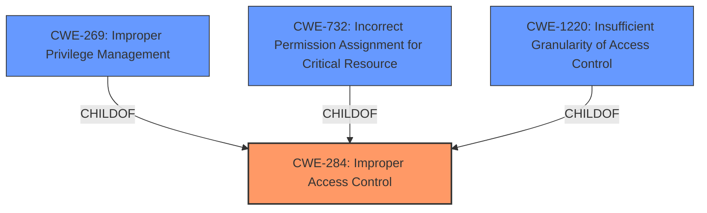

# Analysis for CVE-2021-42808

# Summary
| CWE ID | CWE Name | Confidence | CWE Abstraction Level | CWE Vulnerability Mapping Label | CWE-Vulnerability Mapping Notes |
|---|---|---|---|---|---|
| CWE-284 | Improper Access Control | 0.7 | Pillar | Discouraged | Frequent Misuse, Abstraction. Consider more specific descendants of CWE-284 |
| CWE-269 | Improper Privilege Management | 0.6 | Class | Discouraged | CWE-269 is commonly misused. |
| CWE-732 | Incorrect Permission Assignment for Critical Resource | 0.5 | Class | Allowed-with-Review | Often misused for vulnerabilities in which permissions are not checked, which is an authorization weakness |
| CWE-1220 | Insufficient Granularity of Access Control | 0.5 | Base | Allowed | The implemented access controls lack required granularity, which renders the control policy too broad |

## Evidence and Confidence

*   **Confidence Score:** 0.7
*   **Evidence Strength:** MEDIUM

## Relationship Analysis
The primary relationship influencing the decision is the hierarchical structure with CWE-284 as a high-level pillar. The analysis considered the discouraged usage of CWE-284 and the potential for more specific child CWEs. CWE-269 and CWE-732 are children of CWE-284 or related to access control and privilege management but were deemed less suitable due to their discouraged usage or frequent misuse. CWE-1220 provides a more specific base-level option, but the evidence is insufficient to confirm that the **improper access control** stems from insufficient granularity.

## Vulnerability Chain
The vulnerability chain is relatively simple:
  1. **Root Cause:** **Improper Access Control**
  2. **Impact:** Privilege escalation by a local user

## Summary of Analysis
The initial analysis focused on identifying a CWE that accurately represents the **improper access control** vulnerability. The primary evidence is the phrase "**Improper Access Control** in Thales Sentinel Protection Installer could allow a local user to escalate privileges." The retriever results suggested several potential CWEs, including CWE-284, CWE-269, CWE-732, and CWE-1220.

CWE-284 is the most general, representing a failure to properly restrict access. However, it's a Pillar-level CWE and is discouraged for use due to its high-level nature and frequent misuse. The mapping guidance suggests considering more specific descendants.

CWE-269 (Improper Privilege Management) is a Class-level CWE but is also discouraged due to common misuse and conflation with privilege escalation as an impact rather than a root cause.

CWE-732 (Incorrect Permission Assignment for Critical Resource) is another Class-level CWE related to permissions. However, the mapping guidance notes that it is often misused when permissions are not checked, which is an authorization weakness. Since the vulnerability description only mentions **improper access control** and privilege escalation, there is no specific evidence to suggest that incorrect permission assignment is the root cause.

CWE-1220 (Insufficient Granularity of Access Control) is a Base-level CWE that describes a situation where access controls lack the necessary granularity. This is a plausible scenario, but the vulnerability description doesn't provide enough detail to confirm that insufficient granularity is the underlying weakness.

Given the limited information, the best option is to assign CWE-284 as the primary CWE, acknowledging its high-level nature and the need for further investigation to identify a more specific root cause. The other CWEs (CWE-269, CWE-732, and CWE-1220) are considered as secondary candidates. The confidence score is 0.7, reflecting the uncertainty due to the lack of detailed information.

Relevant CWE Information: