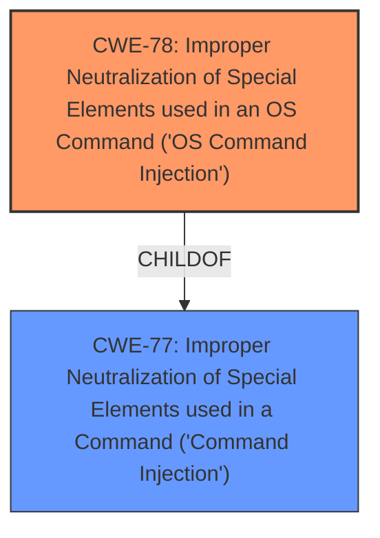

# Analysis for CVE-2021-42872

# Summary
| CWE ID | CWE Name | Confidence | CWE Abstraction Level | CWE Vulnerability Mapping Label | CWE-Vulnerability Mapping Notes |
|---|---|---|---|---|---|
| CWE-78 | Improper Neutralization of Special Elements used in an OS Command ('OS Command Injection') | 1.0 | Base | Allowed | Primary CWE |

## Evidence and Confidence

*   **Confidence Score:** 1.0
*   **Evidence Strength:** HIGH

## Relationship Analysis
The primary relationship influencing the decision is the ChildOf relationship between CWE-78 and CWE-77. While CWE-77 is a broader class, CWE-78 is a base-level CWE and a more specific type of command injection, focusing on OS commands, which aligns perfectly with the vulnerability description. Other relationships like CanFollow (e.g., CWE-184) are less relevant in this specific instance, as the description focuses primarily on the injection itself.

## Vulnerability Chain
The vulnerability chain is straightforward:
1.  **Root Cause:** **Command injection** vulnerability (CWE-78) due to **improper neutralization** of special elements.
2.  **Impact:** Remote execution of arbitrary code.

## Summary of Analysis
The analysis indicates that the vulnerability is a **command injection** (CWE-78) vulnerability in TOTOLINK EX1200T V4.1.2cu.5215, allowing for remote execution of arbitrary code. The **Vulnerability Description Key Phrases** section and vulnerability description both clearly indicate **command injection** as the root cause.

The **Retriever Results** list CWE-77 as the top combined result, but the Mapping Guidance for CWE-77 suggests considering CWE-78 if OS command injection is the specific case. The vulnerability description clearly states a **command injection** vulnerability that can remotely execute arbitrary code which aligns perfectly with OS command injection. Therefore, CWE-78 is the more appropriate and specific choice.

The decision to choose CWE-78 is based on the explicit mention of **command injection** in the vulnerability description, the base level abstraction making it more specific, and the mapping guidance suggesting CWE-78 as an alternative to CWE-77 when OS commands are involved. The evidence is strong and directly supports the classification.

Relevant CWE Information:

# Enhanced Context (25 CWEs)
The following CWEs were identified as potentially relevant to this vulnerability:

## CWE-74: Improper Neutralization of Special Elements in Output Used by a Downstream Component ('Injection')
**Abstraction Level**: Class
**Similarity Score**: 0.78
**Source**: dense

**Description**:
The product constructs all or part of a command, data structure, or record using externally-influenced input from an upstream component, but it does not neutralize or incorrectly neutralizes special elements that could modify how it is parsed or interpreted when it is sent to a downstream component.

**Mapping Guidance**:
- Usage: Discouraged
- Rationale: CWE-74 is high-level and often misused when lower-level weaknesses are more appropriate.

## CWE-77: Improper Neutralization of Special Elements used in a Command ('Command Injection')
**Abstraction Level**: Class
**Status:** Draft

### Description
The product constructs all or part of a command using externally-influenced input from an upstream component, but it does not neutralize or incorrectly neutralizes special elements that could modify the intended command when it is sent to a downstream component.

### Extended Description

Many protocols and products have their own custom command language. While OS or shell command strings are frequently discovered and targeted, developers may not realize that these other command languages might also be vulnerable to attacks.

### Alternative Terms
Command injection: an attack-oriented phrase for this weakness. Note: often used when "OS command injection" (CWE-78) was intended.

### Relationships
ChildOf -> CWE-74
ChildOf -> CWE-74

### Mapping Guidance
**Usage:** Allowed-with-Review
**Rationale:** CWE-77 is often misused when OS command injection (CWE-78) was intended instead [REF-1287].
**Comments:** Ensure that the analysis focuses on the root-cause error that allows the execution of commands, as there are many weaknesses that can lead to this consequence. See Terminology Notes. If the weakness involves a command language besides OS shell invocation, then CWE-77 could be used.
**Reasons:**
- Frequent Misuse
**Suggested Alternatives:**
- CWE-78: OS Command Injection

### Additional Notes
**[Terminology]** 

The "command injection" phrase carries different meanings, either as an attack or as a technical impact. The most common usage of "command injection" refers to the more-accurate OS command injection (CWE-78), but there are many command languages.

## CWE-78: Improper Neutralization of Special Elements used in an OS Command ('OS Command Injection')
**Abstraction Level**: Base
**Status**: Stable

### Description
The product constructs all or part of an OS command using externally-influenced input from an upstream component, but it does not neutralize or incorrectly neutralizes special elements that could modify the intended OS command when it is sent to a downstream component.

### Extended Description
This weakness can lead to a vulnerability in environments in which the attacker does not have direct access to the operating system, such as in web applications. Alternately, if the weakness occurs in a privileged program, it could allow the attacker to specify commands that normally would not be accessible, or to call alternate commands with privileges that the attacker does not have. The problem is exacerbated if the compromised process does not follow the principle of least privilege, because the attacker-controlled commands may run with special system privileges that increases the amount of damage.

### Relationships
ChildOf -> CWE-77
ChildOf -> CWE-74
ChildOf -> CWE-77
ChildOf -> CWE-77
CanAlsoBe -> CWE-88

### Mapping Guidance
**Usage:** Allowed
**Rationale:** This CWE entry is at the Base level of abstraction, which is a preferred level of abstraction for mapping to the root causes of vulnerabilities.

## CWE-88: Improper Neutralization of Argument Delimiters in a Command ('Argument Injection')
**Abstraction Level**: Base
**Status**: Draft

### Description
The product constructs a string for a command to be executed by a separate component in another control sphere, but it does not properly delimit the intended arguments, options, or switches within that command string.

### Extended Description
Not provided

### Alternative Terms
None

### Relationships
ChildOf -> CWE-77
ChildOf -> CWE-77
ChildOf -> CWE-74
ChildOf -> CWE-77

### Mapping Guidance
**Usage:** Allowed
**Rationale:** This CWE entry is at the Base level of abstraction, which is a preferred level of abstraction for mapping to the root causes of vulnerabilities.

### Summary of Considered but Unused CWEs:

*   **CWE-77:** Considered but not used because CWE-78 is a more specific base-level weakness, that is more appropriate in this context. The vulnerability description mentions "command injection" which is often referring to "OS command injection" (CWE-78)
*   **CWE-74:** Considered but not used because it is a higher-level class than CWE-78.
*   **CWE-88:** Considered but not used as the primary issue is not related to argument delimiters but directly with the construction of the OS command itself.