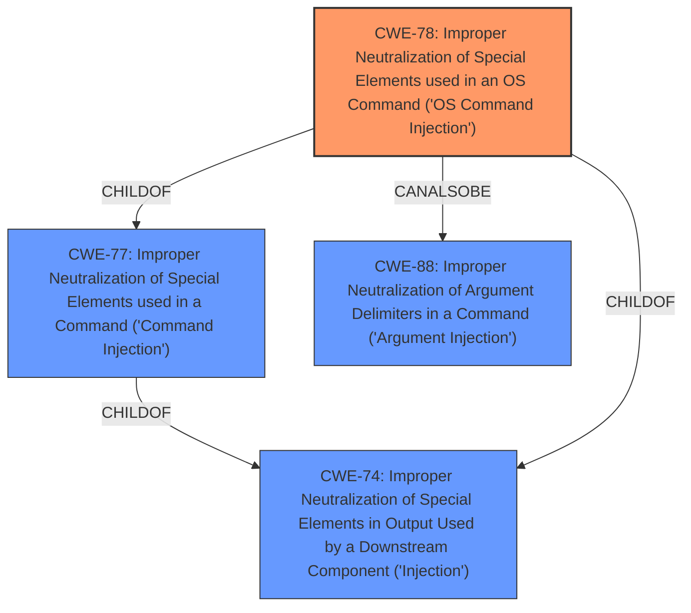

# Analysis for CVE-2021-42885

# Summary
| CWE ID | CWE Name | Confidence | CWE Abstraction Level | CWE Vulnerability Mapping Label | CWE-Vulnerability Mapping Notes |
|---|---|---|---|---|---|
| CWE-78 | Improper Neutralization of Special Elements used in an OS Command ('OS Command Injection') | 1.0 | Base | Allowed | Primary CWE |

## Evidence and Confidence

*   **Confidence Score:** 1.0
*   **Evidence Strength:** HIGH

## Relationship Analysis
The primary relationship that influenced the decision was the ChildOf relationship between CWE-78 and CWE-77. While CWE-77 is a more general "Command Injection", CWE-78 is specifically for "OS Command Injection" which fits the vulnerability description better. The other CWEs considered are either too general or focus on related but distinct issues such as hardcoded credentials or missing authentication.

## Vulnerability Chain
The vulnerability chain starts with **improper input sanitization**, which leads to **remote command injection**, ultimately allowing an attacker to execute system commands.

## Summary of Analysis
The initial assessment based on the vulnerability description and the "CWE for similar CVE Descriptions" clearly points towards CWE-78: Improper Neutralization of Special Elements used in an OS Command ('OS Command Injection'). The vulnerability description explicitly mentions **remote command injection** in the `setDeviceMac` function, which aligns perfectly with the definition of CWE-78.

The evidence to support this is:
- "TOTOLINK EX1200T V4.1.2cu.5215 contains a **remote command injection** vulnerability in function setDeviceMac of the file global.so which can control deviceName to attack."
- "**weakness:** **remote command injection**"
- "**impact:** execute system commands"

The retriever results also list CWE-78 as a strong candidate, further solidifying this assessment. The hierarchical relationship analysis confirms that while CWE-77 is a parent, CWE-78 provides a more specific and accurate classification. The mapping guidance for CWE-78 allows its usage, and it's at the preferred Base level of abstraction. The confidence in this mapping is high (1.0) due to the clear and direct evidence from the vulnerability description.

Other CWEs Considered:

*   **CWE-77:** Considered as a parent of CWE-78, but not chosen because CWE-78 is more specific to OS commands.
*   **CWE-88:** Considered due to the CANALSOBE relationship with CWE-78, but not chosen because the vulnerability description explicitly mentions command injection rather than argument injection.
*   **CWE-184:** Considered because it can precede CWE-78, but it's not the root cause in this case. The root cause is the **improper neutralization** leading to the **command injection**, not an incomplete list.
*   **CWE-94:** Considered because it relates to code injection, but the description specifically mentions OS command injection, making CWE-78 a better fit.

The selected CWE is at the optimal level of specificity because it directly addresses the vulnerability's root cause: the **improper neutralization** of special elements in an OS command, which leads to the ability to execute arbitrary commands on the system.