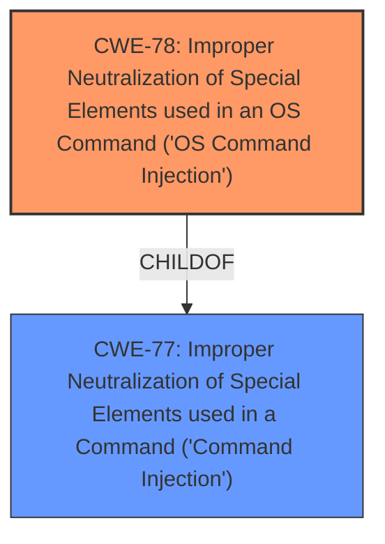

# Raw Analyzer Response for CVE-2021-42888

# Summary
| CWE ID | CWE Name | Confidence | CWE Abstraction Level | CWE Vulnerability Mapping Label | CWE-Vulnerability Mapping Notes |
|---|---|---|---|---|---|
| CWE-78 | Improper Neutralization of Special Elements used in an OS Command ('OS Command Injection') | 1.0 | Base | Allowed | Primary CWE |
| CWE-77 | Improper Neutralization of Special Elements used in a Command ('Command Injection') | 0.7 | Class | Allowed-with-Review | Secondary Candidate |

## Evidence and Confidence

*   **Confidence Score:** 1.0
*   **Evidence Strength:** HIGH

## Relationship Analysis
The primary CWE is CWE-78, which is a base-level CWE and a child of CWE-77.
CWE-77 is a class-level CWE.
The vulnerability description indicates that the weakness is a command injection vulnerability. Since it is related to the OS, CWE-78 is the better fit.

## Vulnerability Chain
The chain of root cause and weaknesses is as follows:
1.  **Improper input sanitization** (root cause).
2.  **Remote command injection** (weakness).
3.  Execution of system commands (impact).

## Summary of Analysis
The initial analysis correctly identifies the vulnerability as a **remote command injection** due to **improper input sanitization**. The `setLanguageCfg` function in `global.so` is vulnerable to command injection via manipulation of the `langType` parameter.

The Retriever Results list CWE-77 and CWE-78 as top candidates. CWE-78 is the more specific Base CWE, which is the preferred level of abstraction. CWE-77 is a more general Class CWE. Since the vulnerability allows for the execution of OS commands, CWE-78 is the more appropriate choice.

The vulnerability description mentions that the `langType` parameter can be controlled to launch an attack. The vulnerability allows the attacker to execute system commands.

The selection of CWE-78 is at the optimal level of specificity because it accurately describes the vulnerability as an OS command injection. The evidence supports this classification, as the vulnerability allows an attacker to inject and execute arbitrary OS commands via the `langType` parameter.

Relevant CWE Information:

# Enhanced Context (25 CWEs)
The following CWEs were identified as potentially relevant to this vulnerability:

## CWE-74: Improper Neutralization of Special Elements in Output Used by a Downstream Component ('Injection')
**Abstraction Level**: Class
**Similarity Score**: 0.77
**Source**: dense

**Description**:
The product constructs all or part of a command, data structure, or record using externally-influenced input from an upstream component, but it does not neutralize or incorrectly neutralizes special elements that could modify how it is parsed or interpreted when it is sent to a downstream component.

**Mapping Guidance**:
- Usage: Discouraged
- Rationale: CWE-74 is high-level and often misused when lower-level weaknesses are more appropriate.

## CWE-78: Improper Neutralization of Special Elements used in an OS Command ('OS Command Injection')
**Abstraction Level**: Base
**Similarity Score**: 5.03
**Source**: graph

**Description**:
CWE-78: Improper Neutralization of Special Elements used in an OS Command ('OS Command Injection')

**Mapping Guidance**:
- Usage: Allowed
- Rationale: This CWE entry is at the Base level of abstraction, which is a preferred level of abstraction for mapping to the root causes of vulnerabilities.

**Relationships**:
- CANFOLLOW -> CWE-184
- CANALSOBE -> CWE-88
- CHILDOF -> CWE-77
- CHILDOF -> CWE-77
- CHILDOF -> CWE-74

## CWE-77: Improper Neutralization of Special Elements used in a Command ('Command Injection')
**Abstraction Level:** Class

### Technical Explanation for CWE-78:
The vulnerability description clearly indicates that the TOTOLINK EX1200T router is vulnerable to command injection. Specifically, the `setLanguageCfg` function in the `global.so` file does not properly neutralize special elements in the `langType` parameter, which allows an attacker to inject and execute arbitrary OS commands.

### Security Implications for CWE-78:
The security implication of this vulnerability is that an attacker can remotely execute arbitrary OS commands on the router. This can lead to a complete compromise of the device, allowing the attacker to steal sensitive information, modify the device's configuration, or use the device as part of a botnet.

### Parent-Child Relationships for CWE-78:
CWE-78 is a child of CWE-77 (Improper Neutralization of Special Elements used in a Command). This relationship indicates that CWE-78 is a more specific type of command injection that occurs when the command is an OS command.

### Chain Patterns for CWE-78:
The vulnerability chain starts with **improper input sanitization**, which leads to **remote command injection**, and ultimately results in the execution of system commands.

### MITRE Mapping Guidance for CWE-78:
The MITRE mapping guidance states that CWE-78 is a Base level CWE and is allowed. This confirms that CWE-78 is an appropriate choice for this vulnerability.

### Technical Explanation for CWE-77:
CWE-77 describes a situation where a product constructs a command using external input without proper neutralization of special elements. While this CWE broadly applies to the vulnerability, CWE-78 is more specific because the injected commands are OS commands.

### Justification for Not Selecting Other CWEs:
CWE-74 (Improper Neutralization of Special Elements in Output Used by a Downstream Component ('Injection')) is a high-level Class CWE that is discouraged for use when lower-level weaknesses are more appropriate. Since CWE-78 is a more specific Base CWE, it is a better fit for this vulnerability.

CWE-790 (Improper Filtering of Special Elements) is a Class CWE, and the description is too general.

CWE-259 (Use of Hard-coded Password) is not relevant to this vulnerability.

CWE-138 (Improper Neutralization of Special Elements) is a Class CWE, and the description is too general.

CWE-96 (Improper Neutralization of Directives in Statically Saved Code ('Static Code Injection')) is not relevant to this vulnerability.

CWE-184 (Incomplete List of Disallowed Inputs) could be related, but the primary issue is the lack of proper neutralization, not an incomplete list of disallowed inputs.

CWE-121 (Stack-based Buffer Overflow) is not relevant to this vulnerability.

CWE-306 (Missing Authentication for Critical Function) is not relevant to this vulnerability.

CWE-94 (Improper Control of Generation of Code ('Code Injection')) is not relevant to this vulnerability.