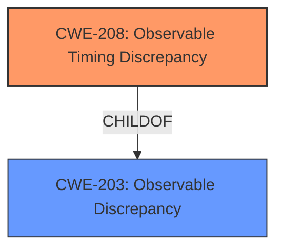

# Raw Analyzer Response for CVE-2021-4294

# Summary
| CWE ID | CWE Name | Confidence | CWE Abstraction Level | CWE Vulnerability Mapping Label | CWE-Vulnerability Mapping Notes |
|---|---|---|---|---|---|
| CWE-208 | Observable Timing Discrepancy | 1.0 | Base | Allowed | Primary CWE |
| CWE-203 | Observable Discrepancy | 0.7 | Base | Allowed | Secondary Candidate |

## Evidence and Confidence

*   **Confidence Score:** 0.9
*   **Evidence Strength:** HIGH

## Relationship Analysis
The primary CWE identified is CWE-208 (Observable Timing Discrepancy), which is a specific type of CWE-203 (Observable Discrepancy). The vulnerability description clearly states that the manipulation of the 'secret' argument leads to an observable timing discrepancy. The relationship analysis indicates that CWE-208 is a child of CWE-203. Given the specific nature of the timing discrepancy, CWE-208 is the more appropriate and specific choice.

## Vulnerability Chain
The vulnerability chain starts with the **improper** implementation of the `ClientSecretMatches` and `CheckClientSecret` functions, which use direct string comparison. This leads to an **observable timing discrepancy** (CWE-208), which allows an attacker to potentially recover a valid client secret. The root cause is the **use of a non-constant time comparison**, and the impact is the potential for unauthorized access due to the compromised secret.

## Summary of Analysis
The initial analysis identified CWE-208 as the primary candidate due to the explicit mention of "observable timing discrepancy" in the vulnerability description. The retriever results and CVE Reference Links Content Summary strongly support this assessment, highlighting the **timing attack vulnerability** resulting from the use of direct string comparisons. The evidence from the CVE reference links ("The vulnerability stems from the use of a non-constant time comparison when matching client secrets in the `osin` library") directly supports this conclusion.

CWE-203 was considered as a broader category since CWE-208 is a child of CWE-203. However, the specific nature of the vulnerability being related to timing makes CWE-208 the more precise and appropriate choice. The use of `subtle.ConstantTimeCompare` as a mitigation further reinforces that the core issue is a timing-related weakness.

The selection of CWE-208 is at the optimal level of specificity because it accurately reflects the detailed nature of the vulnerability as a timing-based side-channel issue arising from the **improper** implementation of secret comparison.

Relevant CWE Information:

# Enhanced Context (25 CWEs)
The following CWEs were identified as potentially relevant to this vulnerability:

## CWE-208: Observable Timing Discrepancy
**Abstraction Level**: Base
**Similarity Score**: 0.79
**Source**: dense

**Description**:
Two separate operations in a product require different amounts of time to complete, in a way that is observable to an actor and reveals security-relevant information about the state of the product, such as whether a particular operation was successful or not.

**Mapping Guidance**:
- Usage: Allowed
- Rationale: This CWE entry is at the Base level of abstraction, which is a preferred level of abstraction for mapping to the root causes of vulnerabilities.

## CWE-203: Observable Discrepancy
**Abstraction Level**: Base
**Similarity Score**: 0.76
**Source**: dense

**Description**:
The product behaves differently or sends different responses under different circumstances in a way that is observable to an unauthorized actor, which exposes security-relevant information about the state of the product, such as whether a particular operation was successful or not.

**Mapping Guidance**:
- Usage: Allowed
- Rationale: This CWE entry is at the Base level of abstraction, which is a preferred level of abstraction for mapping to the root causes of vulnerabilities.