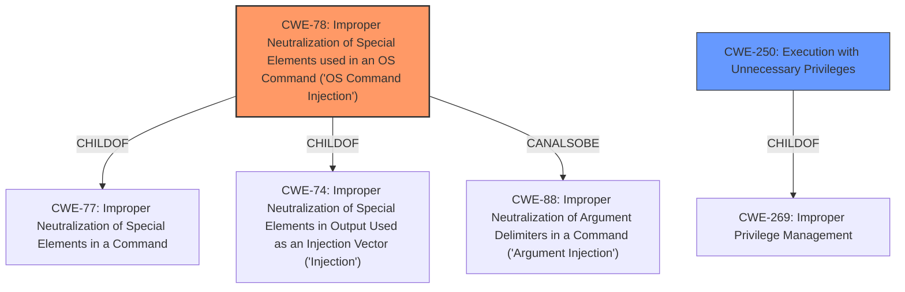

# Raw Analyzer Response for CVE-2021-43033

# Summary
| CWE ID | CWE Name | Confidence | CWE Abstraction Level | CWE Vulnerability Mapping Label | CWE-Vulnerability Mapping Notes |
|---|---|---|---|---|---|
| CWE-78 | Improper Neutralization of Special Elements used in an OS Command ('OS Command Injection') | 0.9 | Base | Allowed | Primary CWE |
| CWE-250 | Execution with Unnecessary Privileges | 0.7 | Base | Allowed | Secondary CWE |

## Evidence and Confidence

*   **Confidence Score:** 0.8
*   **Evidence Strength:** MEDIUM

## Relationship Analysis
The primary CWE is CWE-78, which is a Base level CWE. It has child relationships to CWE-77 and CWE-74, representing broader categories of improper neutralization. CWE-78 also has a peer relationship with CWE-88, which deals with argument injection, indicating a related but distinct weakness. CWE-250 is a Base level CWE and a child of CWE-269.

## Vulnerability Chain
The vulnerability chain starts with **untrusted input being passed to system calls**, leading to arbitrary remote code execution as root. This can be mapped as follows:

1.  **Root Cause:** **Untrusted input being passed to system calls** (CWE-78)
2.  **Privilege:** The program is running with root privileges (CWE-250)
3.  **Impact:** Arbitrary remote code execution as root

## Summary of Analysis
The vulnerability description indicates that **untrusted input being passed to system calls** results in arbitrary remote code execution as root. This clearly points to CWE-78 (Improper Neutralization of Special Elements used in an OS Command ('OS Command Injection')). The description states the **rootcause** is **untrusted input being passed to system calls**.

The vulnerability's impact, arbitrary remote code execution as root, highlights that the application likely had unnecessary privileges. This leads to the secondary CWE, CWE-250 (Execution with Unnecessary Privileges).

The retriever results also support this selection, with CWE-78 being the top result.

I considered CWE-20 (Improper Input Validation), but it is too broad. The specific issue is that the input is passed to system calls without proper neutralization, which is better captured by CWE-78. Similarly, CWE-269 (Improper Privilege Management) is also too broad, whereas CWE-250 specifically addresses the unnecessary privileges used by the application.

The selected CWEs are at the optimal level of specificity because they accurately represent the **rootcause** and contributing factors to the vulnerability, based on the provided evidence.

Relevant CWE Information:

# Enhanced Context (25 CWEs)
The following CWEs were identified as potentially relevant to this vulnerability:

## CWE-78: Improper Neutralization of Special Elements used in an OS Command ('OS Command Injection')
**Abstraction:** Base
**Status:** Stable

### Description
The product constructs all or part of an OS command using externally-influenced input from an upstream component, but it does not neutralize or incorrectly neutralizes special elements that could modify the intended OS command when it is sent to a downstream component.

### Extended Description
This weakness can lead to a vulnerability in environments in which the attacker does not have direct access to the operating system, such as in web applications. Alternately, if the weakness occurs in a privileged program, it could allow the attacker to specify commands that normally would not be accessible, or to call alternate commands with privileges that the attacker does not have. The problem is exacerbated if the compromised process does not follow the principle of least privilege, because the attacker-controlled commands may run with special system privileges that increases the amount of damage.

### Alternative Terms
Shell injection
Shell metacharacters
OS Command Injection

### Relationships
ChildOf -> CWE-77
ChildOf -> CWE-74
ChildOf -> CWE-77
ChildOf -> CWE-77
CanAlsoBe -> CWE-88

### Mapping Guidance
**Usage:** Allowed
**Rationale:** This CWE entry is at the Base level of abstraction, which is a preferred level of abstraction for mapping to the root causes of vulnerabilities.

## CWE-250: Execution with Unnecessary Privileges
**Abstraction:** Base
**Status:** Draft

### Description
The product performs an operation at a privilege level that is higher than the minimum level required, which creates new weaknesses or amplifies the consequences of other weaknesses.

### Extended Description
New weaknesses can be exposed because running with extra privileges, such as root or Administrator, can disable the normal security checks being performed by the operating system or surrounding environment. Other pre-existing weaknesses can turn into security vulnerabilities if they occur while operating at raised privileges.

### Relationships
ChildOf -> CWE-269
ChildOf -> CWE-657

### Mapping Guidance
**Usage:** Allowed
**Rationale:** This CWE entry is at the Base level of abstraction, which is a preferred level of abstraction for mapping to the root causes of vulnerabilities.