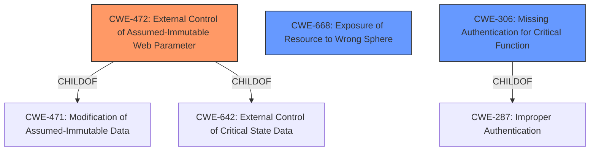

# Raw Analyzer Response for CVE-2021-43129

# Summary
| CWE ID | CWE Name | Confidence | CWE Abstraction Level | CWE Vulnerability Mapping Label | CWE-Vulnerability Mapping Notes |
|---|---|---|---|---|---|
| CWE-472 | External Control of Assumed-Immutable Web Parameter | 0.9 | Base | Allowed | Primary CWE |
| CWE-668 | Exposure of Resource to Wrong Sphere | 0.7 | Base | Allowed | Secondary Candidate |
| CWE-306 | Missing Authentication for Critical Function | 0.6 | Base | Allowed | Secondary Candidate |

## Evidence and Confidence

*   **Confidence Score:** 0.8
*   **Evidence Strength:** HIGH

## Relationship Analysis
The primary CWE selected is CWE-472, a base-level weakness that directly addresses the vulnerability's root cause: the application's failure to validate a URL parameter (`drc`) intended to control the "Disable Right Click" setting. While other CWEs like CWE-668 (Exposure of Resource to Wrong Sphere) and CWE-306 (Missing Authentication for Critical Function) were considered due to their relevance to aspects of the vulnerability, CWE-472 provides the most precise and targeted classification of the core flaw. There aren't strong parent-child relationships that heavily influenced the decision, but the base-level nature of CWE-472 is ideal for root cause mapping.

## Vulnerability Chain
The vulnerability chain begins with the **improper** handling of the "Disable Right Click" setting in D2L Brightspace's quizzing feature.

1.  **Root Cause:** **Improper handling of URL parameters related to the "Disable Right Click" setting** (**CWE-472**). The application trusts the presence of the `&drc=1` parameter to enforce the setting, but the parameter is externally controllable and not properly validated.
2.  **Weakness:** This leads to the **bypass** of the intended restriction.
3.  **Impact:** A quiz-taker can then access print and copy functionality, potentially leading to data exfiltration and cheating. The application exposes the "Disable Right Click" setting to the user via a URL parameter, which allows a user to disable this intended restriction by simply modifying the URL (**CWE-668**). If there was no authentication to access this setting, this might lead to **CWE-306**, but there is no evidence of missing authentication.

## Summary of Analysis
The initial assessment identified several potential CWEs, but after carefully reviewing the vulnerability description and available evidence, the primary finding is that the root cause lies in the application's **improper handling of externally controllable URL parameters** used to manage the "Disable Right Click" setting. This is best captured by **CWE-472 (External Control of Assumed-Immutable Web Parameter)**.

The vulnerability description key phrases highlight the "**bypass Disable Right Click option**" as the core **weakness**, and the CVE Reference Links Content Summary confirms that the application **relies on URL parameters** to enforce the setting. The fact that a user can simply remove the `&drc=1` parameter to bypass the restriction provides strong evidence for this classification.

The selection of **CWE-472** is further supported by its base-level abstraction and the MITRE mapping guidance, which explicitly allows for its usage in cases where the root cause of the vulnerability involves a failure to properly validate externally controllable parameters.

While **CWE-668 (Exposure of Resource to Wrong Sphere)** and **CWE-306 (Missing Authentication for Critical Function)** were considered, they don't fully capture the nuances of the **root cause**. **CWE-668** is related to the general problem of exposing resources to unintended actors, but it does not specifically address the issue of **improper validation**. **CWE-306** relates to missing authentication, and while related, this is not the primary issue.

Therefore, the assessment concludes that **CWE-472** is the most appropriate and specific classification for this vulnerability, as it directly addresses the coding error (lack of input validation) that allows a user to bypass the intended restriction. The selected CWE is at the optimal level of specificity, providing a clear and accurate representation of the vulnerability's root cause.