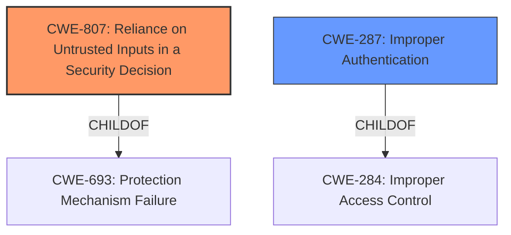

# Analysis for CVE-2021-4314

# Summary
| CWE ID | CWE Name | Confidence | CWE Abstraction Level | CWE Vulnerability Mapping Label | CWE-Vulnerability Mapping Notes |
|---|---|---|---|---|---|
| CWE-807 | Reliance on Untrusted Inputs in a Security Decision | 0.8 | Base | Allowed | Primary CWE. The vulnerability stems from trusting the JWT token without proper validation. |
| CWE-287 | Improper Authentication | 0.5 | Class | Discouraged | Secondary CWE.  The vulnerability results in bypassing authentication. |

## Evidence and Confidence

*   **Confidence Score:** 0.7
*   **Evidence Strength:** MEDIUM

## Relationship Analysis
The primary CWE is CWE-807, which describes relying on untrusted inputs for security decisions. CWE-287, Improper Authentication, is a broader class of errors that can result from CWE-807. CWE-807 is a `Base` level CWE, while CWE-287 is a `Class` level CWE. We choose CWE-807 because it more precisely describes the root cause, that zOSMF services are trusting the content of JWT tokens without validating their integrity, whereas CWE-287 is too general.

## Vulnerability Chain
The vulnerability chain starts with **reliance on an untrusted input** (the JWT token) which then leads to **improper authentication** allowing unauthorized access.

## Summary of Analysis
The initial assessment pointed towards CWE-807 as a strong candidate due to its description aligning with the **weakness** of trusting JWT tokens without proper validation. The vulnerability description states that it is possible to **authenticate without valid JWT token**.

The graph relationships show that CWE-807 is a `Base` level CWE and a child of CWE-693, Protection Mechanism Failure, while CWE-287 is a `Class` level CWE and a child of CWE-284, Improper Access Control. The decision to use CWE-807 over CWE-287 is due to its specificity in describing the **root cause**.

The selection of CWE-807 is based on the evidence that the system trusts an input (JWT token) that can be manipulated by an attacker. This aligns directly with the description of CWE-807.

Relevant CWE Information:
# Enhanced Context (25 CWEs)
The following CWEs were identified as potentially relevant to this vulnerability:

## CWE-807: Reliance on Untrusted Inputs in a Security Decision
**Abstraction Level**: Base
**Similarity Score**: 0.79
**Source**: dense

**Description**:
The product uses a protection mechanism that relies on the existence or values of an input, but the input can be modified by an untrusted actor in a way that bypasses the protection mechanism.

**Mapping Guidance**:
- Usage: Allowed
- Rationale: This CWE entry is at the Base level of abstraction, which is a preferred level of abstraction for mapping to the root causes of vulnerabilities.

## CWE-287: Improper Authentication
**Abstraction Level**: Class
**Similarity Score**: 0.585
**Source**: sparse

**Description**:
When an actor claims to have a given identity, the product does not prove or insufficiently proves that the claim is correct.

**Mapping Guidance**:
- Usage: Discouraged
- Rationale: This CWE entry might be misused when lower-level CWE entries are likely to be applicable. It is a level-1 Class (i.e., a child of a Pillar).

## CWE-863: Incorrect Authorization
**Abstraction Level**: Class
**Similarity Score**: 0.537
**Source**: sparse

**Description**:
The product performs an authorization check when an actor attempts to access a resource or perform an action, but it does not correctly perform the check.

## CWE-347: Improper Verification of Cryptographic Signature
**Abstraction Level**: Base
**Similarity Score**: 0.534
**Source**: sparse

**Description**:
The product does not verify, or incorrectly verifies, the cryptographic signature for data.

## CWE-1390: Weak Authentication
**Abstraction Level**: Class
**Similarity Score**: 0.531
**Source**: sparse

**Description**:
The product uses an authentication mechanism to restrict access to specific users or identities, but the mechanism does not sufficiently prove that the claimed identity is correct.