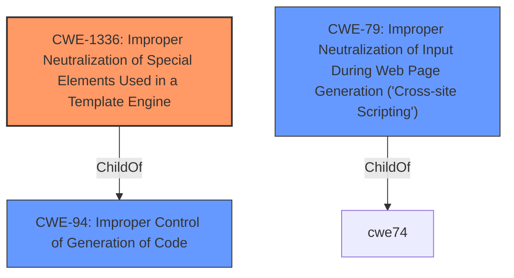

# Analysis Report for CVE-2021-4315

# Vulnerability Analysis Report: CVE-2021-4315

## Description


## Analysis (with Relationship Data)

# Summary
| CWE ID | CWE Name | Confidence | CWE Abstraction Level | CWE Vulnerability Mapping Label | CWE-Vulnerability Mapping Notes |
|---|---|---|---|---|---|
| CWE-1336 | Improper Neutralization of Special Elements Used in a Template Engine | 1.0 | Base | Allowed | Primary CWE |
| CWE-79 | Improper Neutralization of Input During Web Page Generation ('Cross-site Scripting') | 0.7 | Base | Allowed | Secondary Candidate |

## Evidence and Confidence

*   **Confidence Score:** 0.9
*   **Evidence Strength:** HIGH

## Relationship Analysis
The primary CWE is CWE-1336, which falls under CWE-94 (Improper Control of Generation of Code). While XSS (CWE-79) is related, CWE-1336 offers a more precise classification as it directly addresses the vulnerability in template engines.



## Vulnerability Chain
The vulnerability chain involves:
  1. **Root Cause:** **Improper neutralization of special elements** in the `mode` parameter.
  2. **Weakness:** Server-Side Template Injection (SSTI).
  3. **Impact:** Arbitrary code execution.

## Summary of Analysis
Based on the provided evidence, the primary vulnerability is **CWE-1336: Improper Neutralization of Special Elements Used in a Template Engine**. This is supported by the vulnerability description stating "**improper neutralization of special elements** used in a template engine" and the CVE Reference Links Content Summary, which identifies Server-Side Template Injection (SSTI) as a key weakness.

The description from the CVE Reference Links Content Summary explicitly mentions the use of `render_template_string` function and the `mode` parameter being passed directly to it, allowing for code injection. This aligns perfectly with the description of CWE-1336.

While CWE-79 (Cross-Site Scripting) is a related concern, it's less specific than CWE-1336 in this case. The core issue is the template engine's failure to neutralize special elements, not just the generation of a web page with unsanitized input.

The choice of CWE-1336 is also supported by the Retriever Results, which ranks it as the top match with a score of 0.749. The mapping guidance for CWE-1336 recommends its use as it is at the Base level of abstraction.

Relevant CWE Information:

# Enhanced Context (25 CWEs)
The following CWEs were identified as potentially relevant to this vulnerability:

## CWE-74: Improper Neutralization of Special Elements in Output Used by a Downstream Component ('Injection')
**Abstraction Level**: Class
**Similarity Score**: 0.78
**Source**: dense

**Description**:
The product constructs all or part of a command, data structure, or record using externally-influenced input from an upstream component, but it does not neutralize or incorrectly neutralizes special elements that could modify how it is parsed or interpreted when it is sent to a downstream component.

**Mapping Guidance**:
- Usage: Discouraged
- Rationale: CWE-74 is high-level and often misused when lower-level weaknesses are more appropriate.

## CWE-79: Improper Neutralization of Input During Web Page Generation ('Cross-site Scripting')
**Abstraction Level**: Base
**Similarity Score**: 8151.07
**Source**: sparse

**Description**:
The product does not neutralize or incorrectly neutralizes user-controllable input before it is placed in output that is used as a web page that is served to other users.

**Mapping Guidance**:
- Usage: Allowed
- Rationale: This CWE entry is at the Base level of abstraction, which is a preferred level of abstraction for mapping to the root causes of vulnerabilities.

## CWE-1336: Improper Neutralization of Special Elements Used in a Template Engine
**Abstraction Level**: Base
**Similarity Score**: 8127.79
**Source**: sparse

**Description**:
The product uses a template engine to insert or process externally-influenced input, but it does not neutralize or incorrectly neutralizes special elements or syntax that can be interpreted as template expressions or other code directives when processed by the engine.

**Mapping Guidance**:
- Usage: Allowed
- Rationale: This CWE entry is at the Base level of abstraction, which is a preferred level of abstraction for mapping to the root causes of vulnerabilities.

## CWE-78: Improper Neutralization of Special Elements used in an OS Command ('OS Command Injection')
**Abstraction Level**: base
**Similarity Score**: 5.03
**Source**: graph

**Description**:
CWE-78: Improper Neutralization of Special Elements used in an OS Command ('OS Command Injection')

**Mapping Guidance**:
- Usage: Allowed
- Rationale: This CWE entry is at the Base level of abstraction, which is a preferred level of abstraction for mapping to the root causes of vulnerabilities.

I considered CWE-74 (Improper Neutralization of Special Elements in Output Used by a Downstream Component ('Injection')), but its mapping guidance explicitly discourages its use when lower-level weaknesses are more appropriate. Both CWE-78 (Improper Neutralization of Special Elements used in an OS Command ('OS Command Injection')) and CWE-89 (Improper Neutralization of Special Elements used in an SQL Command ('SQL Injection')) were not selected as they don't apply to template injection.


## CWE Relationship Analysis

Current CWEs represent these abstraction levels: .


### Vulnerability Chain Analysis

**Chain starting from CWE-89:**
- 89 (Improper Neutralization of Special Elements used in an SQL Command ('SQL Injection')) - ROOT


**Chain starting from CWE-78:**
- 78 (Improper Neutralization of Special Elements used in an OS Command ('OS Command Injection')) - ROOT


### CWE Relationship Diagram

```mermaid
graph TD
    classDef primary fill:#f96,stroke:#333,stroke-width:2px
    classDef secondary fill:#69f,stroke:#333
    classDef tertiary fill:#9e9,stroke:#333
```


*Report generated on 2025-03-30 15:09:07*
