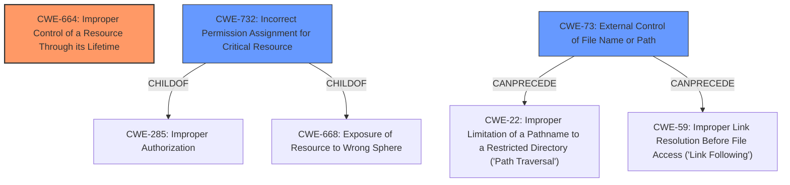

# Raw Analyzer Response for CVE-2021-43204

# Summary
| CWE ID | CWE Name | Confidence | CWE Abstraction Level | CWE Vulnerability Mapping Label | CWE-Vulnerability Mapping Notes |
|---|---|---|---|---|---|
| **CWE-664** | **Improper Control of a Resource Through its Lifetime** | 0.9 | Pillar | Primary | Discouraged (but most fitting based on the evidence) |
| CWE-732 | Incorrect Permission Assignment for Critical Resource | 0.5 | Class | Secondary | Allowed-with-Review |
| CWE-73 | External Control of File Name or Path | 0.4 | Base | Secondary | Allowed |

## Evidence and Confidence

*   **Confidence Score:** 0.7
*   **Evidence Strength:** MEDIUM

## Relationship Analysis
The primary CWE is CWE-664, a Pillar-level weakness. While discouraged, it directly reflects the **improper control of a resource through its lifetime**. CWE-732 (Incorrect Permission Assignment for Critical Resource) and CWE-73 (External Control of File Name or Path) were considered due to the attack vector involving changes to directory access permissions. However, CWE-664 best encapsulates the core issue of the application's failure to manage resource access permissions throughout its lifecycle.

## Vulnerability Chain
The chain of events is as follows:
1.  **Root Cause:** **Improper control of resource through its lifetime** (CWE-664) leads to
2.  **Attack Vector:** Changes to directory access permissions
3.  **Impact:** Complete denial of service of the FortiClient Windows components.

## Summary of Analysis
Initially, the analysis focused on the "improper control of resource" aspect as the root cause. The "CVE Reference Links Content Summary" explicitly states: "Root cause of vulnerability: **Improper control of a resource through its lifetime** (CWE-664). Specifically, the vulnerability exists due to the application not properly handling changes to the root directory's access permissions."

CWE-664 is a Pillar, and the mapping guidance discourages its use when lower-level children are available. However, none of the children of CWE-664 fully capture the essence of the vulnerability, which is the failure to properly manage the resource's lifecycle in the face of permission changes.

CWE-732 (Incorrect Permission Assignment for Critical Resource) was considered because the attack involves changes to permissions. However, CWE-732 typically refers to a static misconfiguration of permissions, whereas this vulnerability concerns the application's runtime reaction to external changes. The description of CWE-732 indicates that it is "often misused for vulnerabilities in which 'permissions' are not checked, which is an 'authorization' weakness (CWE-285 or descendants) within CWE's model." This usage doesn't quite fit the provided vulnerability description.

CWE-73 (External Control of File Name or Path) was also considered, but it doesn't accurately describe the vulnerability since the attacker isn't directly controlling the filename or path used by the application. Instead, the attacker is modifying the permissions of a directory that the application uses.

Therefore, despite the discouraged usage, CWE-664 is the most appropriate CWE because it directly reflects the **root cause** described in the CVE summary: "**improper control of a resource through its lifetime**."

Relevant CWE Information:

# Enhanced Context (25 CWEs)
The following CWEs were identified as potentially relevant to this vulnerability:

## CWE-74: Improper Neutralization of Special Elements in Output Used by a Downstream Component ('Injection')
**Abstraction Level**: Class
**Similarity Score**: 0.77
**Source**: dense

**Description**:
The product constructs all or part of a command, data structure, or record using externally-influenced input from an upstream component, but it does not neutralize or incorrectly neutralizes special elements that could modify how it is parsed or interpreted when it is sent to a downstream component.

**Mapping Guidance**:
- Usage: Discouraged
- Rationale: CWE-74 is high-level and often misused when lower-level weaknesses are more appropriate.

## CWE-73: External Control of File Name or Path
**Abstraction Level**: Base
**Similarity Score**: 0.77
**Source**: dense

**Description**:
The product allows user input to control or influence paths or file names that are used in filesystem operations.

**Mapping Guidance**:
- Usage: Allowed
- Rationale: This CWE entry is at the Base level of abstraction, which is a preferred level of abstraction for mapping to the root causes of vulnerabilities.

## CWE-59: Improper Link Resolution Before File Access ('Link Following')
**Abstraction Level**: Base
**Similarity Score**: 0.76
**Source**: dense

**Description**:
The product attempts to access a file based on the filename, but it does not properly prevent that filename from identifying a link or shortcut that resolves to an unintended resource.

**Mapping Guidance**:
- Usage: Allowed
- Rationale: This CWE entry is at the Base level of abstraction, which is a preferred level of abstraction for mapping to the root causes of vulnerabilities.

## CWE-41: Improper Resolution of Path Equivalence
**Abstraction Level**: Base
**Similarity Score**: 0.76
**Source**: dense

**Description**:
The product is vulnerable to file system contents disclosure through path equivalence. Path equivalence involves the use of special characters in file and directory names. The associated manipulations are intended to generate multiple names for the same object.

**Mapping Guidance**:
- Usage: Allowed
- Rationale: This CWE entry is at the Base level of abstraction, which is a preferred level of abstraction for mapping to the root causes of vulnerabilities.

## CWE-668: Exposure of Resource to Wrong Sphere
**Abstraction Level**: Class
**Similarity Score**: 0.76
**Source**: dense

**Description**:
The product exposes a resource to the wrong control sphere, providing unintended actors with inappropriate access to the resource.

**Mapping Guidance**:
- Usage: Discouraged
- Rationale: CWE-668 is high-level and is often misused as a catch-all when lower-level CWE IDs might be applicable. It is sometimes used for low-information vulnerability reports [REF-1287]. It is a level-1 Class (i.e., a child of a Pillar). It is not useful for trend analysis.

## CWE-664: Improper Control of a Resource Through its Lifetime
**Abstraction Level**: Pillar
**Similarity Score**: 0.76
**Source**: dense

**Description**:
The product does not maintain or incorrectly maintains control over a resource throughout its lifetime of creation, use, and release.

**Mapping Guidance**:
- Usage: Discouraged
- Rationale: This CWE entry is high-level when lower-level children are available.

## CWE-99: Improper Control of Resource Identifiers ('Resource Injection')
**Abstraction Level**: Class
**Similarity Score**: 0.76
**Source**: dense

**Description**:
The product receives input from an upstream component, but it does not restrict or incorrectly restricts the input before it is used as an identifier for a resource that may be outside the intended sphere of control.

**Mapping Guidance**:
- Usage: Allowed-with-Review
- Rationale: This CWE entry is a Class and might have Base-level children that would be more appropriate

## CWE-184: Incomplete List of Disallowed Inputs
**Abstraction Level**: Base
**Similarity Score**: 0.76
**Source**: dense

**Description**:
The product implements a protection mechanism that relies on a list of inputs (or properties of inputs) that are not allowed by policy or otherwise require other action to neutralize before additional processing takes place, but the list is incomplete.

**Mapping Guidance**:
- Usage: Allowed
- Rationale: This CWE entry is at the Base level of abstraction, which is a preferred level of abstraction for mapping to the root causes of vulnerabilities.

## CWE-280: Improper Handling of Insufficient Permissions or Privileges
**Abstraction Level**: Base
**Similarity Score**: 0.75
**Source**: dense

**Description**:
The product does not handle or incorrectly handles when it has