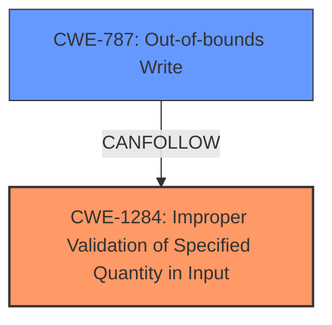

# Analysis for CVE-2021-43267

# Summary
| CWE ID  | CWE Name                                                 | Confidence | CWE Abstraction Level | CWE Vulnerability Mapping Label | CWE-Vulnerability Mapping Notes |
| :-------- | :------------------------------------------------------- | :--------- | :---------------------- | :------------------------------ | :------------------------------ |
| CWE-1284 | Improper Validation of Specified Quantity in Input      | 0.95      | Base                    | Primary                       | Allowed                       |
| CWE-787  | Out-of-bounds Write                                    | 0.85      | Base                    | Secondary                     | Allowed                       |

## Evidence and Confidence

*   **Confidence Score:** 0.90
*   **Evidence Strength:** HIGH

## Relationship Analysis
The primary weakness is **insufficient validation of user-supplied sizes**, which directly relates to CWE-1284. This can lead to an out-of-bounds write (CWE-787) if the size is used to allocate memory or copy data.

## Vulnerability Chain
The vulnerability chain starts with **insufficient validation of user-supplied sizes** (CWE-1284). This **root cause** leads to a condition where an attacker can provide an invalid size, which, in turn, results in an out-of-bounds write (CWE-787) when the system attempts to use the provided size.

## Summary of Analysis
Initially, the vulnerability description points to **insufficient validation of user-supplied sizes**. The **Vulnerability Description Key Phrases** section explicitly mentions this.

The **CVE Reference Links Content Summary** confirms this, stating: "Specifically, the function does not properly validate the `member_cnt` field of the `tipc_mon_domain` struct before using it to determine the size of the `members` array." It further clarifies this leads to "an out-of-bounds write on the stack when the record is copied using `memcpy`."

The **Retriever Results** also show that CWE-1284 (Improper Validation of Specified Quantity in Input) is the top match.

Given this evidence, CWE-1284 is chosen as the primary CWE. The subsequent out-of-bounds write is mapped to CWE-787.

CWE-1284 is at the optimal level of specificity as it directly addresses the **root cause** of the vulnerability, which is the lack of proper validation of user-supplied sizes.

Relevant CWE Information:

# Enhanced Context (25 CWEs)
The following CWEs were identified as potentially relevant to this vulnerability:

## CWE-131: Incorrect Calculation of Buffer Size
**Abstraction Level**: Base
**Similarity Score**: 0.77
**Source**: dense

**Description**:
The product does not correctly calculate the size to be used when allocating a buffer, which could lead to a buffer overflow.

**Mapping Guidance**:
- Usage: Allowed
- Rationale: This CWE entry is at the Base level of abstraction, which is a preferred level of abstraction for mapping to the root causes of vulnerabilities.

## CWE-1284: Improper Validation of Specified Quantity in Input
**Abstraction Level**: Base
**Similarity Score**: 7991.93
**Source**: sparse

**Description**:
The product receives input that is expected to specify a quantity (such as size or length), but it does not validate or incorrectly validates that the quantity has the required properties.

**Mapping Guidance**:
- Usage: Allowed
- Rationale: This CWE entry is at the Base level of abstraction, which is a preferred level of abstraction for mapping to the root causes of vulnerabilities.

## CWE-787: Out-of-bounds Write
**Abstraction Level**: base
**Similarity Score**: 3.89
**Source**: graph

**Description**:
CWE-787: Out-of-bounds Write

**Mapping Guidance**:
- Usage: Allowed
- Rationale: This CWE entry is at the Base level of abstraction, which is a preferred level of abstraction for mapping to the root causes of vulnerabilities.

### Technical Explanation for CWE-1284:
*   **How the vulnerability's details match the CWE's characteristics:** The vulnerability involves **insufficient validation of user-supplied sizes**. The system uses this size without proper checks, directly aligning with CWE-1284's description of "The product receives input that is expected to specify a quantity... but it does not validate or incorrectly validates that the quantity has the required properties."
*   **The security implications and potential impact:** The security implication is that an attacker can control the size parameter, potentially leading to an out-of-bounds write or other memory corruption issues.
*   **Any parent-child relationships or chain patterns that influenced your mapping:** CWE-1284 is a child of CWE-20 (Improper Input Validation), highlighting that the root cause is a specific type of input validation failure.
*   **Whether the weakness is primary or secondary in the vulnerability:** CWE-1284 is the primary weakness.
*   **How the official MITRE mapping guidance influenced your decision:** The MITRE mapping guidance recommends using Base-level CWEs, and CWE-1284 is a Base-level CWE.

### Technical Explanation for CWE-787:
*   **How the vulnerability's details match the CWE's characteristics:** The **insufficient validation** can lead to writing data past the end of a buffer, which directly corresponds to CWE-787's description: "The product writes data past the end, or before the beginning, of the intended buffer."
*   **The security implications and potential impact:** Out-of-bounds writes can lead to arbitrary code execution, denial of service, or information disclosure.
*   **Any parent-child relationships or chain patterns that influenced your mapping:** CWE-787 is a child of CWE-119 (Improper Restriction of Operations within the Bounds of a Memory Buffer), which represents a more general class of memory safety issues.
*   **Whether the weakness is primary or secondary in the vulnerability:** CWE-787 is a secondary weakness, resulting from the primary weakness CWE-1284.
*   **How the official MITRE mapping guidance influenced your decision:** The MITRE mapping guidance recommends using Base-level CWEs.

### Other CWEs Considered but Not Used:
*   CWE-20 (Improper Input Validation): While the vulnerability involves input validation, CWE-1284 is a more specific and accurate representation of the weakness.
*   CWE-119 (Improper Restriction of Operations within the Bounds of a Memory Buffer): CWE-787 is more specific in describing the out-of-bounds write.
*   CWE-770 (Allocation of Resources Without Limits or Throttling): Considered because the **insufficient validation** could lead to excessive resource allocation, but the primary issue is the validation itself, making CWE-1284 more appropriate.
*   CWE-125 (Out-of-bounds Read): Not applicable as the vulnerability focuses on writing out of bounds, not reading.
*   CWE-1339 (Insufficient Precision or Accuracy of a Real Number): Not applicable, as the issue doesn't involve real number precision.
*   CWE-1285 (Improper Validation of Specified Index, Position, or Offset in Input): While similar, CWE-1284 is more general and fits better as it is about any quantity, not just index/position/offset.
*   CWE-116 (Improper Encoding or Escaping of Output): Not applicable as the vulnerability is about the size, not the encoding.
*   CWE-909 (Missing Initialization of Resource): Not applicable, as the issue is not about missing initialization.
*   CWE-131 (Incorrect Calculation of Buffer Size): Not applicable, as the issue is not about buffer size calculation, but rather about validation of the user-supplied sizes.