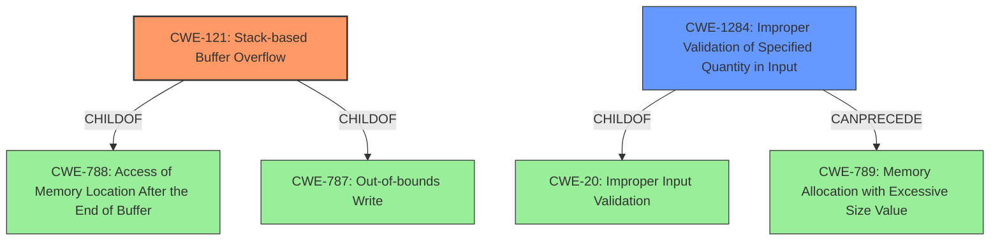

# Enhanced Analysis for CVE-2021-43300

# Summary
| CWE ID | CWE Name | Confidence | CWE Abstraction Level | CWE Vulnerability Mapping Label | CWE-Vulnerability Mapping Notes |
|---|---|---|---|---|---|
| CWE-121 | Stack-based Buffer Overflow | 1.0 | Variant | Allowed | Primary CWE. The vulnerability description clearly indicates a stack overflow due to copying data to a fixed-size stack buffer without size validation. |
| CWE-1284 | Improper Validation of Specified Quantity in Input | 0.8 | Base | Allowed | Secondary CWE. The root cause is the missing size validation of the attacker-controlled filename argument. |

## Evidence and Confidence

*   **Confidence Score:** 0.9
*   **Evidence Strength:** HIGH

## Relationship Analysis
The primary CWE is CWE-121, which is a variant of CWE-788 and CWE-787. CWE-1284 can precede CWE-789, but is more relevant as it is the specific **lack of validation** that allows the overflow to occur in the first place.



## Vulnerability Chain
The vulnerability chain starts with **improper validation** of the filename length (CWE-1284). This **lack of validation** leads to a stack-based buffer overflow (CWE-121) when the oversized filename is copied to the fixed-size buffer. The potential impact is arbitrary code execution or denial of service.

## Summary of Analysis
The initial analysis identified a stack overflow vulnerability. The key phrase "copied to a fixed-size stack buffer without any size validation" strongly suggests CWE-121 (Stack-based Buffer Overflow) as the primary weakness, and CWE-1284 (Improper Validation of Specified Quantity in Input) as the root cause.

The retriever results support this assessment. CWE-121 has the highest score and is described as "A stack-based buffer overflow condition is a condition where the buffer being overwritten is allocated on the stack". CWE-1284 is also listed, with its description matching the **missing size validation**.

Evidence from the CVE Reference Links Content Summary:
*   "The vulnerability is a stack buffer overflow in the PJSUA API within the `pjsua_recorder_create` function."
*   "The `filename` argument, controlled by the attacker, is copied to a fixed-size stack buffer without proper size validation."
*   "**Missing Size Validation:** The code lacks a check on the length of the filename before copying it to the stack buffer. This is the core weakness enabling the overflow."

The relationship analysis confirms that CWE-121 is a specific type of buffer overflow, making it the most appropriate primary CWE. CWE-1284 is the root cause that allowed this overflow to occur.

CWE-121 is at the Variant level, which is the preferred level of abstraction. CWE-1284 is at the Base level, also a preferred level. These choices provide sufficient specificity to describe the vulnerability without being overly broad.


## CWE Relationship Analysis

Current CWEs represent these abstraction levels: .


### Vulnerability Chain Analysis

**Chain starting from CWE-20:**
- 20 (Improper Input Validation) - ROOT


**Chain starting from CWE-121:**
- 121 (Stack-based Buffer Overflow) - ROOT


### CWE Relationship Diagram

```mermaid
graph TD
    classDef primary fill:#f96,stroke:#333,stroke-width:2px
    classDef secondary fill:#69f,stroke:#333
    classDef tertiary fill:#9e9,stroke:#333
```