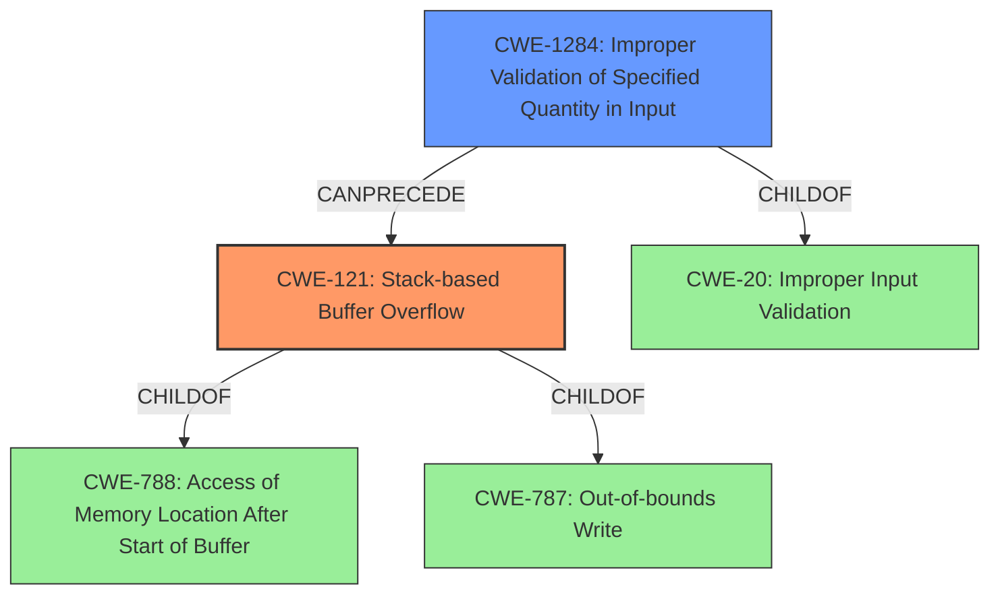

# Enhanced Analysis for CVE-2021-43301

# Summary
| CWE ID    | CWE Name                                                                        | Confidence | CWE Abstraction Level | CWE Vulnerability Mapping Label | CWE-Vulnerability Mapping Notes |
| :-------- | :------------------------------------------------------------------------------ | :--------- | :-------------------- | :------------------------------ | :------------------------------ |
| CWE-121   | Stack-based Buffer Overflow                                                     | 1.0        | Variant               | Primary                         | Allowed                       |
| CWE-1284  | Improper Validation of Specified Quantity in Input                               | 0.75        | Base                  | Secondary                       | Allowed                       |

## Evidence and Confidence

*   **Confidence Score:** 0.9
*   **Evidence Strength:** HIGH

## Relationship Analysis
The primary weakness is CWE-121, a variant of buffer overflow that occurs on the stack. CWE-121 is a child of CWE-788 (Access of Memory Location After Start of Buffer) and CWE-787 (Out-of-bounds Write). CWE-1284 (Improper Validation of Specified Quantity in Input) is a base CWE and a child of CWE-20 (Improper Input Validation). The relationship shows that the lack of input validation (CWE-1284) can lead to a stack-based buffer overflow (CWE-121).



## Vulnerability Chain
The vulnerability chain starts with **improper input validation** (CWE-1284) of the `file_names` argument. Because the size isn't validated, an attacker can provide a long string, which then leads to a **stack-based buffer overflow** (CWE-121) when the `file_names` argument is copied to a fixed-size buffer on the stack. The overflow can then lead to arbitrary code execution or denial of service.

## Summary of Analysis
The analysis is based on the provided evidence from the vulnerability description and CVE reference summary.

The vulnerability description clearly states: "**Stack overflow** in PJSUA API when calling pjsua_playlist_create. An attacker-controlled file_names argument may cause a buffer overflow since it is copied to a fixed-size stack buffer without any size validation."

The CVE Reference Links Content Summary reinforces this: "**Root Cause:** Stack overflow due to insufficient size validation when handling the `file_names` argument... **Weakness:** The `file_names` argument, controlled by an attacker, is copied to a fixed-size stack buffer without any size checks, leading to a buffer overflow..."

The graph relationships and retriever results support this assessment. CWE-121 is a direct match for stack-based buffer overflows. CWE-1284 is related as it describes the **improper validation** that leads to the overflow.

CWE-121 is selected as the primary CWE because the vulnerability is explicitly a stack-based buffer overflow. CWE-1284 is a secondary CWE because it describes the root cause of the overflow: **lack of validation**. Both CWEs are at the optimal level of specificity, with CWE-121 being a Variant and CWE-1284 being a Base.

**CWEs Considered But Not Used:**

*   **CWE-190 Integer Overflow or Wraparound:** While integer overflows can sometimes lead to buffer overflows, there's no evidence of an integer overflow in this specific vulnerability. The issue is directly related to copying an overly long string to a fixed-size buffer without validation, not an integer calculation.
*   **CWE-120 Buffer Copy without Checking Size of Input ('Classic Buffer Overflow'):** This CWE is similar, but CWE-121 is more specific, since the buffer is allocated on the stack.
*   **CWE-193 Off-by-one Error:** There is no indication of an off-by-one error in the description.
*   **CWE-789 Memory Allocation with Excessive Size Value:** While excessive memory allocation can be a consequence of improper validation, the core issue here is the buffer overflow on the stack due to a lack of input validation, not the memory allocation itself.
*   **CWE-1325 Improperly Controlled Sequential Memory Allocation:** This CWE describes a weakness where memory allocation is not properly limited for a *group* of objects. The vulnerability in question does not involve managing multiple objects, so this CWE isn't applicable.
*   **CWE-681 Incorrect Conversion between Numeric Types:** There is no evidence of type conversion issues.
*   **CWE-131 Incorrect Calculation of Buffer Size:** While an incorrect buffer size is involved, the root cause is the lack of validation of the input size, rather than a calculation error of the buffer size itself.


## CWE Relationship Analysis

Current CWEs represent these abstraction levels: .


### Vulnerability Chain Analysis

**Chain starting from CWE-190:**
- 190 (Integer Overflow or Wraparound) - ROOT


**Chain starting from CWE-1325:**
- 1325 (Improperly Controlled Sequential Memory Allocation) - ROOT


### CWE Relationship Diagram

```mermaid
graph TD
    classDef primary fill:#f96,stroke:#333,stroke-width:2px
    classDef secondary fill:#69f,stroke:#333
    classDef tertiary fill:#9e9,stroke:#333
```