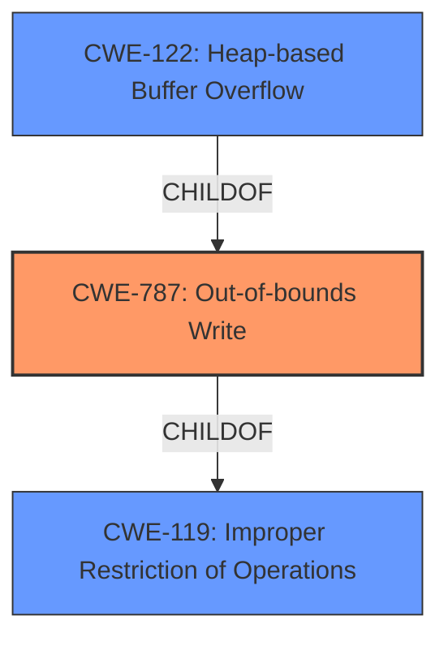

# Analysis for CVE-2021-43312

# Summary
| CWE ID  | CWE Name | Confidence | CWE Abstraction Level | CWE Vulnerability Mapping Label | CWE-Vulnerability Mapping Notes |
|----------------|---------------------------------------------------------------------------------------|----------------|---------------------------|------------------------------------|--------------------------------------------------------------------------------------|
| CWE-787 | Out-of-bounds Write | 1.0 | Base | Allowed | Primary CWE |
| CWE-122 | Heap-based Buffer Overflow | 0.7 | Variant | Allowed | Secondary Candidate |
| CWE-119 | Improper Restriction of Operations within the Bounds of a Memory Buffer | 0.5 | Class | Discouraged | Secondary Candidate |

## Evidence and Confidence

*   **Confidence Score:** 0.9
*   **Evidence Strength:** HIGH

## Relationship Analysis
The primary CWE is CWE-787 (**Out-of-bounds Write**), which is a base-level CWE. It is related to the Class-level CWE-119 (**Improper Restriction of Operations within the Bounds of a Memory Buffer**) through a parent-child relationship (CWE-787 is a child of CWE-119). CWE-122 (**Heap-based Buffer Overflow**) is a variant of CWE-787. The vulnerability involves writing data outside the allocated buffer, leading to a heap-based buffer overflow.

## Vulnerability Chain
The vulnerability chain starts with the **heap-based buffer overflow** due to the improper boundary check, leading to an **out-of-bounds write**. This leads to denial of service and potential code execution.
  - **Root Cause:** **Heap-based Buffer Overflow** in `PackLinuxElf64::invert_pt_dynamic` function.
  - **Weakness:** **Out-of-bounds Write** due to missing boundary check.
  - **Impact:** Denial of Service (DoS) due to segmentation fault, potential for code execution.

## Summary of Analysis
The initial assessment identified CWE-787 (**Out-of-bounds Write**) as the primary CWE, and this aligns with the provided information, particularly the **Vulnerability Description Key Phrases** and **CVE Reference Links Content Summary**. The root cause is a **heap-based buffer overflow** which leads to writing outside the intended memory bounds. This assessment is primarily based on the evidence provided, specifically the description of the vulnerability as a "**heap-based buffer overflow**" in the function `PackLinuxElf64invert_pt_dynamic`.

The graph relationships reinforce this selection, as CWE-787 is a specific type of CWE-119 (Improper Restriction of Operations within the Bounds of a Memory Buffer) and is related to CWE-122 (Heap-based Buffer Overflow). While CWE-119 is a broader category, CWE-787 more precisely describes the nature of the write occurring outside the bounds of the allocated memory.

The selection of CWE-787 is at the optimal level of specificity because it accurately reflects the **root cause** of the vulnerability, which is writing data outside the intended buffer.

Relevant CWE Information:

# Enhanced Context (25 CWEs)
The following CWEs were identified as potentially relevant to this vulnerability:

## CWE-191: Integer Underflow (Wrap or Wraparound)
**Abstraction Level**: Base
**Similarity Score**: 0.80

## CWE-131: Incorrect Calculation of Buffer Size
**Abstraction Level**: Base
**Similarity Score**: 0.78

## CWE-124: Buffer Underwrite ('Buffer Underflow')
**Abstraction Level**: Base
**Similarity Score**: 0.77

## CWE-805: Buffer Access with Incorrect Length Value
**Abstraction Level**: Base
**Similarity Score**: 0.76

## CWE-125: Out-of-bounds Read
**Abstraction Level**: Base
**Similarity Score**: 0.76

## CWE-126: Buffer Over-read
**Abstraction Level**: Variant
**Similarity Score**: 0.76

## CWE-197: Numeric Truncation Error
**Abstraction Level**: Base
**Similarity Score**: 0.76

## CWE-681: Incorrect Conversion between Numeric Types
**Abstraction Level**: Base
**Similarity Score**: 0.76

## CWE-190: Integer Overflow or Wraparound
**Abstraction Level**: Base
**Similarity Score**: 0.76

## CWE-193: Off-by-one Error
**Abstraction Level**: Base
**Similarity Score**: 0.75

## CWE-190: Integer Overflow or Wraparound
**Abstraction Level**: Base
**Similarity Score**: 6607.17

## CWE-125: Out-of-bounds Read
**Abstraction Level**: Base
**Similarity Score**: 6243.61

## CWE-191: Integer Underflow (Wrap or Wraparound)
**Abstraction Level**: Base
**Similarity Score**: 6223.35

## CWE-193: Off-by-one Error
**Abstraction Level**: Base
**Similarity Score**: 6120.73

## CWE-1284: Improper Validation of Specified Quantity in Input
**Abstraction Level**: Base
**Similarity Score**: 5976.03

## CWE-128: Wrap-around Error
**Abstraction Level**: base
**Similarity Score**: 5.03

## CWE-170: Improper Null Termination
**Abstraction Level**: base
**Similarity Score**: 5.03

## CWE-1284: Improper Validation of Specified Quantity in Input
**Abstraction Level**: base
**Similarity Score**: 4.33

## CWE-617: Reachable Assertion
**Abstraction Level**: base
**Similarity Score**: 4.33

## CWE-195: Signed to Unsigned Conversion Error
**Abstraction Level**: variant
**Similarity Score**: 3.88

## CWE-463: Deletion of Data Structure Sentinel
**Abstraction Level**: base
**Similarity Score**: 3.64

## CWE-1339: Insufficient Precision or Accuracy of a Real Number
**Abstraction Level**: base
**Similarity Score**: 3.57

## CWE-120: Buffer Copy without Checking Size of Input ('Classic Buffer Overflow')
**Abstraction Level**: base
**Similarity Score**: 3.36

## CWE-190: Integer Overflow or Wraparound
**Abstraction Level**: Base
**Similarity Score**: 3.32

## CWE-787: Out-of-bounds Write
**Abstraction Level**: base
**Similarity Score**: 3.30

**CWE-119 (Improper Restriction of Operations within the Bounds of a Memory Buffer)** was considered but not selected as the primary CWE because while it broadly describes the issue, CWE-787 provides a more specific description of the vulnerability as an out-of-bounds write, which aligns better with the evidence. CWE-119 is too high-level.

**CWE-122 (Heap-based Buffer Overflow)** was considered because the vulnerability is explicitly described as a heap-based buffer overflow. However, CWE-787 focuses on the action of writing outside the bounds, which is the direct cause. CWE-122 describes the location of the buffer, which is a secondary characteristic.

**CWE-190 (Integer Overflow or Wraparound)**, **CWE-191 (Integer Underflow (Wrap or Wraparound))**, **CWE-193 (Off-by-one Error)**, **CWE-125 (Out-of-bounds Read)**, and **CWE-126 (Buffer Over-read)** were considered but ruled out because the primary issue is writing outside the bounds of the buffer, not integer manipulation or reading outside the bounds.