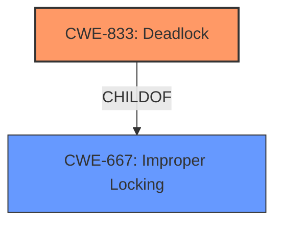

# Analysis Report for CVE-2021-43395

# Vulnerability Analysis Report: CVE-2021-43395

## Description


## Analysis (with Relationship Data)

# Summary
| CWE ID | CWE Name | Confidence | CWE Abstraction Level | CWE Vulnerability Mapping Label | CWE-Vulnerability Mapping Notes |
|---|---|---|---|---|---|
| CWE-833 | Deadlock | 0.9 | Base | Allowed | Primary CWE |
| CWE-667 | Improper Locking | 0.7 | Class | Allowed-with-Review | Secondary Candidate |

## Evidence and Confidence

*   **Confidence Score:** 0.8
*   **Evidence Strength:** HIGH

## Relationship Analysis
The primary CWE identified is CWE-833 (Deadlock), which is a Base level CWE. This is directly supported by the vulnerability description, which states that a local unprivileged user can cause a **deadlock** and kernel panic. CWE-833 is a child of CWE-667 (Improper Locking), suggesting that the deadlock is a consequence of improper locking mechanisms.



## Vulnerability Chain
The vulnerability chain starts with a race condition due to the improper locking, leading to a deadlock. The final impact is a kernel panic, resulting in a denial of service.
- **Root Cause:** Race condition due to improper locking.
- **Weakness:** Deadlock.
- **Impact:** Kernel panic and denial of service.

## Summary of Analysis
The initial analysis identified CWE-833 as the primary candidate due to the explicit mention of a **deadlock** in the vulnerability description. The CVE Reference Links Content Summary confirms that the **root cause** involves a race condition due to inconsistent locking order, leading to the **deadlock**.

The relationship graph shows CWE-833 as a child of CWE-667. While CWE-667 (Improper Locking) is a plausible candidate, CWE-833 (Deadlock) is more specific and directly reflects the observed impact. Therefore, CWE-833 is the more appropriate choice.

The decision is based on the provided evidence from the vulnerability description and the CVE Reference Links Content Summary. The selection of CWE-833 is at the optimal level of specificity because it directly represents the vulnerability's manifestation.

Relevant CWE Information:

# Enhanced Context (25 CWEs)
The following CWEs were identified as potentially relevant to this vulnerability:

## CWE-667: Improper Locking
**Abstraction Level**: Class
**Similarity Score**: 0.77
**Source**: dense

**Description**:
The product does not properly acquire or release a lock on a resource, leading to unexpected resource state changes and behaviors.

**Mapping Guidance**:
- Usage: Allowed-with-Review
- Rationale: This CWE entry is a Class and might have Base-level children that would be more appropriate

## CWE-833: Deadlock
**Abstraction Level**: Base
**Similarity Score**: 5535.48
**Source**: sparse

**Description**:
The product contains multiple threads or executable segments that are waiting for each other to release a necessary lock, resulting in deadlock.

**Mapping Guidance**:
- Usage: Allowed
- Rationale: This CWE entry is at the Base level of abstraction, which is a preferred level of abstraction for mapping to the root causes of vulnerabilities.

### Technical Explanation for CWE-833 (Deadlock):
-   **How the vulnerability's details match the CWE's characteristics:** The vulnerability description explicitly mentions that a local unprivileged user can cause a **deadlock**. The CVE Reference Links Content Summary confirms that the vulnerability is caused by a race condition in the `tmpfs` implementation, where two threads contend for the same locks, resulting in a **deadlock**.
-   **The security implications and potential impact:** A **deadlock** can cause a denial of service, as the system becomes unresponsive until it is reset.
-   **Any parent-child relationships or chain patterns that influenced your mapping:** CWE-833 is a child of CWE-667 (Improper Locking), indicating that the **deadlock** is a consequence of improper locking mechanisms.
-   **Whether the weakness is primary or secondary in the vulnerability:** CWE-833 is the primary weakness because it directly represents the vulnerability's manifestation.
-   **How the official MITRE mapping guidance influenced your decision:** The MITRE mapping guidance for CWE-833 states that it is at the Base level of abstraction, which is a preferred level for mapping root causes. The guidance also states that you should carefully read both the name and description to ensure that this mapping is an appropriate fit.

### Technical Explanation for CWE-667 (Improper Locking):
-   **How the vulnerability's details match the CWE's characteristics:** The CVE Reference Links Content Summary indicates that the root cause is a race condition related to inconsistent locking order during rename operations in `tmpfs`. While the description focuses on the resulting **deadlock**, **improper locking** is the underlying cause.
-   **The security implications and potential impact:** **Improper locking** can lead to data corruption, memory corruption, denial of service, and other unexpected behaviors.
-   **Any parent-child relationships or chain patterns that influenced your mapping:** CWE-667 is a parent of CWE-833, indicating that the **deadlock** is a consequence of **improper locking**.
-   **Whether the weakness is primary or secondary in the vulnerability:** CWE-667 is a secondary weakness because it is the underlying cause of the primary weakness (CWE-833).
-   **How the official MITRE mapping guidance influenced your decision:** The MITRE mapping guidance for CWE-667 states that it is a Class and might have Base-level children that would be more appropriate. This suggests considering more specific CWEs, such as CWE-833.

### Other CWEs Considered But Not Used:

-   CWE-787 (Out-of-bounds Write): This was considered but not used because the primary issue is a **deadlock**, not memory corruption due to an out-of-bounds write.
-   CWE-20 (Improper Input Validation): This was considered but not used because the vulnerability is not directly related to input validation. The issue is in the locking mechanism, not in how input is handled.
-   CWE-665 (Improper Initialization): This was considered but not used because the issue is not related to improper initialization of resources.
-   CWE-732 (Incorrect Permission Assignment for Critical Resource) and CWE-276 (Incorrect Default Permissions): These were not used because the vulnerability does not involve incorrect permission assignments.
-   CWE-502 (Deserialization of Untrusted Data): This was not used as it is not relevant to the described vulnerability.
-   CWE-909 (Missing Initialization of Resource): Similar to CWE-665, this was not used because the issue is not related to missing initialization.
-   CWE-123 (Write-what-where Condition): This was not used as it is not related to attacker-controlled arbitrary writes.
-   CWE-367 (Time-of-check Time-of-use (TOCTOU) Race Condition): While a race condition exists, the ultimate issue is the deadlock due to the locking.


## CWE Relationship Analysis

Current CWEs represent these abstraction levels: .


### Vulnerability Chain Analysis

**Chain starting from CWE-833:**
- 833 (Deadlock) - ROOT


**Chain starting from CWE-276:**
- 276 (Incorrect Default Permissions) - ROOT


### CWE Relationship Diagram

```mermaid
graph TD
    classDef primary fill:#f96,stroke:#333,stroke-width:2px
    classDef secondary fill:#69f,stroke:#333
    classDef tertiary fill:#9e9,stroke:#333
```


*Report generated on 2025-03-31 00:40:48*
