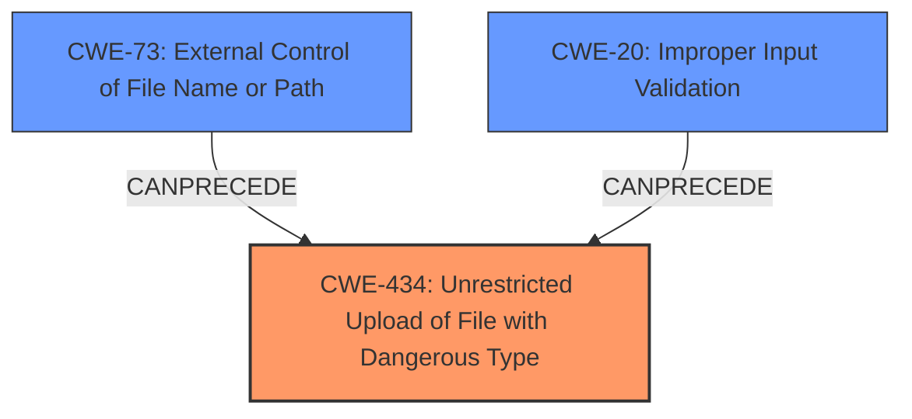

# Analysis for CVE-2021-43404

# Summary
| CWE ID | CWE Name | Confidence | CWE Abstraction Level | CWE Vulnerability Mapping Label | CWE-Vulnerability Mapping Notes |
|---|---|---|---|---|---|
| CWE-434 | Unrestricted Upload of File with Dangerous Type | 0.9 | Base | Primary | Allowed |
| CWE-20 | Improper Input Validation | 0.7 | Base | Secondary | Allowed |
| CWE-73 | External Control of File Name or Path | 0.6 | Base | Secondary | Allowed |

## Evidence and Confidence

*   **Confidence Score:** 0.8
*   **Evidence Strength:** HIGH

## Relationship Analysis
The primary CWE identified is CWE-434, which deals with unrestricted file uploads of dangerous types. This aligns with the vulnerability description, which mentions that a risky file name can be uploaded.

CWE-20 and CWE-73 are included as contributing factors because the vulnerability arises from **inadequate input validation** (CWE-20) and **external control over the filename** (CWE-73), which then leads to the ability to upload dangerous file types (CWE-434). These CWEs can precede CWE-434 in a vulnerability chain.

## Vulnerability Chain
The vulnerability chain starts with external control over the filename (CWE-73), which bypasses **inadequate input validation** (CWE-20), leading to the **unrestricted upload of files with dangerous types** (CWE-434). This can then result in remote code execution or other security risks.
  - The chain:
    1.  CWE-73: External Control of File Name or Path
    2.  CWE-20: Improper Input Validation
    3.  CWE-434: Unrestricted Upload of File with Dangerous Type

## Summary of Analysis
The initial assessment considered CWE-22, CWE-79, and CWE-116, but these were determined to be less relevant than CWE-434. While CWE-22 addresses path traversal, the provided vulnerability description primarily focuses on the risks associated with the filename itself rather than directory traversal. CWE-79 (Cross-Site Scripting) is not directly applicable since the vulnerability is not about injecting malicious scripts into web pages. CWE-116 (Improper Encoding or Escaping of Output) is also not the primary issue, as the problem lies in the **lack of proper validation** and the ability to upload dangerous file types.

The provided content gives a specific insight into the vulnerability by showing the exact code changes made to fix it. It highlights how the file name is now being hashed using md5() to avoid issues caused by special characters and the potential security risks involved with the original approach. This is significantly more detailed than a typical CVE description.
The vulnerability description mentions, "The FAX file name may have risky characters." The "CVE Reference Links Content Summary" describes the **root cause** as "**Inadequate Filename Sanitization**" and details potential consequences like file overwrite and remote code execution. The fix was to use an MD5 hash of the original filename.
Based on this evidence, the most appropriate CWE is CWE-434 (Unrestricted Upload of File with Dangerous Type), as it directly addresses the core weakness: the ability to upload files with **risky characters** due to **inadequate filename sanitization**.
CWE-434 is at the Base level of abstraction, which is preferred for mapping to root causes. It is also more specific than higher-level classes, making it the optimal choice. The related CWEs, CWE-20 and CWE-73, provide additional context but are not the primary weakness.

Relevant CWE Information:
# Enhanced Context (25 CWEs)
The following CWEs were identified as potentially relevant to this vulnerability:

## CWE-23: Relative Path Traversal
**Abstraction Level**: Base
**Similarity Score**: 0.76
**Source**: dense
**Description**:
The product uses external input to construct a pathname that should be within a restricted directory, but it does not properly neutralize sequences such as ".." that can resolve to a location that is outside of that directory.
**Mapping Guidance**:
- Usage: Allowed
- Rationale: This CWE entry is at the Base level of abstraction, which is a preferred level of abstraction for mapping to the root causes of vulnerabilities.

## CWE-41: Improper Resolution of Path Equivalence
**Abstraction Level**: Base
**Similarity Score**: 0.76
**Source**: dense
**Description**:
The product is vulnerable to file system contents disclosure through path equivalence. Path equivalence involves the use of special characters in file and directory names. The associated manipulations are intended to generate multiple names for the same object.
**Mapping Guidance**:
- Usage: Allowed
- Rationale: This CWE entry is at the Base level of abstraction, which is a preferred level of abstraction for mapping to the root causes of vulnerabilities.

## CWE-73: External Control of File Name or Path
**Abstraction Level**: Base
**Similarity Score**: 0.75
**Source**: dense
**Description**:
The product allows user input to control or influence paths or file names that are used in filesystem operations.
**Mapping Guidance**:
- Usage: Allowed
- Rationale: This CWE entry is at the Base level of abstraction, which is a preferred level of abstraction for mapping to the root causes of vulnerabilities.

## CWE-59: Improper Link Resolution Before File Access ('Link Following')
**Abstraction Level**: Base
**Similarity Score**: 0.75
**Source**: dense
**Description**:
The product attempts to access a file based on the filename, but it does not properly prevent that filename from identifying a link or shortcut that resolves to an unintended resource.
**Mapping Guidance**:
- Usage: Allowed
- Rationale: This CWE entry is at the Base level of abstraction, which is a preferred level of abstraction for mapping to the root causes of vulnerabilities.

## CWE-668: Exposure of Resource to Wrong Sphere
**Abstraction Level**: Class
**Similarity Score**: 0.75
**Source**: dense
**Description**:
The product exposes a resource to the wrong control sphere, providing unintended actors with inappropriate access to the resource.
**Mapping Guidance**:
- Usage: Discouraged
- Rationale: CWE-668 is high-level and is often misused as a catch-all when lower-level CWE IDs might be applicable. It is sometimes used for low-information vulnerability reports [REF-1287]. It is a level-1 Class (i.e., a child of a Pillar). It is not useful for trend analysis.

## CWE-276: Incorrect Default Permissions
**Abstraction Level**: Base
**Similarity Score**: 0.75
**Source**: dense
**Description**:
During installation, installed file permissions are set to allow anyone to modify those files.
**Mapping Guidance**:
- Usage: Allowed
- Rationale: This CWE entry is at the Base level of abstraction, which is a preferred level of abstraction for mapping to the root causes of vulnerabilities.

## CWE-266: Incorrect Privilege Assignment
**Abstraction Level**: Base
**Similarity Score**: 0.75
**Source**: dense
**Description**:
A product incorrectly assigns a privilege to a particular actor, creating an unintended sphere of control for that actor.
**Mapping Guidance**:
- Usage: Allowed
- Rationale: This CWE entry is at the Base level of abstraction, which is a preferred level of abstraction for mapping to the root causes of vulnerabilities.

## CWE-274: Improper Handling of Insufficient Privileges
**Abstraction Level**: Base
**Similarity Score**: 0.74
**Source**: dense
**Description**:
The product does not handle or incorrectly handles when it has insufficient privileges to perform an operation, leading to resultant weaknesses.
**Mapping Guidance**:
- Usage: Discouraged
- Rationale: This CWE entry could be deprecated in a future version of CWE.

## CWE-280: Improper Handling of Insufficient Permissions or Privileges
**Abstraction Level**: Base
**Similarity Score**: 0.74
**Source**: dense
**Description**:
The product does not handle or incorrectly handles when it has insufficient privileges to access resources or functionality as specified by their permissions. This may cause it to follow unexpected code paths that may leave the product in an invalid state.
**Mapping Guidance**:
- Usage: Allowed
- Rationale: This CWE entry is at the Base level of abstraction, which is a preferred level of abstraction for mapping to the root causes of vulnerabilities.

## CWE-653: Improper Isolation or Compartmentalization
**Abstraction