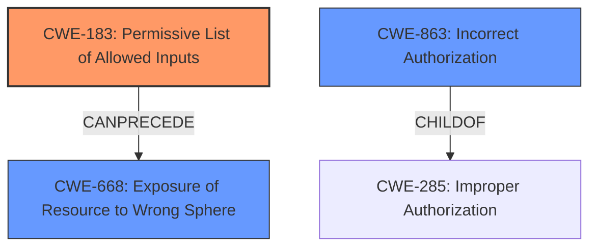

# Raw Analyzer Response for CVE-2021-43415

# Summary
| CWE ID  | CWE Name                                                                   | Confidence | CWE Abstraction Level | CWE Vulnerability Mapping Label | CWE-Vulnerability Mapping Notes |
| :-------- | :------------------------------------------------------------------------- | :--------- | :---------------------- | :------------------------------ | :------------------------------ |
| CWE-183   | Permissive List of Allowed Inputs                                          | 0.9        | Base                    | Primary                         | Allowed                       |
| CWE-863   | Incorrect Authorization                                                  | 0.7        | Class                   | Secondary                       | Allowed-with-Review           |
| CWE-668   | Exposure of Resource to Wrong Sphere                                       | 0.6        | Class                   | Secondary                       | Discouraged                    |

## Evidence and Confidence

*   **Confidence Score:** 0.8
*   **Evidence Strength:** HIGH

## Relationship Analysis
The primary CWE selected is CWE-183 (**Permissive List of Allowed Inputs**), which directly addresses the **root cause** of the vulnerability: the **failure** to adequately restrict allowed image paths, leading to a bypass.

CWE-863 (**Incorrect Authorization**) and CWE-668 (**Exposure of Resource to Wrong Sphere**) are related. CWE-863 reflects the **incorrect authorization** check, or possibly the **missing authorization** aspects of the image path validation bypass, while CWE-668 describes the consequence of **exposing resources** (in this case, the host filesystem) to an unintended sphere of control due to the **failure** of input validation.

The abstraction levels influenced the choice. CWE-183 is a Base-level CWE, which is preferred, and accurately describes the **root cause**. While CWE-863 and CWE-668 are Class-level CWEs, they represent a higher-level view of the issue.

## Vulnerability Chain
The vulnerability chain starts with the **permissive list of allowed inputs** (CWE-183) in the QEMU task driver. This **failure** to properly validate the image paths leads to **incorrect authorization** (CWE-863) because the system **fails** to prevent unauthorized access to the host filesystem. The consequence of this is the **exposure of resources to the wrong sphere** (CWE-668) because the attacker gains access to sensitive resources they should not have.

## Summary of Analysis
The primary assessment is based on the provided evidence, specifically the "CVE Reference Links Content Summary," which states that the "**vulnerability stems from the QEMU task driver in HashiCorp Nomad not properly restricting the command-line arguments passed to QEMU**." This is a clear indication of **insufficient input validation** and a **bypass of intended restrictions**.

The vulnerability description highlights that the vulnerability allows authenticated users to "**bypass the configured allowed image paths**." This directly corresponds to the definition of CWE-183 (**Permissive List of Allowed Inputs**), where the product "**implements a protection mechanism that relies on a list of inputs (or properties of inputs) that are explicitly allowed by policy because the inputs are assumed to be safe, but the list is too permissive - that is, it allows an input that is unsafe, leading to resultant weaknesses.**"

The graph relationships influenced the selection by highlighting potential connections between the CWEs. While CWE-863 and CWE-668 are related to authorization and resource exposure, the **root cause** lies in the **failure** to properly restrict the allowed image paths, making CWE-183 the most accurate and specific choice.

The selected CWEs are at the optimal level of specificity. CWE-183 is a Base-level CWE that directly addresses the **root cause** of the vulnerability. CWE-863 and CWE-668 are Class-level CWEs that represent a higher-level view of the issue, but they are included as secondary CWEs to provide a more comprehensive understanding of the vulnerability.

Other CWEs considered but not used:

*   CWE-285 (**Improper Authorization**): While related to authorization, it's a high-level class and less specific than CWE-183 and CWE-863.
*   CWE-269 (**Improper Privilege Management**): While privilege is involved, the **root cause** is input validation, not privilege management itself.
*   CWE-434 (**Unrestricted Upload of File with Dangerous Type**): This is not an upload issue. It's about bypassing image path restrictions.
*   CWE-79 (**Improper Neutralization of Input During Web Page Generation ('Cross-site Scripting')**): This is not a cross-site scripting issue.