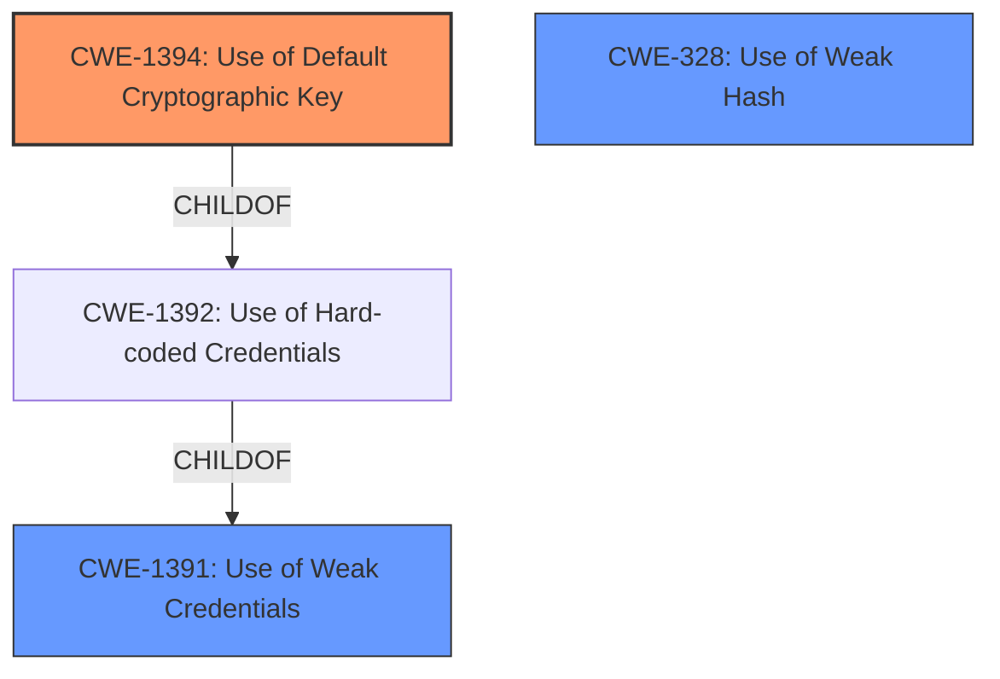

# Raw Analyzer Response for CVE-2021-43444

# Summary
| CWE ID    | CWE Name                                           | Confidence | CWE Abstraction Level | CWE Vulnerability Mapping Label | CWE-Vulnerability Mapping Notes |
| --------- | -------------------------------------------------- | ---------- | ----------------------- | ----------------------------- | ------------------------------- |
| CWE-1394 | Use of Default Cryptographic Key | 0.95       | Base                    | Allowed                       | Primary CWE                     |
| CWE-328  | Use of Weak Hash                                    | 0.75       | Base                    | Allowed                       | Secondary Candidate             |
| CWE-1391 | Use of Weak Credentials                             | 0.75       | Class                    | Allowed-with-Review           | Secondary Candidate             |

## Evidence and Confidence

*   **Confidence Score:** 0.9
*   **Evidence Strength:** HIGH

## Relationship Analysis
The primary relationship influencing the choice of CWE-1394 is its hierarchical position as a child of CWE-1392, indicating a more specific type of credential usage. While CWE-1391 (Use of Weak Credentials) is a parent, CWE-1394 directly addresses the use of default cryptographic keys, aligning precisely with the vulnerability description. CWE-328 (Use of Weak Hash) was considered due to the reference to MD5 signed URLs, but the core issue is the default key, not the hash algorithm's weakness itself in this context.

## Vulnerability Chain
The chain of events is as follows:
1.  **Root Cause:** **Weak default URL signing key** (CWE-1394)
2.  **Weakness:** Predictable/forgeable document download URLs
3.  **Impact:** Unauthorized document access

## Summary of Analysis
The analysis is primarily based on the vulnerability description, which explicitly mentions a "**weak default URL signing key**". The CVE Reference Links Content Summary further supports this by stating, "The MD5 signed URLs are signed using the default string 'verysecretstring'". This confirms the presence of a default key used for signing URLs.

The selection of CWE-1394 is justified because it directly addresses the **root cause** of using a default cryptographic key. It is a Base level CWE, which is the preferred level of abstraction. While other CWEs like CWE-328 (Use of Weak Hash) and CWE-1391 (Use of Weak Credentials) were considered, they are not as specific to the identified **root cause**. The graph relationships helped solidify the choice by illustrating the hierarchical structure and emphasizing the specificity of CWE-1394.

Relevant CWE Information:

# Enhanced Context (25 CWEs)

## CWE-1394: Use of Default Cryptographic Key
**Abstraction:** Base
**Status:** Incomplete

### Description
The product uses a default cryptographic key for potentially critical functionality.

### Extended Description
It is common practice for products to be designed to use default keys. The rationale is to simplify the manufacturing process or the system administrator's task of installation and deployment into an enterprise. However, if admins do not change the defaults, it is easier for attackers to bypass authentication quickly across multiple organizations.

### Alternative Terms
None

### Relationships
ChildOf -> CWE-1392

### Mapping Guidance
**Usage:** Allowed
**Rationale:** This CWE entry is at the Base level of abstraction, which is a preferred level of abstraction for mapping to the root causes of vulnerabilities.
**Comments:** Carefully read both the name and description to ensure that this mapping is an appropriate fit. Do not try to 'force' a mapping to a lower-level Base/Variant simply to comply with this preferred level of abstraction.

### Observed Examples
- **CVE-2018-3825:** cloud cluster management product has a default master encryption key
- **CVE-2016-1561:** backup storage product has a default SSH public key in the authorized_keys file, allowing root access
- **CVE-2010-2306:** Intrusion Detection System (IDS) uses the same static, private SSL keys for multiple devices and installations, allowing decryption of SSL traffic

**Explanation:** The vulnerability description directly states that there's a "**weak default URL signing key**," which aligns precisely with CWE-1394. The use of a default key allows attackers to forge document download URLs, bypassing access controls. This is a critical security flaw. The relationship to CWE-1392 (Use of Hard-coded Credentials) as a parent indicates that while the key might be changeable, its default state is the problem. The "Allowed" mapping guidance and the Base abstraction level further support this choice.

## CWE-328: Use of Weak Hash
**Abstraction:** Base
**Status:** Draft

### Description
The product uses an algorithm that produces a digest (output value) that does not meet security expectations for a hash function that allows an adversary to reasonably determine the original input (preimage attack), find another input that can produce the same hash (2nd preimage attack), or find multiple inputs that evaluate to the same hash (birthday attack).

**Explanation:** While the vulnerability uses MD5 signed URLs, the weakness lies in the default key used for signing, not necessarily in the MD5 algorithm itself (though MD5 is considered weak). If a strong, unique key were used with MD5, the vulnerability would be mitigated. Therefore, CWE-328 is a secondary consideration.

## CWE-1391: Use of Weak Credentials
**Abstraction:** Class
**Status:** Incomplete

### Description
The product uses weak credentials (such as a default key or hard-coded password) that can be calculated, derived, reused, or guessed by an attacker.

**Explanation:** CWE-1391 is a broader class that encompasses the use of default keys. While it's relevant, CWE-1394 is more specific and accurately reflects the **root cause**. The "Allowed-with-Review" mapping guidance suggests examining child entries for a better fit, which leads to CWE-1394.