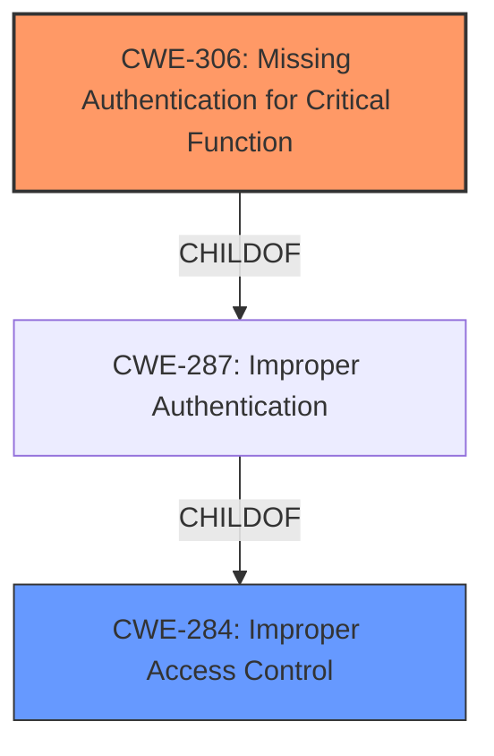

# Raw Analyzer Response for CVE-2021-43447

# Summary
| CWE ID    | CWE Name                                          | Confidence | CWE Abstraction Level | CWE Vulnerability Mapping Label | CWE-Vulnerability Mapping Notes |
| --------- | ------------------------------------------------- | ---------- | --------------------- | ------------------------------- | ------------------------------- |
| CWE-306   | Missing Authentication for Critical Function      | 1.0        | Base                  | Primary                         | Allowed                       |
| CWE-284   | Improper Access Control                           | 0.75       | Pillar                | Secondary                       | Discouraged                   |

## Evidence and Confidence

*   **Confidence Score:** 0.9
*   **Evidence Strength:** HIGH

## Relationship Analysis
The primary CWE is CWE-306 Missing Authentication for Critical Function, which is a Base level CWE. The retriever also suggested CWE-284 Improper Access Control, but this is a Pillar level CWE and is too high level. CWE-306 is a child of CWE-287 Improper Authentication, which is a child of CWE-284. Since we have enough information to select the Base level CWE-306, we will do so.

## Vulnerability Chain
The vulnerability chain starts with the **missing authentication** on the WebSocket endpoint (CWE-306), which then leads to the impact of allowing attackers to edit documents without authentication and potentially leading to data exposure, session hijacking, and remote code execution.

## Summary of Analysis
The initial assessment identified **Incorrect Access Control** as the root cause, leading to an **authentication bypass**. The retriever results and the CVE reference links content summary strongly support the selection of CWE-306 Missing Authentication for Critical Function, as the WebSocket endpoint lacks any authentication mechanism.

The CVE reference links content summary states:
*   **Root Cause:** The ONLYOFFICE document editor's WebSocket endpoint did not require authentication, allowing unauthenticated connections.

The vulnerability description states:
*   ONLYOFFICE all versions as of 2021-11-08 is affected by **Incorrect Access Control**. An **authentication bypass** in the document editor allows attackers to edit documents without authentication.

The selection of CWE-306 is based on the direct evidence of the **missing authentication** for the WebSocket endpoint and the resulting impact. The CWE is at the optimal level of specificity (Base) and is supported by the retriever results and the vulnerability details. Other CWEs like CWE-284 Improper Access Control are too general. CWE-305 Authentication Bypass by Primary Weakness was considered, but the primary weakness is the **missing authentication** itself, making CWE-306 a more direct fit.

Relevant CWE Information:

# Enhanced Context (25 CWEs)

## CWE-303: Incorrect Implementation of Authentication Algorithm
**Abstraction Level**: Base
**Similarity Score**: 0.77
**Source**: dense

**Description**:
The requirements for the product dictate the use of an established authentication algorithm, but the implementation of the algorithm is incorrect.
**Rationale for not selecting**: There is no authentication algorithm used.

## CWE-639: Authorization Bypass Through User-Controlled Key
**Abstraction Level**: Base
**Similarity Score**: 0.76
**Source**: dense

**Description**:
The system's authorization functionality does not prevent one user from gaining access to another user's data or record by modifying the key value identifying the data.
**Rationale for not selecting**: There is no authorization used.

## CWE-807: Reliance on Untrusted Inputs in a Security Decision
**Abstraction Level**: Base
**Similarity Score**: 0.76
**Source**: dense

**Description**:
The product uses a protection mechanism that relies on the existence or values of an input, but the input can be modified by an untrusted actor in a way that bypasses the protection mechanism.
**Rationale for not selecting**: There is no protection mechanism.

## CWE-1390: Weak Authentication
**Abstraction Level**: Class
**Similarity Score**: 0.76
**Source**: dense

**Description**:
The product uses an authentication mechanism to restrict access to specific users or identities, but the mechanism does not sufficiently prove that the claimed identity is correct.
**Rationale for not selecting**: There is no authentication mechanism.

## CWE-274: Improper Handling of Insufficient Privileges
**Abstraction Level**: Base
**Similarity Score**: 0.75
**Source**: dense

**Description**:
The product does not handle or incorrectly handles when it has insufficient privileges to perform an operation, leading to resultant weaknesses.
**Rationale for not selecting**: There is no privilege check.

## CWE-472: External Control of Assumed-Immutable Web Parameter
**Abstraction Level**: Base
**Similarity Score**: 0.75
**Source**: dense

**Description**:
The web application does not sufficiently verify inputs that are assumed to be immutable but are actually externally controllable, such as hidden form fields.
**Rationale for not selecting**: There are no assumed-immutable parameters.

## CWE-302: Authentication Bypass by Assumed-Immutable Data
**Abstraction Level**: Base
**Similarity Score**: 0.75
**Source**: dense

**Description**:
The authentication scheme or implementation uses key data elements that are assumed to be immutable, but can be controlled or modified by the attacker.
**Rationale for not selecting**: There is no authentication.

## CWE-1391: Use of Weak Credentials
**Abstraction Level**: Class
**Similarity Score**: 0.74
**Source**: dense

**Description**:
The product uses weak credentials (such as a default key or hard-coded password) that can be calculated, derived, reused, or guessed by an attacker.
**Rationale for not selecting**: There are no credentials used.

## CWE-1289: Improper Validation of Unsafe Equivalence in Input
**Abstraction Level**: Base
**Similarity Score**: 0.74
**Source**: dense

**Description**:
The product receives an input value that is used as a resource identifier or other type of reference, but it does not validate or incorrectly validates that the input is equivalent to a potentially-unsafe value.
**Rationale for not selecting**: The document does not reference validation.

## CWE-288: Authentication Bypass Using an Alternate Path or Channel
**Abstraction Level**: Base
**Similarity Score**: 0.74
**Source**: dense

**Description**:
The product requires authentication, but the product has an alternate path or channel that does not require authentication.
**Rationale for not selecting**: There is no alternate path.

## CWE-425: Direct Request ('Forced Browsing')
**Abstraction Level**: Base
**Similarity Score**: 6054.87
**Source**: sparse

**Description**:
The web application does not adequately enforce appropriate authorization on all restricted URLs, scripts, or files.
**Rationale for not selecting**: This is an authentication issue.

## CWE-863: Incorrect Authorization
**Abstraction Level**: Class
**Similarity Score**: 6012.06
**Source**: sparse

**Description**:
The product performs an authorization check when an actor attempts to access a resource or perform an action, but it does not correctly perform the check.
**Rationale for not selecting**: There is no authorization check.

## CWE-611: Improper Restriction of XML External Entity Reference
**Abstraction Level**: Base
**Similarity Score**: 5971.00
**Source**: sparse

**Description**:
The product processes an XML document that can contain XML entities with URIs that resolve to documents outside of the intended sphere of control, causing the product to embed incorrect documents into its output.
**Rationale for not selecting**: This is not an XML issue.

## CWE-285: Improper Authorization
**Abstraction Level**: Class
**Similarity Score**: 5925.20
**Source**: sparse

**Description**:
The product does not perform or incorrectly performs an authorization check when an actor attempts to access a resource or perform an action.
**Rationale for not selecting**: There is no authorization check.

## CWE-639: Authorization Bypass Through User-Controlled Key
**Abstraction Level**: Base
**Similarity Score**: 5882.31
**Source**: sparse

**Description**:
The system's authorization functionality does not prevent one user from gaining access to another user's data or record by modifying the key value identifying the data.
**Rationale for not selecting**: There is no authorization check.

## CWE-471: Modification of Assumed-Immutable Data (MAID)
**Abstraction Level**: base
**Similarity Score**: 4.33
**Source**: graph

**Description**:
CWE