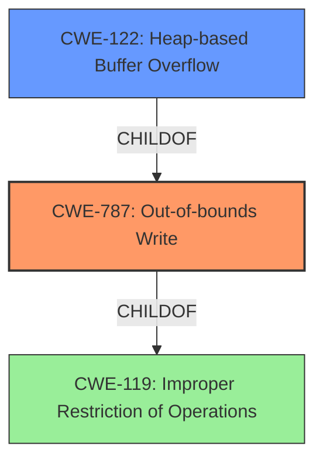

# Raw Analyzer Response for CVE-2021-43527

# Summary
| CWE ID  | CWE Name                                                                 | Confidence | CWE Abstraction Level | CWE Vulnerability Mapping Label | CWE-Vulnerability Mapping Notes |
| :-------- | :----------------------------------------------------------------------- | :---------- | :---------------------- | :------------------------------ | :---------------------------------- |
| CWE-787 | Out-of-bounds Write                                                      | 1          | Base                     | Primary CWE                    | Allowed                              |
| CWE-122 | Heap-based Buffer Overflow                                                 | 0.9         | Variant                  | Secondary CWE                    | Allowed                              |
| CWE-119 | Improper Restriction of Operations within the Bounds of a Memory Buffer | 0.7         | Class                   | Secondary CWE                    | Allowed                               |

## Evidence and Confidence

*   **Confidence Score:** 0.9
*   **Evidence Strength:** HIGH

## Relationship Analysis
The primary weakness is an out-of-bounds write (**CWE-787**) that occurs on the heap, making **CWE-122** (Heap-based Buffer Overflow) a more specific variant of **CWE-787**. Both **CWE-787** and **CWE-122** are children of **CWE-119** (Improper Restriction of Operations within the Bounds of a Memory Buffer), which represents the broader class of memory boundary errors. The selection of **CWE-787** as primary and **CWE-122** as secondary reflects the specific location (heap) and type (out-of-bounds write) of the error.

## Vulnerability Chain
The chain of events starts with **improper input validation** of signature lengths, leading to a **heap overflow** (**CWE-122**), which is an instance of **out-of-bounds write** (**CWE-787**).

## Summary of Analysis
The primary weakness is a **heap overflow** due to **improper input validation**. This leads to an **out-of-bounds write** on the heap.

The provided information states, "NSS (Network Security Services) versions prior to 3.73 or 3.68.1 ESR are vulnerable to a **heap overflow** when handling DER-encoded DSA or RSA-PSS signatures." Further, the "CVE Reference Links Content Summary" section indicates that "The function fails to properly validate the length of the signature data before copying it to a fixed-size buffer," and "The overflow occurs in a heap-allocated buffer within the `VFYContextStr` structure, potentially corrupting other heap data."

Based on this evidence, **CWE-787** (Out-of-bounds Write) is the most appropriate primary CWE because the core issue is writing data beyond the intended buffer's boundaries. **CWE-122** (Heap-based Buffer Overflow) is selected as a secondary CWE to provide more specific context, as the overflow occurs on the heap. **CWE-119** is selected as a tertiary CWE to represent the broader class of memory boundary errors. The selection of these CWEs is based on the evidence and relationship analysis, ensuring the most accurate and specific classification possible.

Relevant CWE Information:

# Enhanced Context (25 CWEs)
The following CWEs were identified as potentially relevant to this vulnerability:

## CWE-1289: Improper Validation of Unsafe Equivalence in Input
**Abstraction Level**: Base
**Similarity Score**: 0.77
**Source**: dense

**Description**:
The product receives an input value that is used as a resource identifier or other type of reference, but it does not validate or incorrectly validates that the input is equivalent to a potentially-unsafe value.
**Didn't Select**: This is not the root cause, the input that is not validated is the quantity of the data to be written to the buffer, not an equivalence comparison.

## CWE-125: Out-of-bounds Read
**Abstraction Level**: Base
**Similarity Score**: 0.77
**Source**: dense

**Description**:
The product reads data past the end, or before the beginning, of the intended buffer.
**Didn't Select**: The vulnerability is about writing out of bounds not reading out of bounds.

## CWE-74: Improper Neutralization of Special Elements in Output Used by a Downstream Component ('Injection')
**Abstraction Level**: Class
**Similarity Score**: 0.76
**Source**: dense

**Description**:
The product constructs all or part of a command, data structure, or record using externally-influenced input from an upstream component, but it does not neutralize or incorrectly neutralizes special elements that could modify how it is parsed or interpreted when it is sent to a downstream component.
**Didn't Select**: This CWE is too high level. The vulnerability is not about injection.

## CWE-345: Insufficient Verification of Data Authenticity
**Abstraction Level**: Class
**Similarity Score**: 0.76
**Source**: dense

**Description**:
The product does not sufficiently verify the origin or authenticity of data, in a way that causes it to accept invalid data.
**Didn't Select**: The vulnerability is not about data authenticity, but about a buffer overflow.

## CWE-138: Improper Neutralization of Special Elements
**Abstraction Level**: Class
**Similarity Score**: 0.76
**Source**: dense

**Description**:
The product receives input from an upstream component, but it does not neutralize or incorrectly neutralizes special elements that could be interpreted as control elements or syntactic markers when they are sent to a downstream component.
**Didn't Select**: The vulnerability is not about neutralization of special elements.

## CWE-191: Integer Underflow (Wrap or Wraparound)
**Abstraction Level**: Base
**Similarity Score**: 0.76
**Source**: dense

**Description**:
The product subtracts one value from another, such that the result is less than the minimum allowable integer value, which produces a value that is not equal to the correct result.
**Didn't Select**: This CWE is not related to integer underflow.

## CWE-116: Improper Encoding or Escaping of Output
**Abstraction Level**: Class
**Similarity Score**: 0.76
**Source**: dense

**Description**:
The product prepares a structured message for communication with another component, but encoding or escaping of the data is either missing or done incorrectly. As a result, the intended structure of the message is not preserved.
**Didn't Select**: This CWE is not related to encoding or escaping of output.

## CWE-131: Incorrect Calculation of Buffer Size
**Abstraction Level**: Base
**Similarity Score**: 0.76
**Source**: dense

**Description**:
The product does not correctly calculate the size to be used when allocating a buffer, which could lead to a buffer overflow.
**Didn't Select**: The CVE details that the data is copied into a fixed size buffer, and that the length of the data is not validated before the copy. This means that the size of the buffer is not incorrectly calculated, but that a fixed size is used and the data is not validated.

## CWE-297: Improper Validation of Certificate with Host Mismatch
**Abstraction Level**: Variant
**Similarity Score**: 0.76
**Source**: dense

**Description**:
The product communicates with a host that provides a certificate, but the product does not properly ensure that the certificate is actually associated with that host.
**Didn't Select**: This CWE is not related to certificate validation with host mismatch.

## CWE-295: Improper Certificate Validation
**Abstraction Level**: Base
**Similarity Score**: 0.76
**Source**: dense

**Description**:
The product does not validate, or incorrectly validates, a certificate.
**Didn't Select**: This is related to certificate validation, but the root cause is a heap overflow.

## CWE-190: Integer Overflow or Wraparound
**Abstraction Level**: Base
**Similarity Score**: 7492.85
**Source**: sparse

**Description**:
The product performs a calculation that can
         produce an integer overflow or wraparound when the logic
         assumes that the resulting value will always be larger than
         the original value. This occurs when an integer value is
         incremented to a value that is too large to store in the
         associated representation. When this occurs, the value may
         become a very small or negative number.
**Didn't Select**: Although integer overflows can lead to heap overflows, this is not the primary weakness.

## CWE-1284