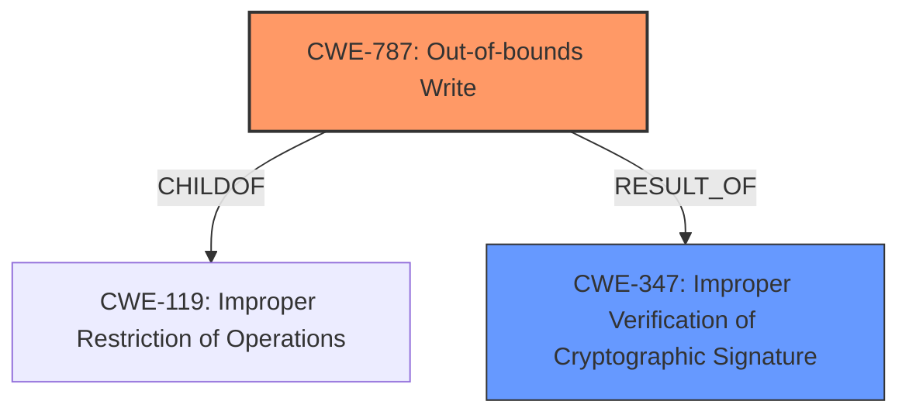

# Analysis for CVE-2021-43529

# Summary
| CWE ID | CWE Name | Confidence | CWE Abstraction Level | CWE Vulnerability Mapping Label | CWE-Vulnerability Mapping Notes |
|---|---|---|---|---|---|
| CWE-787 | Out-of-bounds Write | 0.9 | Base | Allowed | Primary CWE |
| CWE-347 | Improper Verification of Cryptographic Signature | 0.7 | Base | Allowed | Secondary CWE |

## Evidence and Confidence

*   **Confidence Score:** 0.8
*   **Evidence Strength:** HIGH

## Relationship Analysis
The primary relationship is that of a heap overflow (CWE-787) resulting from **insufficient certificate verification** (CWE-347). CWE-787 is a child of CWE-119 (Improper Restriction of Operations within the Bounds of a Memory Buffer), illustrating the general category of buffer handling issues. CWE-347 is linked to the root cause of the **insufficient verification** process during automatic import of S/MIME certificates.

## Vulnerability Chain
The vulnerability chain starts with **insufficient certificate verification** (CWE-347) during the automatic import of S/MIME certificates. This leads to the acceptance of malicious certificates, which, when processed, trigger a **heap overflow** (CWE-787) due to the vulnerable code in `decodeECorDsaSignature` (CVE-2021-43527). The final impact is memory corruption and potential code execution.

## Summary of Analysis
The initial assessment points to a **heap overflow** (CWE-787) triggered by processing S/MIME messages with maliciously crafted certificates. The root cause is the **insufficient verification** of these certificates (CWE-347).

The evidence supporting this includes:
*   **Vulnerability Description Key Phrases:** "**heap overflow**"
*   **CVE Reference Links Content Summary:** "The vulnerability stems from the automatic import of S/MIME certificates during the processing of signed emails...the vulnerability is a result of an **insufficient verification** process during automatic import of S/MIME certificates...the vulnerability is directly linked to a heap overflow described in CVE-2021-43527 during the processing of DER-encoded DSA or RSA-PSS signatures in S/MIME messages."

The relationship analysis shows that CWE-787 is a child of CWE-119, representing a specific type of memory corruption. The chain analysis clearly maps the progression from **insufficient verification** to the **heap overflow**.

CWE-787 is the most specific and appropriate classification for the **heap overflow** condition. CWE-347 captures the root cause of **insufficient certificate verification**, which allowed the malicious certificates to be processed in the first place. Both CWEs are at the Base level of abstraction.

**CWEs Considered but Not Used:**
*   CWE-190 (Integer Overflow or Wraparound): While integer overflows can lead to memory corruption, the primary issue here is a **heap overflow** due to **insufficient verification** of certificates, not an integer overflow.
*   CWE-122 (Heap-based Buffer Overflow): This is a more specific variant of out-of-bounds write, but since the description only mentions the **heap overflow** and not the mechanism behind it, it's better to use CWE-787.
*   CWE-125 (Out-of-bounds Read): The core issue is writing past the end of the buffer, making CWE-787 more relevant than a read.
*   CWE-843 (Access of Resource Using Incompatible Type ('Type Confusion')): While type confusion can lead to memory corruption, the primary issue is the **heap overflow** resulting from **insufficient certificate verification**.

Relevant CWE Information:

# Enhanced Context (25 CWEs)
The following CWEs were identified as potentially relevant to this vulnerability:

## CWE-191: Integer Underflow (Wrap or Wraparound)
**Abstraction Level**: Base
**Similarity Score**: 0.79
**Source**: dense

**Description**:
The product subtracts one value from another, such that the result is less than the minimum allowable integer value, which produces a value that is not equal to the correct result.

**Mapping Guidance**:
- Usage: Allowed
- Rationale: This CWE entry is at the Base level of abstraction, which is a preferred level of abstraction for mapping to the root causes of vulnerabilities.

## CWE-131: Incorrect Calculation of Buffer Size
**Abstraction Level**: Base
**Similarity Score**: 0.78
**Source**: dense

**Description**:
The product does not correctly calculate the size to be used when allocating a buffer, which could lead to a buffer overflow.

**Mapping Guidance**:
- Usage: Allowed
- Rationale: This CWE entry is at the Base level of abstraction, which is a preferred level of abstraction for mapping to the root causes of vulnerabilities.

## CWE-193: Off-by-one Error
**Abstraction Level**: Base
**Similarity Score**: 0.77
**Source**: dense

**Description**:
A product calculates or uses an incorrect maximum or minimum value that is 1 more, or 1 less, than the correct value.

**Mapping Guidance**:
- Usage: Allowed
- Rationale: This CWE entry is at the Base level of abstraction, which is a preferred level of abstraction for mapping to the root causes of vulnerabilities.

## CWE-197: Numeric Truncation Error
**Abstraction Level**: Base
**Similarity Score**: 0.76
**Source**: dense

**Description**:
Truncation errors occur when a primitive is cast to a primitive of a smaller size and data is lost in the conversion.

**Mapping Guidance**:
- Usage: Allowed
- Rationale: This CWE entry is at the Base level of abstraction, which is a preferred level of abstraction for mapping to the root causes of vulnerabilities.

## CWE-681: Incorrect Conversion between Numeric Types
**Abstraction Level**: Base
**Similarity Score**: 0.76
**Source**: dense

**Description**:
When converting from one data type to another, such as long to integer, data can be omitted or translated in a way that produces unexpected values. If the resulting values are used in a sensitive context, then dangerous behaviors may occur.

**Mapping Guidance**:
- Usage: Allowed
- Rationale: This CWE entry is at the Base level of abstraction, which is a preferred level of abstraction for mapping to the root causes of vulnerabilities.

## CWE-125: Out-of-bounds Read
**Abstraction Level**: Base
**Similarity Score**: 0.76
**Source**: dense

**Description**:
The product reads data past the end, or before the beginning, of the intended buffer.

**Mapping Guidance**:
- Usage: Allowed
- Rationale: This CWE entry is at the Base level of abstraction, which is a preferred level of abstraction for mapping to the root causes of vulnerabilities.

## CWE-805: Buffer Access with Incorrect Length Value
**Abstraction Level**: Base
**Similarity Score**: 0.75
**Source**: dense

**Description**:
The product uses a sequential operation to read or write a buffer, but it uses an incorrect length value that causes it to access memory that is outside of the bounds of the buffer.

**Mapping Guidance**:
- Usage: Allowed
- Rationale: This CWE entry is at the Base level of abstraction, which is a preferred level of abstraction for mapping to the root causes of vulnerabilities.

## CWE-190: Integer Overflow or Wraparound
**Abstraction Level**: Base
**Similarity Score**: 0.75
**Source**: dense

**Description**:
The product performs a calculation that can
         produce an integer overflow or wraparound when the logic
         assumes that the resulting value will always be larger than
         the original value. This occurs when an integer value is
         incremented to a value that is too large to store in the
         associated representation. When this occurs, the value may
         become a very small or negative number.

**Mapping Guidance**:
- Usage: Allowed
- Rationale: This CWE entry is at the Base level of abstraction, which is a preferred level of abstraction for mapping to the root causes of vulnerabilities.

## CWE-404: Improper Resource Shutdown or Release
**Abstraction Level**: Class
**Similarity Score**: 0.75
**Source**: dense

**Description**:
The product does not release or incorrectly releases a resource before it is made available for re-use.

**Mapping Guidance**:
- Usage: Allowed-with-Review
- Rationale: This CWE entry is a Class and