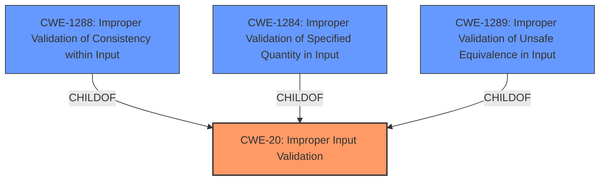

# Raw Analyzer Response for CVE-2021-43548

# Summary
| CWE ID | CWE Name | Confidence | CWE Abstraction Level | CWE Vulnerability Mapping Label | CWE-Vulnerability Mapping Notes |
|---|---|---|---|---|---|
| CWE-20 | Improper Input Validation | 0.9 | Class | Primary | Discouraged |
| CWE-1288 | Improper Validation of Consistency within Input | 0.7 | Base | Secondary | Allowed |
| CWE-1284 | Improper Validation of Specified Quantity in Input | 0.6 | Base | Secondary | Allowed |
| CWE-1289 | Improper Validation of Unsafe Equivalence in Input | 0.5 | Base | Secondary | Allowed |

## Evidence and Confidence

*   **Confidence Score:** 0.8
*   **Evidence Strength:** HIGH

## Relationship Analysis
The analysis focused on the root cause of the vulnerability, which is **improper input validation**. CWE-20 is a class-level CWE, and while it is discouraged for direct mapping, the provided context does not offer enough information to determine a more specific variant. Therefore, it's used as the primary CWE. CWE-1288, CWE-1284, and CWE-1289 are considered as secondary candidates because they represent more specific types of input validation issues that might be present.

## Vulnerability Chain
The vulnerability chain starts with **improper input validation** (CWE-20), which can then lead to denial of service or unauthorized access to data. The provided information does not give the exact sequence of weaknesses but instead gives us the root cause and its potential impact.

## Summary of Analysis
The primary assessment is based on the provided evidence, specifically the vulnerability description stating that the product "**does not validate or incorrectly validates that the input has the properties required to process the data safely and correctly**". The CVE Reference Links Content Summary reinforces this by stating: "The Patient Information Center iX (PIC iX) Versions C.02 and C.03 do not properly validate input data, which allows for processing of potentially unsafe or incorrect data."

CWE-20 is chosen as the primary CWE because it directly reflects the **lack of input validation**. However, since CWE-20 is discouraged, more specific CWEs like CWE-1288, CWE-1284, and CWE-1289 were considered. Due to insufficient information to pinpoint the exact type of **improper validation**, they are classified as secondary. The final selection aims for the optimal level of specificity based on the available evidence.

Relevant CWE Information:

# Enhanced Context (25 CWEs)

## CWE-1289: Improper Validation of Unsafe Equivalence in Input
**Abstraction Level**: Base
**Similarity Score**: 0.81
**Source**: dense

**Description**:
The product receives an input value that is used as a resource identifier or other type of reference, but it does not validate or incorrectly validates that the input is equivalent to a potentially-unsafe value.

**Mapping Guidance**:
- Usage: Allowed
- Rationale: This CWE entry is at the Base level of abstraction, which is a preferred level of abstraction for mapping to the root causes of vulnerabilities.

**Technical Explanation**:
This CWE describes a scenario where an input is used as a reference but isn't checked for equivalence against potentially unsafe values. While the vulnerability description mentions **incorrect validation**, it doesn't specify that it involves unsafe equivalence. Thus, this CWE is considered as a secondary candidate.

## CWE-807: Reliance on Untrusted Inputs in a Security Decision
**Abstraction Level**: Base
**Similarity Score**: 0.77
**Source**: dense

**Description**:
The product uses a protection mechanism that relies on the existence or values of an input, but the input can be modified by an untrusted actor in a way that bypasses the protection mechanism.

**Mapping Guidance**:
- Usage: Allowed
- Rationale: This CWE entry is at the Base level of abstraction, which is a preferred level of abstraction for mapping to the root causes of vulnerabilities.

**Technical Explanation**:
This CWE isn't directly applicable as the description focuses on **improper validation** rather than reliance on untrusted inputs in security decisions.

## CWE-1288: Improper Validation of Consistency within Input
**Abstraction Level**: Base
**Similarity Score**: 0.77
**Source**: dense

**Description**:
The product receives a complex input with multiple elements or fields that must be consistent with each other, but it does not validate or incorrectly validates that the input is actually consistent.

**Mapping Guidance**:
- Usage: Allowed
- Rationale: This CWE entry is at the Base level of abstraction, which is a preferred level of abstraction for mapping to the root causes of vulnerabilities.

**Technical Explanation**:
This CWE is considered as a secondary candidate because the input might be complex and require consistency checks that are not properly implemented.

## CWE-297: Improper Validation of Certificate with Host Mismatch
**Abstraction Level**: Variant
**Similarity Score**: 0.77
**Source**: dense

**Description**:
The product communicates with a host that provides a certificate, but the product does not properly ensure that the certificate is actually associated with that host.

**Mapping Guidance**:
- Usage: Allowed
- Rationale: This CWE entry is at the Variant level of abstraction, which is a preferred level of abstraction for mapping to the root causes of vulnerabilities.

**Technical Explanation**:
This CWE is not applicable because the vulnerability description doesn't involve certificate validation or host mismatch.

## CWE-345: Insufficient Verification of Data Authenticity
**Abstraction Level**: Class
**Similarity Score**: 0.76
**Source**: dense

**Description**:
The product does not sufficiently verify the origin or authenticity of data, in a way that causes it to accept invalid data.

**Mapping Guidance**:
- Usage: Discouraged
- Rationale: This CWE entry is a level-1 Class (i.e., a child of a Pillar). It might have lower-level children that would be more appropriate

**Technical Explanation**:
While data authenticity could be related, the primary **weakness** is the lack of **improper input validation** in general, not specifically data authenticity.

## CWE-295: Improper Certificate Validation
**Abstraction Level**: Base
**Similarity Score**: 0.76
**Source**: dense

**Description**:
The product does not validate, or incorrectly validates, a certificate.

**Mapping Guidance**:
- Usage: Allowed
- Rationale: This CWE entry is at the Base level of abstraction, which is a preferred level of abstraction for mapping to the root causes of vulnerabilities.

**Technical Explanation**:
This CWE is not applicable because the vulnerability description doesn't involve certificate validation.

## CWE-703: Improper Check or Handling of Exceptional Conditions
**Abstraction Level**: Pillar
**Similarity Score**: 0.76
**Source**: dense

**Description**:
The product does not properly anticipate or handle exceptional conditions that rarely occur during normal operation of the product.

**Mapping Guidance**:
- Usage: Discouraged
- Rationale: This CWE entry is extremely high-level, a Pillar.

**Technical Explanation**:
This CWE is too general and doesn't directly relate to **improper input validation**.

## CWE-657: Violation of Secure Design Principles
**Abstraction Level**: Class
**Similarity Score**: 0.76
**Source**: dense

**Description**:
The product violates well-established principles for secure design.

**Mapping Guidance**:
- Usage: Discouraged
- Rationale: This CWE entry is a level-1 Class (i.e., a child of a Pillar). It might have lower-level children that would be more appropriate

**Technical Explanation**:
This CWE is too general and doesn't specifically address the **improper input validation**.

## CWE-184: Incomplete List of Disallowed Inputs
**Abstraction Level**: Base
**Similarity Score**: 0.75
**Source**: dense

**Description**:
The product implements a protection mechanism that relies on a list of inputs (or properties of inputs) that are not allowed by policy or otherwise require other action to neutralize before additional processing takes place, but the list is incomplete.

**Mapping Guidance**:
- Usage: Allowed
- Rationale: This CWE entry is at the Base level of abstraction, which is a preferred level of abstraction for