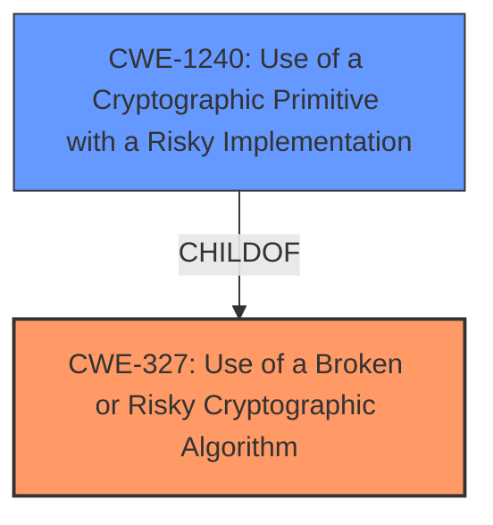

# Enhanced Analysis for CVE-2021-43550

# Summary
| CWE ID | CWE Name | Confidence | CWE Abstraction Level | CWE Vulnerability Mapping Label | CWE-Vulnerability Mapping Notes |
|---|---|---|---|---|---|
| CWE-327 | Use of a Broken or Risky Cryptographic Algorithm | 1.0 | Class | Primary | Allowed-with-Review |
| CWE-1240 | Use of a Cryptographic Primitive with a Risky Implementation | 0.75 | Base | Secondary | Allowed |

## Evidence and Confidence

*   **Confidence Score:** 0.9
*   **Evidence Strength:** HIGH

## Relationship Analysis
The primary CWE selected is CWE-327, "Use of a Broken or Risky Cryptographic Algorithm," which is a Class-level CWE. CWE-1240, "Use of a Cryptographic Primitive with a Risky Implementation," is a child of CWE-327 and a Base-level CWE and was considered as a more specific alternative. However, the description of the vulnerability did not provide enough detail to definitively determine if the issue was with the implementation of a cryptographic primitive rather than the algorithm itself, so CWE-327 was chosen as the primary CWE.



## Vulnerability Chain
The vulnerability chain consists of the **use of a broken or risky cryptographic algorithm** (CWE-327), which leads to the exposure of sensitive information.
  - Root Cause: CWE-327: Use of a Broken or Risky Cryptographic Algorithm
  - Impact: Exposure of Sensitive Information

## Summary of Analysis
The initial analysis focused on identifying the root cause of the vulnerability. The key phrase "**broken or risky cryptographic algorithm**" in the vulnerability description and the "CVE Reference Links Content Summary" directly pointed to issues related to cryptography. Both the retriever results and the vulnerability description support CWE-327: Use of a Broken or Risky Cryptographic Algorithm as a strong candidate.

The vulnerability description states, "The use of a **broken or risky cryptographic algorithm** is an unnecessary risk that may result in the exposure of sensitive information." The "CVE Reference Links Content Summary" further validates this, stating, "The vulnerability stems from the use of a broken or risky cryptographic algorithm" and "CWE-327: Use of a Broken or Risky Cryptographic Algorithm: The system employs a flawed cryptographic algorithm, increasing the risk of exposing sensitive information during communication."

CWE-327 is a Class-level CWE, and the guidance suggests examining child CWEs for a better fit. CWE-1240: Use of a Cryptographic Primitive with a Risky Implementation, which is a Base-level CWE and a child of CWE-327, was considered. However, the provided information did not specify whether the issue was with the algorithm itself or its specific implementation. Therefore, CWE-327 was chosen as the primary CWE because it more accurately represents the available information.

CWE-1240 is included as a secondary candidate.

The retriever results listed several other CWEs, including CWE-328: Use of Weak Hash, CWE-916: Use of Password Hash With Insufficient Computational Effort, and CWE-208: Observable Timing Discrepancy. However, these were not chosen because the vulnerability description and CVE summary clearly indicate a problem with the cryptographic algorithm itself, not specifically with hashing or timing discrepancies.

Relevant CWE Information:

# Enhanced Context (25 CWEs)

## CWE-1240: Use of a Cryptographic Primitive with a Risky Implementation
**Abstraction Level**: Base
**Similarity Score**: 0.77
**Source**: dense

**Description**:
To fulfill the need for a cryptographic primitive, the product implements a cryptographic algorithm using a non-standard, unproven, or disallowed/non-compliant cryptographic implementation.

**Mapping Guidance**:
- Usage: Allowed
- Rationale: This CWE entry is at the Base level of abstraction, which is a preferred level of abstraction for mapping to the root causes of vulnerabilities.

## CWE-327: Use of a Broken or Risky Cryptographic Algorithm
**Abstraction:** Class
**Status:** Draft

### Description
The product uses a broken or risky cryptographic algorithm or protocol.

### Extended Description
Cryptographic algorithms are the methods by which data is scrambled to prevent observation or influence by unauthorized actors. Insecure cryptography can be exploited to expose sensitive information, modify data in unexpected ways, spoof identities of other users or devices, or other impacts.

## CWE-328: Use of Weak Hash
**Abstraction Level**: Base
**Similarity Score**: 0.74
**Source**: dense

**Description**:
The product uses an algorithm that produces a digest (output value) that does not meet security expectations for a hash function that allows an adversary to reasonably determine the original input (preimage attack), find another input that can produce the same hash (2nd preimage attack), or find multiple inputs that evaluate to the same hash (birthday attack).

## CWE-321: Use of Hard-coded Cryptographic Key
**Abstraction:** Variant
**Status:** Draft

### Description
The use of a hard-coded cryptographic key significantly increases the possibility that encrypted data may be recovered.


## CWE Relationship Analysis

Current CWEs represent these abstraction levels: .


### Vulnerability Chain Analysis

**Chain starting from CWE-916:**
- 916 (Use of Password Hash With Insufficient Computational Effort) - ROOT


**Chain starting from CWE-208:**
- 208 (Observable Timing Discrepancy) - ROOT


### CWE Relationship Diagram

```mermaid
graph TD
    classDef primary fill:#f96,stroke:#333,stroke-width:2px
    classDef secondary fill:#69f,stroke:#333
    classDef tertiary fill:#9e9,stroke:#333
```