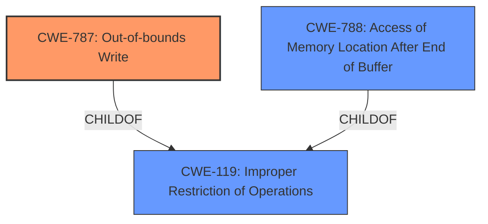

# Analysis for CVE-2021-43755

# Summary
| CWE ID | CWE Name | Confidence | CWE Abstraction Level | CWE Vulnerability Mapping Label | CWE-Vulnerability Mapping Notes |
|---|---|---|---|---|---|
| CWE-787 | Out-of-bounds Write | 1.0 | Base | Primary | Allowed |
| CWE-788 | Access of Memory Location After End of Buffer | 0.7 | Base | Secondary | Discouraged |
| CWE-119 | Improper Restriction of Operations within the Bounds of a Memory Buffer | 0.4 | Class | Secondary | Discouraged |

## Evidence and Confidence

*   **Confidence Score:** 1.0
*   **Evidence Strength:** HIGH

## Relationship Analysis
The primary CWE is CWE-787 (**Out-of-bounds Write**), which is a base-level CWE and a child of CWE-119 (**Improper Restriction of Operations within the Bounds of a Memory Buffer**). CWE-788 (**Access of Memory Location After End of Buffer**) is also a child of CWE-119 and is closely related to CWE-787. However, CWE-787 is a better fit because the vulnerability description explicitly mentions an **Out-of-bounds Write**. While CWE-788 describes the access after the end of the buffer, the core issue is the writing operation, making CWE-787 the more precise choice.

## Vulnerability Chain
The vulnerability chain starts with the **insecure handling** of a malicious file, which leads to an **Out-of-bounds Write**, potentially resulting in arbitrary code execution.

## Summary of Analysis
The analysis is based on the vulnerability description, which explicitly mentions an **Out-of-bounds Write**. The **CVE Reference Links Content Summary** also supports this, stating that the root cause of the vulnerability is the access of a memory location after the end of the buffer. However, since the vulnerability results in writing data past the end of the buffer, CWE-787 is the most appropriate choice.

The vulnerability description key phrases also highlight the following:
- **rootcause:** **insecure handling**
- **weakness:** **Out-of-bounds Write**
- **impact:** arbitrary code execution

Based on the provided information, I am confident that CWE-787 is the most appropriate CWE for this vulnerability.

Relevant CWE Information:

# Enhanced Context (25 CWEs)

## CWE-131: Incorrect Calculation of Buffer Size
**Abstraction Level**: Base
**Similarity Score**: 0.78
**Source**: dense

**Description**:
The product does not correctly calculate the size to be used when allocating a buffer, which could lead to a buffer overflow.
*This CWE was considered but is not a fit. There's no mention of incorrect buffer size calculation in the description. The root cause is the insecure handling of a malicious file, leading to an out-of-bounds write, not an incorrect size calculation.*

## CWE-125: Out-of-bounds Read
**Abstraction Level**: Base
**Similarity Score**: 0.77
**Source**: dense

**Description**:
The product reads data past the end, or before the beginning, of the intended buffer.
*This CWE was considered but is not the primary issue. The vulnerability description explicitly mentions an **Out-of-bounds Write**, not a read.*

## CWE-788: Access of Memory Location After End of Buffer
**Abstraction Level**: Base
**Similarity Score**: 0.77
**Source**: dense

**Description**:
The product reads or writes to a buffer using an index or pointer that references a memory location after the end of the buffer.
*This CWE was considered as a secondary candidate since it describes the access after the end of the buffer. However, the core issue is the writing operation, making CWE-787 the more precise choice.*

## CWE-805: Buffer Access with Incorrect Length Value
**Abstraction Level**: Base
**Similarity Score**: 0.77
**Source**: dense

**Description**:
The product uses a sequential operation to read or write a buffer, but it uses an incorrect length value that causes it to access memory that is outside of the bounds of the buffer.
*This CWE was considered but is not a good fit. The description doesn't mention anything about incorrect length values.*

## CWE-191: Integer Underflow (Wrap or Wraparound)
**Abstraction Level**: Base
**Similarity Score**: 0.76
**Source**: dense

**Description**:
The product subtracts one value from another, such that the result is less than the minimum allowable integer value, which produces a value that is not equal to the correct result.
*This CWE was not considered because the vulnerability does not involve integer underflow.*

## CWE-823: Use of Out-of-range Pointer Offset
**Abstraction Level**: Base
**Similarity Score**: 0.76
**Source**: dense

**Description**:
The product performs pointer arithmetic on a valid pointer, but it uses an offset that can point outside of the intended range of valid memory locations for the resulting pointer.
*This CWE was considered, but the description focuses on an **Out-of-bounds Write**, not specifically an out-of-range pointer offset. The **insecure handling** leads directly to the write operation.*

## CWE-124: Buffer Underwrite ('Buffer Underflow')
**Abstraction Level**: Base
**Similarity Score**: 0.76
**Source**: dense

**Description**:
The product writes to a buffer using an index or pointer that references a memory location prior to the beginning of the buffer.
*This CWE was not considered because the vulnerability involves writing past the end of the buffer, not before the beginning.*

## CWE-126: Buffer Over-read
**Abstraction Level**: Variant
**Similarity Score**: 0.76
**Source**: dense

**Description**:
The product reads from a buffer using buffer access mechanisms such as indexes or pointers that reference memory locations after the targeted buffer.
*This CWE was not considered because the vulnerability is an **Out-of-bounds Write**, not a read.*

## CWE-119: Improper Restriction of Operations within the Bounds of a Memory Buffer
**Abstraction Level**: Class
**Similarity Score**: 0.76
**Source**: dense

**Description**:
The product performs operations on a memory buffer, but it reads from or writes to a memory location outside the buffer's intended boundary. This may result in read or write operations on unexpected memory locations that could be linked to other variables, data structures, or internal program data.
*This CWE was considered as a general case, but CWE-787 provides a more specific description of the vulnerability.*

## CWE-404: Improper Resource Shutdown or Release
**Abstraction Level**: Class
**Similarity Score**: 0.75
**Source**: dense

**Description**:
The product does not release or incorrectly releases a resource before it is made available for re-use.
*This CWE was not considered because the vulnerability does not involve resource management issues.*

## CWE-1284: Improper Validation of Specified Quantity in Input
**Abstraction Level**: Base
**Similarity Score**: 6429.63
**Source**: sparse

**Description**:
The product receives input that is expected to specify a quantity (such as size or length), but it does not validate or incorrectly validates that the quantity has the required properties.
*This CWE was considered but is not a primary factor. While **insecure handling** could involve validation, the direct consequence is the out-of-bounds write.*

## CWE-41: Improper Resolution of Path Equivalence
**Abstraction Level**: base
**Similarity Score**: 5.03
**Source**: graph

**Description**:
CWE-41: Improper Resolution of Path Equivalence
*This CWE was not considered because the vulnerability does not involve path equivalence issues.*

## CWE-170: Improper Null Termination
**Abstraction Level**: base
**Similarity Score**: 4.33
**Source**: graph

**Description**:
CWE-170: Improper Null Termination
*This CWE was not considered because the vulnerability does not involve null termination issues.*

## CWE-130: Improper Handling of Length Parameter Inconsistency
**Abstraction Level**: base
**Similarity Score**: 4.33
**Source**: graph

**Description**:
CWE-130: Improper Handling of Length Parameter Inconsistency
*This CWE was considered, but the description doesn't suggest any length parameter inconsistencies.*

## CWE-190: Integer Overflow