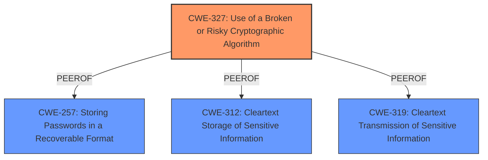

# Raw Analyzer Response for CVE-2021-43774

# Summary
| CWE ID | CWE Name | Confidence | CWE Abstraction Level | CWE Vulnerability Mapping Label | CWE-Vulnerability Mapping Notes |
|---|---|---|---|---|---|
| **CWE-327** | Use of a Broken or Risky Cryptographic Algorithm | 1.0 | Class | Primary | Allowed-with-Review |
| CWE-257 | Storing Passwords in a Recoverable Format | 0.7 | Base | Secondary | Allowed |
| CWE-312 | Cleartext Storage of Sensitive Information | 0.6 | Base | Secondary | Allowed |
| CWE-319 | Cleartext Transmission of Sensitive Information | 0.6 | Base | Secondary | Allowed |

## Evidence and Confidence

*   **Confidence Score:** 1.0
*   **Evidence Strength:** HIGH

## Relationship Analysis
The primary classification is **CWE-327** Use of a Broken or Risky Cryptographic Algorithm, a Class-level CWE.
Several other CWEs were considered, mainly **CWE-257** Storing Passwords in a Recoverable Format, **CWE-312** Cleartext Storage of Sensitive Information, and **CWE-319** Cleartext Transmission of Sensitive Information. The selection of **CWE-327** as the primary CWE takes into account that the vulnerability stems from the **weak encryption** used, rather than the storage or transmission aspects, although those are potential consequences.

## Vulnerability Chain
The vulnerability chain starts with the **root cause**, the use of a **weak cipher** (ROT13), leading to the **impact** of being able to retrieve the original password and potentially compromising domain or FTP user accounts. The chain is:
1.  **CWE-327** Use of a Broken or Risky Cryptographic Algorithm (Root Cause: **weak cipher**)
2.  **CWE-257** Storing Passwords in a Recoverable Format (Impact: passwords easily recoverable)
3.  **CWE-312** Cleartext Storage of Sensitive Information (Since the password is encrypted with a **weak cipher**, it is considered storing it in cleartext)
4.  **CWE-319** Cleartext Transmission of Sensitive Information (Since the password is encrypted with a **weak cipher**, it is considered transmitting it in cleartext)

## Summary of Analysis
The initial analysis focused on identifying the **root cause** of the vulnerability, which is the use of a **weak cipher**. The vulnerability description clearly states, "The passwords are protected by a **weak cipher**, such as ROT13, which requires minimal effort to instantly retrieve the original password." The CVE Reference Links Content Summary further supports this by stating, "Weak cryptography used to protect the address book information when exporting to CSV files" and "Use of a weak encryption algorithm (identified as ROT13 by Foregenix)."

The primary CWE, **CWE-327** Use of a Broken or Risky Cryptographic Algorithm, directly addresses this **weakness**. The retriever results also list **CWE-327** as the top combined result.

The decision to classify this as **CWE-327** is based on the fact that the fundamental vulnerability lies in the use of a **weak** or broken cryptographic algorithm. The impact, such as the retrieval of the original password, is a consequence of this **weakness**.
While other CWEs like **CWE-257**, **CWE-312**, and **CWE-319** could also be applicable, they represent secondary aspects of the vulnerability. **CWE-257** (Storing Passwords in a Recoverable Format) is relevant because the **weak** encryption essentially makes the passwords recoverable. **CWE-312** (Cleartext Storage of Sensitive Information) and **CWE-319** (Cleartext Transmission of Sensitive Information) are also relevant because using ROT13 is akin to storing and transmitting the passwords in cleartext.

The graph relationships helped to understand how these CWEs are related, but the direct evidence from the vulnerability description and CVE reference links strongly supports **CWE-327** as the primary classification.

The selected CWE is at the optimal level of specificity because it directly addresses the **root cause**, which is the use of a **weak** cryptographic algorithm.

Relevant CWE Information:

# Enhanced Context (25 CWEs)
The following CWEs were identified as potentially relevant to this vulnerability:

## CWE-328: Use of Weak Hash
**Abstraction Level**: Base
**Similarity Score**: 0.80
**Source**: dense

**Description**:
The product uses an algorithm that produces a digest (output value) that does not meet security expectations for a hash function that allows an adversary to reasonably determine the original input (preimage attack), find another input that can produce the same hash (2nd preimage attack), or find multiple inputs that evaluate to the same hash (birthday attack).

**Mapping Guidance**:
- Usage: Allowed
- Rationale: This CWE entry is at the Base level of abstraction, which is a preferred level of abstraction for mapping to the root causes of vulnerabilities.

## CWE-916: Use of Password Hash With Insufficient Computational Effort
**Abstraction Level**: Base
**Similarity Score**: 0.80
**Source**: dense

**Description**:
The product generates a hash for a password, but it uses a scheme that does not provide a sufficient level of computational effort that would make password cracking attacks infeasible or expensive.

**Mapping Guidance**:
- Usage: Allowed
- Rationale: This CWE entry is at the Base level of abstraction, which is a preferred level of abstraction for mapping to the root causes of vulnerabilities.

## CWE-1391: Use of Weak Credentials
**Abstraction Level**: Class
**Similarity Score**: 0.79
**Source**: dense

**Description**:
The product uses weak credentials (such as a default key or hard-coded password) that can be calculated, derived, reused, or guessed by an attacker.

**Mapping Guidance**:
- Usage: Allowed-with-Review
- Rationale: This CWE entry is a Class and might have Base-level children that would be more appropriate

## CWE-1240: Use of a Cryptographic Primitive with a Risky Implementation
**Abstraction Level**: Base
**Similarity Score**: 0.78
**Source**: dense

**Description**:
To fulfill the need for a cryptographic primitive, the product implements a cryptographic algorithm using a non-standard, unproven, or disallowed/non-compliant cryptographic implementation.

**Mapping Guidance**:
- Usage: Allowed
- Rationale: This CWE entry is at the Base level of abstraction, which is a preferred level of abstraction for mapping to the root causes of vulnerabilities.

## CWE-312: Cleartext Storage of Sensitive Information
**Abstraction Level**: Base
**Similarity Score**: 0.77
**Source**: dense

**Description**:
The product stores sensitive information in cleartext within a resource that might be accessible to another control sphere.

**Mapping Guidance**:
- Usage: Allowed
- Rationale: This CWE entry is at the Base level of abstraction, which is a preferred level of abstraction for mapping to the root causes of vulnerabilities.

## CWE-798: Use of Hard-coded Credentials
**Abstraction Level**: Base
**Similarity Score**: 0.76
**Source**: dense

**Description**:
The product contains hard-coded credentials, such as a password or cryptographic key.

**Mapping Guidance**:
- Usage: Allowed
- Rationale: This CWE entry is at the Base level of abstraction, which is a preferred level of abstraction for mapping to the root causes of vulnerabilities.

## CWE-330: Use of Insufficiently Random Values
**Abstraction Level**: Class
**Similarity Score**: 0.76
**Source**: dense

**Description**:
The product uses insufficiently random numbers or values in a security context that depends on unpredictable numbers.

**Mapping Guidance**:
- Usage: Discouraged
- Rationale: This CWE entry is a level-1 Class (i.e., a child of a Pillar). It might have lower-level children that would be more appropriate

## CWE-319: Cleartext Transmission of Sensitive Information
**Abstraction Level**: Base
**Similarity Score**: 0.76
**Source**: dense

**Description**:
The product transmits sensitive or security-critical data in cleartext in a communication channel