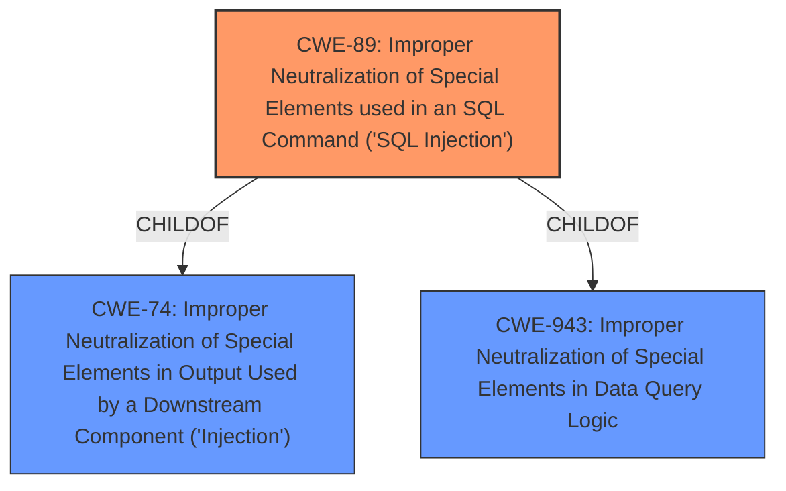

# Analysis Report for CVE-2021-43927

# Vulnerability Analysis Report: CVE-2021-43927

## Description


## Analysis (with Relationship Data)

# Summary

| CWE ID | CWE Name | Confidence | CWE Abstraction Level | CWE Vulnerability Mapping Label | CWE-Vulnerability Mapping Notes |
|---|---|---|---|---|---|
| CWE-89 | Improper Neutralization of Special Elements used in an SQL Command ('SQL Injection') | 1.0 | Base | Allowed | Primary CWE |

## Evidence and Confidence

*   **Confidence Score:** 1.0
*   **Evidence Strength:** HIGH

## Relationship Analysis
The primary relationship is that CWE-89 is a child of CWE-74 (Improper Neutralization of Special Elements in Output Used by a Downstream Component ('Injection')) and CWE-943 (Improper Neutralization of Special Elements in Data Query Logic). This indicates that SQL injection is a specific type of injection that occurs within the context of data queries. The base abstraction level is appropriate because the vulnerability description is specific to SQL injection.



## Vulnerability Chain
The vulnerability chain starts with the **improper neutralization of special elements** in user-supplied input. This leads directly to the ability to inject SQL commands, resulting in potential unauthorized data access or manipulation.

## Summary of Analysis
The initial analysis strongly points to CWE-89, supported by both the vulnerability description and the provided data. The vulnerability description explicitly states "**Improper neutralization of special elements** used in an SQL command (SQL Injection) vulnerability". The CVE Reference Links Content Summary reinforces this by stating the **root cause** as "**Improper neutralization of special elements** used in an SQL command" and the **weakness** as "SQL Injection". The primary CWE match from similar CVE descriptions is also CWE-89. The retriever results also list CWE-89 as the top combined result with a score of 1.0.

The evidence overwhelmingly supports the selection of CWE-89 as the primary CWE. The relationship analysis confirms that it is a specific type of injection, aligning with its base abstraction level. The mapping guidance allows for its usage.

The selection of CWE-89 is at the optimal level of specificity, as it directly addresses the SQL injection vulnerability described.

Other CWEs considered but not used:

*   CWE-74: This is a more general class of "Injection" vulnerabilities. While SQL injection falls under this category, CWE-89 is more specific.
*   CWE-943: This is a class related to "Improper Neutralization of Special Elements in Data Query Logic". While closely related, CWE-89 directly identifies the SQL command context.
*   CWE-78: This relates to OS Command Injection, which is not applicable in this case.
*   CWE-138: This is a general class related to "Improper Neutralization of Special Elements" which is too generic for this SQL Injection case.
*   CWE-287: This relates to improper authentication, which is not the root cause of this vulnerability.
*   CWE-1272: This is related to sensitive information uncleared before debug/power state transition, which is not relevant in this case.
*   CWE-1336: This relates to template injection, which is not relevant in this case.
*   CWE-1236: This relates to CSV injection, which is not relevant in this case.
*   CWE-80: This relates to Cross-Site Scripting (XSS), which is not relevant in this case.


## CWE Relationship Analysis

Current CWEs represent these abstraction levels: .


### Vulnerability Chain Analysis

**Chain starting from CWE-89:**
- 89 (Improper Neutralization of Special Elements used in an SQL Command ('SQL Injection')) - ROOT


**Chain starting from CWE-80:**
- 80 (Improper Neutralization of Script-Related HTML Tags in a Web Page (Basic XSS)) - ROOT


### CWE Relationship Diagram

```mermaid
graph TD
    classDef primary fill:#f96,stroke:#333,stroke-width:2px
    classDef secondary fill:#69f,stroke:#333
    classDef tertiary fill:#9e9,stroke:#333
```


*Report generated on 2025-03-31 06:46:03*
