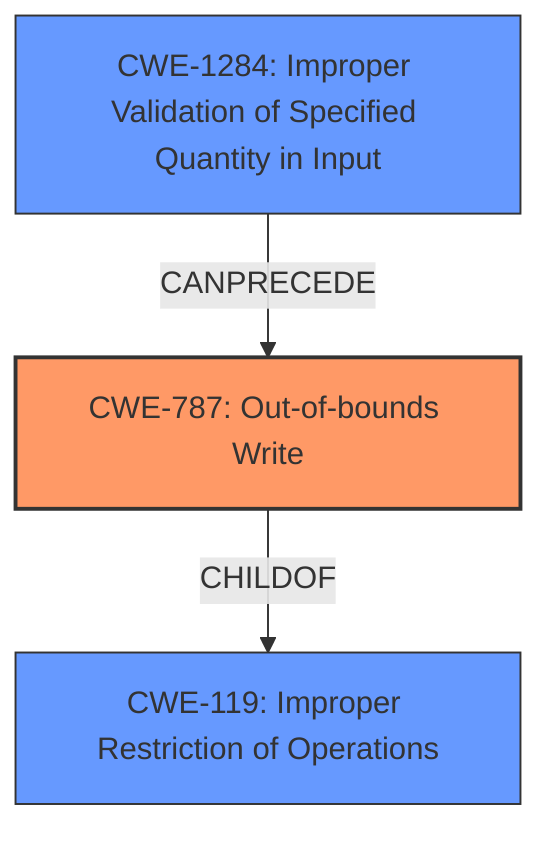

# Analysis Report for CVE-2021-44016

# Vulnerability Analysis Report: CVE-2021-44016

## Description


## Analysis (with Relationship Data)

# Summary
| CWE ID | CWE Name | Confidence | CWE Abstraction Level | CWE Vulnerability Mapping Label | CWE-Vulnerability Mapping Notes |
|---|---|---|---|---|---|
| CWE-787 | Out-of-bounds Write | 1.0 | Base | Allowed | Primary CWE |
| CWE-119 | Improper Restriction of Operations within the Bounds of a Memory Buffer | 0.75 | Class | Allowed | Secondary Candidate |
| CWE-1284 | Improper Validation of Specified Quantity in Input | 0.6 | Base | Allowed | Secondary Candidate |

## Evidence and Confidence

*   **Confidence Score:** 0.9
*   **Evidence Strength:** HIGH

## Relationship Analysis
The primary CWE selected is CWE-787 (**Out-of-bounds Write**), which is a **Base** level CWE. This is the most specific and appropriate CWE given the vulnerability description and the **CVE Reference Links Content Summary**, which explicitly mentions **memory corruption** due to improper validation of data leading to writing to invalid memory locations. CWE-787 is a child of CWE-119 (**Improper Restriction of Operations within the Bounds of a Memory Buffer**), which is a more general **Class** level CWE. CWE-1284 (**Improper Validation of Specified Quantity in Input**) can precede CWE-787, because if the size of the input is not validated, the out-of-bounds write can occur.



## Vulnerability Chain
The vulnerability chain starts with **Improper Validation of Input**, potentially of the size of the input, which leads to an **Out-of-bounds Write** and, finally, **memory corruption**, which allows for **arbitrary code execution**.

## Summary of Analysis
The initial assessment, supported by the **Vulnerability Description Key Phrases**, the **CVE Reference Links Content Summary**, and the **Retriever Results**, pointed towards CWE-787 (**Out-of-bounds Write**) and CWE-119 (**Improper Restriction of Operations within the Bounds of a Memory Buffer**).

The evidence provided explicitly states: "The vulnerability lies within the `plmxmlAdapterSE70.dll` library, specifically during the parsing of PAR files." and "The root cause is a lack of proper validation of user-supplied data within the PAR file, leading to a **memory corruption**." "Memory corruption: The improper validation allows for data to be written to invalid memory locations."

Given this direct evidence of memory corruption due to out-of-bounds write, CWE-787 is the most accurate and specific classification. While CWE-119 is a parent of CWE-787, using CWE-787 provides a more precise description of the vulnerability. CWE-1284 (**Improper Validation of Specified Quantity in Input**) is also related because the out-of-bounds write could be caused by a missing or incorrect size check.

Relevant CWE Information:

# Enhanced Context (25 CWEs)
The following CWEs were identified as potentially relevant to this vulnerability:

## CWE-131: Incorrect Calculation of Buffer Size
**Abstraction Level**: Base
**Similarity Score**: 0.77

## CWE-1289: Improper Validation of Unsafe Equivalence in Input
**Abstraction Level**: Base
**Similarity Score**: 0.77

## CWE-404: Improper Resource Shutdown or Release
**Abstraction Level**: Class
**Similarity Score**: 0.76

## CWE-667: Improper Locking
**Abstraction Level**: Class
**Similarity Score**: 0.76

## CWE-653: Improper Isolation or Compartmentalization
**Abstraction Level**: Class
**Similarity Score**: 0.76

## CWE-129: Improper Validation of Array Index
**Abstraction Level**: Variant
**Similarity Score**: 0.76

## CWE-125: Out-of-bounds Read
**Abstraction Level**: Base
**Similarity Score**: 0.76

## CWE-191: Integer Underflow (Wrap or Wraparound)
**Abstraction Level**: Base
**Similarity Score**: 0.76

## CWE-754: Improper Check for Unusual or Exceptional Conditions
**Abstraction Level**: Class
**Similarity Score**: 0.75

## CWE-703: Improper Check or Handling of Exceptional Conditions
**Abstraction Level**: Pillar
**Similarity Score**: 0.75

## CWE-190: Integer Overflow or Wraparound
**Abstraction Level**: Base
**Similarity Score**: 6782.29

## CWE-125: Out-of-bounds Read
**Abstraction Level**: Base
**Similarity Score**: 6755.95

## CWE-1284: Improper Validation of Specified Quantity in Input
**Abstraction Level**: Base
**Similarity Score**: 6675.50

## CWE-770: Allocation of Resources Without Limits or Throttling
**Abstraction Level**: Base
**Similarity Score**: 6591.80

## CWE-789: Memory Allocation with Excessive Size Value
**Abstraction Level**: Variant
**Similarity Score**: 6479.06

## CWE-41: Improper Resolution of Path Equivalence
**Abstraction Level**: base
**Similarity Score**: 5.03

## CWE-170: Improper Null Termination
**Abstraction Level**: base
**Similarity Score**: 5.03

## CWE-120: Buffer Copy without Checking Size of Input ('Classic Buffer Overflow')
**Abstraction Level**: base
**Similarity Score**: 4.33

## CWE-190: Integer Overflow or Wraparound
**Abstraction Level**: base
**Similarity Score**: 4.33

## CWE-22: Improper Limitation of a Pathname to a Restricted Directory ('Path Traversal')
**Abstraction Level**: base
**Similarity Score**: 4.33

## CWE-770: Allocation of Resources Without Limits or Throttling
**Abstraction Level**: base
**Similarity Score**: 4.33

## CWE-73: External Control of File Name or Path
**Abstraction Level**: base
**Similarity Score**: 4.33

## CWE-1284: Improper Validation of Specified Quantity in Input
**Abstraction Level**: base
**Similarity Score**: 4.33

## CWE-476: NULL Pointer Dereference
**Abstraction Level**: base
**Similarity Score**: 4.33

## CWE-681: Incorrect Conversion between Numeric Types
**Abstraction Level**: base
**Similarity Score**: 3.89

CWE-120 (**Buffer Copy without Checking Size of Input ('Classic Buffer Overflow')**) was considered due to the "memory corruption" aspect, but it is specific to buffer copy operations, and the provided information doesn't specify that the vulnerability involves copying a buffer without checking its size. Therefore, CWE-787 (**Out-of-bounds Write**) is more appropriate.

CWE-20 (**Improper Input Validation**) is too high-level and general. The vulnerability summary provides enough detail to assign more specific CWEs like CWE-787 and CWE-1284.

The final selection emphasizes specificity and accuracy based on available evidence, prioritizing **Base** and **Variant** level CWEs when possible.


## CWE Relationship Analysis

Current CWEs represent these abstraction levels: .


### Vulnerability Chain Analysis

**Chain starting from CWE-41:**
- 41 (Improper Resolution of Path Equivalence) - ROOT


**Chain starting from CWE-119:**
- 119 (Improper Restriction of Operations within the Bounds of a Memory Buffer) - ROOT


### CWE Relationship Diagram

```mermaid
graph TD
    classDef primary fill:#f96,stroke:#333,stroke-width:2px
    classDef secondary fill:#69f,stroke:#333
    classDef tertiary fill:#9e9,stroke:#333
```


*Report generated on 2025-03-30 18:29:04*
