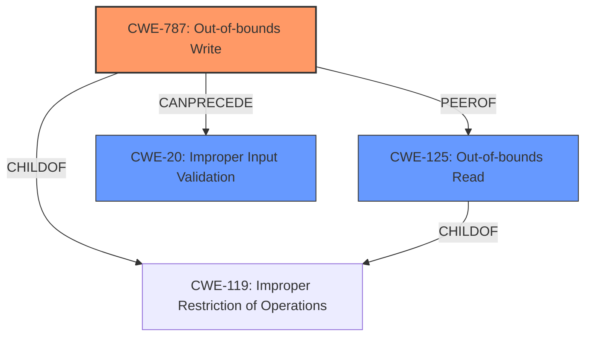

# Analysis for CVE-2021-44018

# Summary
| CWE ID | CWE Name | Confidence | CWE Abstraction Level | CWE Vulnerability Mapping Label | CWE-Vulnerability Mapping Notes |
|---|---|---|---|---|---|
| CWE-787 | Out-of-bounds Write | 1.0 | Base | Allowed | Primary CWE |
| CWE-125 | Out-of-bounds Read | 0.7 | Base | Allowed | Secondary Candidate |
| CWE-20 | Improper Input Validation | 0.5 | Class | Discouraged | Secondary Candidate |

## Evidence and Confidence

*   **Confidence Score:** 0.9
*   **Evidence Strength:** HIGH

## Relationship Analysis
The primary CWE, CWE-787, is a base-level weakness that directly describes the memory corruption due to writing outside the intended buffer. CWE-125 is a closely related weakness involving reading outside the intended buffer. Both CWE-787 and CWE-125 are children of CWE-119 (Improper Restriction of Operations Within the Bounds of a Memory Buffer), indicating a broader class of memory boundary issues. CWE-20, while relevant, is a higher-level class that is less specific than CWE-787 and CWE-125.

## Vulnerability Chain
The vulnerability chain starts with **improper input validation** in the parsing of a PAR file. This leads to a **memory corruption** condition where an out-of-bounds write occurs, potentially resulting in arbitrary code execution.

## Summary of Analysis
The initial assessment was based on the vulnerability description, which indicated **memory corruption** while parsing crafted PAR files, leading to arbitrary code execution. The key phrase "improper input validation" further refined the analysis.

The selection of CWE-787 as the primary CWE is strongly supported by the vulnerability description and the CVE Reference Links Content Summary, which both identify an out-of-bounds write as the root cause. The content summary explicitly states that a crafted PAR file can trigger a read past the end of an allocated buffer and highlights **memory corruption**.

CWE-125 (Out-of-bounds Read) was considered as a potential primary CWE but was deemed less accurate because the description focuses on a write operation leading to **memory corruption**, and the reference material focuses more on the root cause for the code execution than the full breadth of the issue, which could result in a crash.

CWE-20 (Improper Input Validation) was considered due to the "improper input validation" key phrase. However, CWE-20 is a high-level class, and the more specific CWE-787 better captures the nature of the vulnerability.

The final selection of CWE-787 is at the optimal level of specificity, as it directly reflects the out-of-bounds write condition described in the vulnerability. The confidence score is high (0.9) due to the clear and consistent evidence supporting this classification.

Relevant CWE Information:

# Enhanced Context (25 CWEs)

## CWE-1289: Improper Validation of Unsafe Equivalence in Input
**Abstraction Level**: Base
**Similarity Score**: 0.75
**Source**: dense

**Description**:
The product receives an input value that is used as a resource identifier or other type of reference, but it does not validate or incorrectly validates that the input is equivalent to a potentially-unsafe value.

**Mapping Guidance**:
- Usage: Allowed
- Rationale: This CWE entry is at the Base level of abstraction, which is a preferred level of abstraction for mapping to the root causes of vulnerabilities.

*Rationale for not selecting:* While there is **improper validation**, this CWE describes validating equivalence to an unsafe value, which doesn't directly apply to the **memory corruption** caused by a crafted PAR file.

## CWE-664: Improper Control of a Resource Through its Lifetime
**Abstraction Level**: Pillar
**Similarity Score**: 0.75
**Source**: dense

**Description**:
The product does not maintain or incorrectly maintains control over a resource throughout its lifetime of creation, use, and release.

**Mapping Guidance**:
- Usage: Discouraged
- Rationale: This CWE entry is high-level when lower-level children are available.

*Rationale for not selecting:* This is a very high level abstraction and does not directly apply.

## CWE-668: Exposure of Resource to Wrong Sphere
**Abstraction Level**: Class
**Similarity Score**: 0.74
**Source**: dense

**Description**:
The product exposes a resource to the wrong control sphere, providing unintended actors with inappropriate access to the resource.

**Mapping Guidance**:
- Usage: Discouraged
- Rationale: CWE-668 is high-level and is often misused as a catch-all when lower-level CWE IDs might be applicable. It is sometimes used for low-information vulnerability reports [REF-1287]. It is a level-1 Class (i.e., a child of a Pillar). It is not useful for trend analysis.

*Rationale for not selecting:* The **memory corruption** does not directly translate into exposing a resource to the wrong control sphere.

## CWE-653: Improper Isolation or Compartmentalization
**Abstraction Level**: Class
**Similarity Score**: 0.74
**Source**: dense

**Description**:
The product does not properly compartmentalize or isolate functionality, processes, or resources that require different privilege levels, rights, or permissions.

**Mapping Guidance**:
- Usage: Allowed
- Rationale: This CWE entry is at the Base level of abstraction, which is a preferred level of abstraction for mapping to the root causes of vulnerabilities.

*Rationale for not selecting:* The **memory corruption** does not appear to be related to lack of isolation.

## CWE-404: Improper Resource Shutdown or Release
**Abstraction Level**: Class
**Similarity Score**: 0.74
**Source**: dense

**Description**:
The product does not release or incorrectly releases a resource before it is made available for re-use.

**Mapping Guidance**:
- Usage: Allowed-with-Review
- Rationale: This CWE entry is a Class and might have Base-level children that would be more appropriate

*Rationale for not selecting:* The **memory corruption** does not seem related to improper resource shutdown.

## CWE-754: Improper Check for Unusual or Exceptional Conditions
**Abstraction Level**: Class
**Similarity Score**: 0.74
**Source**: dense

**Description**:
The product does not check or incorrectly checks for unusual or exceptional conditions that are not expected to occur frequently during day to day operation of the product.

**Mapping Guidance**:
- Usage: Allowed-with-Review
- Rationale: This CWE entry is a Class and might have Base-level children that would be more appropriate

*Rationale for not selecting:* While **improper input validation** exists, this CWE is too general.

## CWE-41: Improper Resolution of Path Equivalence
**Abstraction Level**: Base
**Similarity Score**: 0.74
**Source**: dense

**Description**:
The product is vulnerable to file system contents disclosure through path equivalence. Path equivalence involves the use of special characters in file and directory names. The associated manipulations are intended to generate multiple names for the same object.

**Mapping Guidance**:
- Usage: Allowed
- Rationale: This CWE entry is at the Base level of abstraction, which is a preferred level of abstraction for mapping to the root causes of vulnerabilities.

*Rationale for not selecting:* This is specific to path equivalency issues.

## CWE-667: Improper Locking
**Abstraction Level**: Class
**Similarity Score**: 0.74
**Source**: dense

**Description**:
The product does not properly acquire or release a lock on a resource, leading to unexpected resource state changes and behaviors.

**Mapping Guidance**:
- Usage: Allowed-with-Review
- Rationale: This CWE entry is a Class and might have Base-level children that would be more appropriate

*Rationale for not selecting:* The **memory corruption** does not appear to be related to improper locking.

## CWE-691: Insufficient Control Flow Management
**Abstraction Level**: Pillar
**Similarity Score**: 0.74
**Source**: dense

**Description**:
The code does not sufficiently manage its control flow during execution, creating conditions in which the control flow can be modified in unexpected ways.

**Mapping Guidance**:
- Usage: Discouraged
- Rationale: