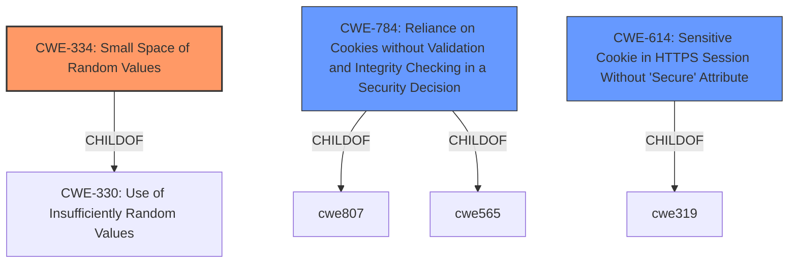

# Enhanced Analysis for CVE-2021-44151

# Summary
| CWE ID | CWE Name | Confidence | CWE Abstraction Level | CWE Vulnerability Mapping Label | CWE-Vulnerability Mapping Notes |
|---|---|---|---|---|---|
| CWE-334 | Small Space of Random Values | 1.0 | Base | Primary | Allowed |
| CWE-784 | Reliance on Cookies without Validation and Integrity Checking in a Security Decision | 0.7 | Variant | Secondary | Allowed |
| CWE-614 | Sensitive Cookie in HTTPS Session Without 'Secure' Attribute | 0.6 | Variant | Secondary | Allowed |

## Evidence and Confidence

*   **Confidence Score:** 0.8
*   **Evidence Strength:** HIGH

## Relationship Analysis
The primary CWE, CWE-334, is a Base level weakness describing the use of a small space of random values, making it susceptible to brute force attacks. The vulnerability description explicitly states the **small session cookies** as the root cause and the possibility of **bruteforcing** them as the attack vector. CWE-334 is a child of CWE-330, which indicates a broader category of insufficient randomness. The other considered CWEs, CWE-784 and CWE-614, are related to the improper handling and security of cookies, which are relevant in this scenario as the **small session cookies** are the target of the attack.



## Vulnerability Chain
The vulnerability chain starts with the **small size of the session cookies** (CWE-334), which allows an attacker to **bruteforce** the cookie values to hijack existing sessions. The vulnerability also highlights a potential weakness in how the cookies are handled, potentially missing validation or integrity checks (CWE-784) and not setting the 'Secure' attribute when transmitted over HTTPS (CWE-614). This leads to the impact of session hijacking, allowing the attacker to gain unauthorized access.

## Summary of Analysis
The primary assessment is based on the **small size of the session cookies** and the **bruteforcing** attack vector described in the vulnerability description. This strongly aligns with CWE-334, which describes the usage of a **small space of random values**. The graph relationships show that CWE-334 is a specific type of insufficient randomness (CWE-330), making it an appropriate choice. The retriever results also support this choice, with CWE-334 being the top result. While CWE-784 and CWE-614 are also relevant due to the cookie-based nature of the vulnerability, they are secondary concerns as they describe potential weaknesses in how the cookies are handled, rather than the fundamental issue of the small value space.

The selected CWEs are at the optimal level of specificity, with CWE-334 being a Base level weakness that directly addresses the root cause. The other candidate CWEs describe additional aspects of the vulnerability, but are not as directly related to the **root cause** as CWE-334.

Relevant CWE Information:

# Enhanced Context (25 CWEs)
The following CWEs were identified as potentially relevant to this vulnerability:

## CWE-334: Small Space of Random Values
**Abstraction Level**: Base
**Similarity Score**: 0.79
**Source**: dense

**Description**:
The number of possible random values is smaller than needed by the product, making it more susceptible to brute force attacks.

**Mapping Guidance**:
- Usage: Allowed
- Rationale: This CWE entry is at the Base level of abstraction, which is a preferred level of abstraction for mapping to the root causes of vulnerabilities.

## CWE-614: Sensitive Cookie in HTTPS Session Without 'Secure' Attribute
**Abstraction Level**: Variant
**Similarity Score**: 0.76
**Source**: dense

**Description**:
The Secure attribute for sensitive cookies in HTTPS sessions is not set, which could cause the user agent to send those cookies in plaintext over an HTTP session.

**Mapping Guidance**:
- Usage: Allowed
- Rationale: This CWE entry is at the Variant level of abstraction, which is a preferred level of abstraction for mapping to the root causes of vulnerabilities.

## CWE-784: Reliance on Cookies without Validation and Integrity Checking in a Security Decision
**Abstraction Level**: Variant
**Similarity Score**: 0.76
**Source**: dense

**Description**:
The product uses a protection mechanism that relies on the existence or values of a cookie, but it does not properly ensure that the cookie is valid for the associated user.

**Mapping Guidance**:
- Usage: Allowed
- Rationale: This CWE entry is at the Variant level of abstraction, which is a preferred level of abstraction for mapping to the root causes of vulnerabilities.

## CWE-113: Improper Neutralization of CRLF Sequences in HTTP Headers ('HTTP Request/Response Splitting')
**Abstraction Level**: Variant
**Similarity Score**: 7416.35
**Source**: sparse

**Description**:
The product receives data from an HTTP agent/component (e.g., web server, proxy, browser, etc.), but it does not neutralize or incorrectly neutralizes CR and LF characters before the data is included in outgoing HTTP headers.

**Mapping Guidance**:
- Usage: Allowed
- Rationale: This CWE entry is at the Variant level of abstraction, which is a preferred level of abstraction for mapping to the root causes of vulnerabilities.

## CWE-79: Improper Neutralization of Input During Web Page Generation ('Cross-site Scripting')
**Abstraction Level**: Base
**Similarity Score**: 7302.17
**Source**: sparse

**Description**:
The product does not neutralize or incorrectly neutralizes user-controllable input before it is placed in output that is used as a web page that is served to other users.

**Mapping Guidance**:
- Usage: Allowed
- Rationale: This CWE entry is at the Base level of abstraction, which is a preferred level of abstraction for mapping to the root causes of vulnerabilities.

## CWE-1390: Weak Authentication
**Abstraction Level**: Class
**Similarity Score**: 6864.55
**Source**: sparse

**Description**:
The product uses an authentication mechanism to restrict access to specific users or identities, but the mechanism does not sufficiently prove that the claimed identity is correct.

**Mapping Guidance**:
- Usage: Allowed-with-Review
- Rationale: This CWE entry is a Class and might have Base-level children that would be more appropriate

## CWE-472: External Control of Assumed-Immutable Web Parameter
**Abstraction Level**: Base
**Similarity Score**: 6851.70
**Source**: sparse

**Description**:
The web application does not sufficiently verify inputs that are assumed to be immutable but are actually externally controllable, such as hidden form fields.

**Mapping Guidance**:
- Usage: Allowed
- Rationale: This CWE entry is at the Base level of abstraction, which is a preferred level of abstraction for mapping to the root causes of vulnerabilities.

## CWE-201: Insertion of Sensitive Information Into Sent Data
**Abstraction Level**: Base
**Similarity Score**: 6838.44
**Source**: sparse

**Description**:
The code transmits data to another actor, but a portion of the data includes sensitive information that should not be accessible to that actor.

**Mapping Guidance**:
- Usage: Allowed
- Rationale: This CWE entry is at the Base level of abstraction, which is a preferred level of abstraction for mapping to the root causes of vulnerabilities.

**CWE-113 (Improper Neutralization of CRLF Sequences in HTTP Headers ('HTTP Request/Response Splitting'))**: This CWE was considered but not selected as it describes vulnerabilities related to improper handling of CRLF sequences in HTTP headers, which is not directly related to the **root cause** of the vulnerability described.

**CWE-79 (Improper Neutralization of Input During Web Page Generation ('Cross-site Scripting'))**: This CWE was considered but not selected as it describes Cross-Site Scripting vulnerabilities, which are not directly related to the **root cause** of the vulnerability described.

**CWE-1390 (Weak Authentication)**: This CWE was considered but not selected as it's a more general class of weakness. While the small cookie space does contribute to **weak authentication**, the more specific CWE-334 better captures the **root cause


## CWE Relationship Analysis

Current CWEs represent these abstraction levels: .


### Vulnerability Chain Analysis

**Chain starting from CWE-201:**
- 201 (Insertion of Sensitive Information Into Sent Data) - ROOT


**Chain starting from CWE-472:**
- 472 (External Control of Assumed-Immutable Web Parameter) - ROOT


### CWE Relationship Diagram

```mermaid
graph TD
    classDef primary fill:#f96,stroke:#333,stroke-width:2px
    classDef secondary fill:#69f,stroke:#333
    classDef tertiary fill:#9e9,stroke:#333
```