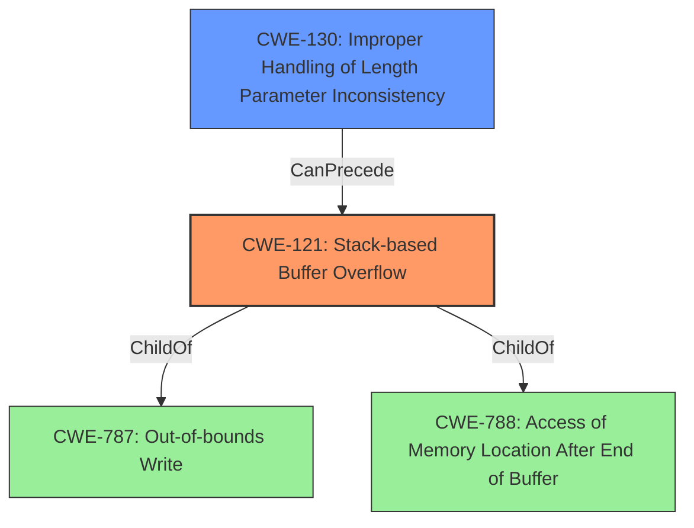

# Analysis for CVE-2021-44158

# Summary
| CWE ID | CWE Name | Confidence | CWE Abstraction Level | CWE Vulnerability Mapping Label | CWE-Vulnerability Mapping Notes |
|---|---|---|---|---|---|
| CWE-121 | Stack-based Buffer Overflow | 1.0 | Variant | Allowed | Primary CWE |
| CWE-130 | Improper Handling of Length Parameter Inconsistency | 0.8 | Base | Allowed | Secondary Candidate |

## Evidence and Confidence

*   **Confidence Score:** 0.9
*   **Evidence Strength:** HIGH

## Relationship Analysis
The primary weakness is CWE-121 which is a variant of CWE-787 (Out-of-bounds Write) and CWE-788 (Access of Memory Location After End of Buffer). The root cause appears to be **improper validation**, specifically CWE-130 Improper Handling of Length Parameter Inconsistency which can lead to buffer overflows.

## Vulnerability Chain
The vulnerability chain starts with the **improper validation for httpd parameter length** (CWE-130), which leads to a **stack-based buffer overflow** (CWE-121), and finally results in arbitrary code execution and denial of service.

## Summary of Analysis
The initial analysis identified CWE-121 as the primary weakness, supported by the vulnerability description explicitly stating a "stack-based buffer overflow." The retriever results also suggested CWE-119, CWE-190, and CWE-1284, but these were deemed less specific than CWE-121 and CWE-130.

The vulnerability description and CVE reference links content summary provided sufficient evidence to map the vulnerability to CWE-121 and CWE-130. The relationship analysis further solidified this decision, as CWE-121 is a variant of out-of-bounds write and the root cause is related to **improper handling of length parameter inconsistency**.

The final selection of CWEs is at the optimal level of specificity, with CWE-121 being a variant that directly describes the stack-based buffer overflow, and CWE-130 describing the root cause of the **improper validation** of the length parameter.

Relevant CWE Information:

### CWE-121: Stack-based Buffer Overflow
The vulnerability description explicitly states that it is a "stack-based buffer overflow", which directly matches the description of CWE-121. The impact is arbitrary code execution, which is a typical consequence of a stack-based buffer overflow. The CWE is at the Variant level of abstraction, which is appropriate given the detailed nature of the description.
### CWE-130: Improper Handling of Length Parameter Inconsistency
The root cause is described as **"improper validation for httpd parameter length"**, indicating that the length parameter is not being properly handled. This aligns with the description of CWE-130, which describes the improper handling of length parameter inconsistencies, leading to potential buffer overflows.

### Other CWEs Considered but Not Used:
*   CWE-119: Improper Restriction of Operations within the Bounds of a Memory Buffer - While this is a general buffer overflow class, CWE-121 is more specific because it identifies the overflow as stack-based. The mapping guidance also discourages the use of CWE-119.
*   CWE-190: Integer Overflow or Wraparound - While integer overflows can sometimes lead to buffer overflows, there's no direct indication of an integer overflow in the provided description.
*   CWE-1284: Improper Validation of Specified Quantity in Input - This is related to input validation, but CWE-130 is a more precise fit because it focuses on the length parameter, which is the direct cause of the overflow.
*   CWE-120: Buffer Copy without Checking Size of Input ('Classic Buffer Overflow') - While this is related to buffer overflows, the root cause is **improper validation**, not the lack of size checking in a copy operation.