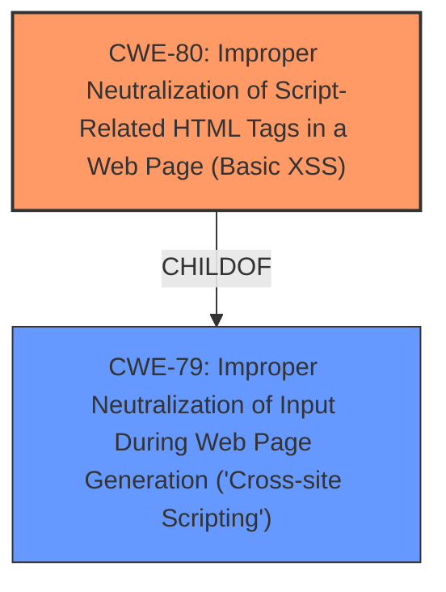

# Analysis for CVE-2021-44196

# Summary
| CWE ID | CWE Name | Confidence | CWE Abstraction Level | CWE Vulnerability Mapping Label | CWE-Vulnerability Mapping Notes |
|---|---|---|---|---|---|
| CWE-80 | Improper Neutralization of Script-Related HTML Tags in a Web Page (Basic XSS) | 1.0 | Variant | Allowed | Primary CWE |
| CWE-79 | Improper Neutralization of Input During Web Page Generation ('Cross-site Scripting') | 0.7 | Base | Allowed | Secondary Candidate |

## Evidence and Confidence

*   **Confidence Score:** 0.9
*   **Evidence Strength:** HIGH

## Relationship Analysis
The primary relationship influencing my decision is that CWE-80 is a child of CWE-79. CWE-80 is a more specific variant that deals with the **improper neutralization** of script-related HTML tags, whereas CWE-79 is a more general case of **improper neutralization** of input during web page generation. Since the vulnerability description explicitly mentions "Script-Related HTML Tags", CWE-80 is the more appropriate choice.

## Vulnerability Chain
The vulnerability chain starts with the product receiving input, then **improperly neutralizing script-related HTML tags**, leading to the potential for cross-site scripting when the output is rendered in a web page.

## Summary of Analysis
The initial assessment strongly points towards CWE-80 due to the explicit mention of "Script-Related HTML Tags" in the vulnerability description. The primary CWE match suggested CWE-89, which is SQL Injection, and this is incorrect. The top CWEs included CWE-79 and CWE-80, so I focused on those. The retriever results also list CWE-79 and CWE-80 as strong candidates.

The evidence directly supports the selection of CWE-80: "**Improper Neutralization of Script-Related HTML Tags in a Web Page (Basic XSS)** vulnerability in UBIT Information Technologies Student Information Management System."

The graph relationships confirm that CWE-80 is a more specific case of CWE-79, and therefore more appropriate when the vulnerability involves HTML tags.

The chosen CWE is at the optimal level of specificity because it directly addresses the type of input that is not being properly neutralized (script-related HTML tags).

Relevant CWE Information:

# Enhanced Context (25 CWEs)
The following CWEs were identified as potentially relevant to this vulnerability:

## CWE-80: Improper Neutralization of Script-Related HTML Tags in a Web Page (Basic XSS)
**Abstraction Level**: Variant
**Similarity Score**: 0.80
**Source**: dense

**Description**:
The product receives input from an upstream component, but it does not neutralize or incorrectly neutralizes special characters such as "<", ">", and "&" that could be interpreted as web-scripting elements when they are sent to a downstream component that processes web pages.

**Mapping Guidance**:
- Usage: Allowed
- Rationale: This CWE entry is at the Variant level of abstraction, which is a preferred level of abstraction for mapping to the root causes of vulnerabilities.

## CWE-79: Improper Neutralization of Input During Web Page Generation ('Cross-site Scripting')
**Abstraction Level**: Base
**Similarity Score**: 7408.12
**Source**: sparse

**Description**:
The product does not neutralize or incorrectly neutralizes user-controllable input before it is placed in output that is used as a web page that is served to other users.

**Mapping Guidance**:
- Usage: Allowed
- Rationale: This CWE entry is at the Base level of abstraction, which is a preferred level of abstraction for mapping to the root causes of vulnerabilities.

CWE-79 was considered but not used as the primary CWE because CWE-80 is a more specific variant. Other CWEs were not considered because they did not align with the specific vulnerability description.