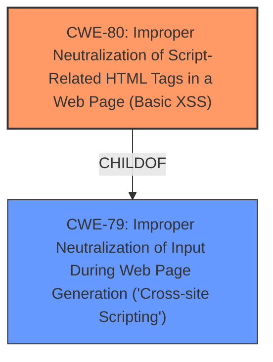

# Enhanced Analysis for CVE-2021-44197

# Summary
| CWE ID | CWE Name | Confidence | CWE Abstraction Level | CWE Vulnerability Mapping Label | CWE-Vulnerability Mapping Notes |
|---|---|---|---|---|---|
| CWE-80 | Improper Neutralization of Script-Related HTML Tags in a Web Page (Basic XSS) | 0.9 | Variant | Allowed | Primary CWE |
| CWE-79 | Improper Neutralization of Input During Web Page Generation ('Cross-site Scripting') | 0.7 | Base | Allowed | Secondary Candidate |

## Evidence and Confidence

*   **Confidence Score:** 0.8
*   **Evidence Strength:** HIGH

## Relationship Analysis
The primary relationship that influenced the selection was the ChildOf relationship between CWE-80 and CWE-79. CWE-80 is a Variant of CWE-79, indicating a more specific type of Cross-Site Scripting. The vulnerability description mentions **"Improper Neutralization of Script-Related HTML Tags"**, which aligns directly with CWE-80's description. CWE-79 was considered as a broader, base-level classification. The choice of the Variant CWE-80 provides a more precise categorization.



## Vulnerability Chain
The vulnerability chain starts with the **improper neutralization of script-related HTML tags**. This leads directly to a **cross-site scripting** vulnerability, allowing an attacker to inject malicious scripts into web pages viewed by other users.

## Summary of Analysis
The initial assessment leaned towards CWE-80 due to the specific mention of **"Improper Neutralization of Script-Related HTML Tags"** in the vulnerability description.

The evidence supporting this decision comes directly from the "Vulnerability Description Key Phrases" section, which states:
- **rootcause:** **Improper Neutralization of Script-Related HTML Tags**
- **weakness:** **cross-site scripting**

The retriever results also support this, with CWE-80 having a high similarity score.
The graph relationships, specifically the ChildOf relationship, further reinforced the choice of CWE-80 as a more specific and accurate representation of the vulnerability compared to its parent, CWE-79.
The selection of CWE-80 is at the optimal level of specificity because it precisely captures the root cause weakness described in the vulnerability.

Relevant CWE Information:

# Enhanced Context (25 CWEs)

## CWE-80: Improper Neutralization of Script-Related HTML Tags in a Web Page (Basic XSS)
**Abstraction:** Variant
**Similarity Score:** 0.83
**Source:** dense

**Description:**
The product receives input from an upstream component, but it does not neutralize or incorrectly neutralizes special characters such as "<", ">", and "&" that could be interpreted as web-scripting elements when they are sent to a downstream component that processes web pages.

**Mapping Guidance:**
- Usage: Allowed
- Rationale: This CWE entry is at the Variant level of abstraction, which is a preferred level of abstraction for mapping to the root causes of vulnerabilities.

## CWE-79: Improper Neutralization of Input During Web Page Generation ('Cross-site Scripting')
**Abstraction:** Base
**Status:** Stable

### Description
The product does not neutralize or incorrectly neutralizes user-controllable input before it is placed in output that is used as a web page that is served to other users.

### Extended Description
[ ... ]

### Mapping Guidance
**Usage:** Allowed
**Rationale:** This CWE entry is at the Base level of abstraction, which is a preferred level of abstraction for mapping to the root causes of vulnerabilities.

## CWE-89: Improper Neutralization of Special Elements used in an SQL Command ('SQL Injection')
**Abstraction:** Base
**Status:** Stable

### Description
The product constructs all or part of an SQL command using externally-influenced input from an upstream component, but it does not neutralize or incorrectly neutralizes special elements that could modify the intended SQL command when it is sent to a downstream component. Without sufficient removal or quoting of SQL syntax in user-controllable inputs, the generated SQL query can cause those inputs to be interpreted as SQL instead of ordinary user data.

### Extended Description
Not provided

### Alternative Terms
SQL injection: a common attack-oriented phrase
SQLi: a common abbreviation for "SQL injection"

### Relationships
ChildOf -> CWE-943
ChildOf -> CWE-74

### Mapping Guidance
**Usage:** Allowed
**Rationale:** This CWE entry is at the Base level of abstraction, which is a preferred level of abstraction for mapping to the root causes of vulnerabilities.
**Comments:** Carefully read both the name and description to ensure that this mapping is an appropriate fit. Do not try to 'force' a mapping to a lower-level Base/Variant simply to comply with this preferred level of abstraction.
**Reasons:**
- Acceptable-Use

### Summary of Analysis

*   **CWE-80: Improper Neutralization of Script-Related HTML Tags in a Web Page (Basic XSS)**
    *   The vulnerability description clearly states that the root cause is **"Improper Neutralization of Script-Related HTML Tags"**.
    *   CWE-80 directly addresses this weakness, describing the scenario where a product **"does not neutralize or incorrectly neutralizes special characters such as '<', '>', and '&' that could be interpreted as web-scripting elements"**.
    *   This aligns perfectly with the described vulnerability, where the system fails to properly handle HTML tags, leading to XSS.
    *   The impact is that an attacker can inject malicious scripts into web pages, potentially compromising user sessions or performing other malicious actions.
    *   CWE-80 is a Variant of CWE-79, making it more specific and appropriate for this case.
    *   The MITRE mapping guidance allows the use of CWE-80.
*   **CWE-79: Improper Neutralization of Input During Web Page Generation ('Cross-site Scripting')**
    *   This CWE represents a broader category of cross-site scripting vulnerabilities.
    *   While the vulnerability does result in XSS, the root cause is more specifically related to the **improper handling of HTML tags**.
    *   CWE-79 is a parent of CWE-80, and while applicable, it is not as precise as CWE-80.
    *   The MITRE mapping guidance allows the use of CWE-79.
*   **CWE-89: Improper Neutralization of Special Elements used in an SQL Command ('SQL Injection')**
    *   This CWE was in the "Top CWEs for similar CVE Descriptions", but it is not applicable.
    *   The vulnerability description does not mention SQL or databases.
    *   This CWE relates to SQL injection, which is a different type of vulnerability.
    *   The MITRE mapping guidance allows the use of CWE-89 for SQL Injection type vulnerabilities.


## CWE Relationship Analysis

Current CWEs represent these abstraction levels: .


### Vulnerability Chain Analysis

**Chain starting from CWE-89:**
- 89 (Improper Neutralization of Special Elements used in an SQL Command ('SQL Injection')) - ROOT


**Chain starting from CWE-80:**
- 80 (Improper Neutralization of Script-Related HTML Tags in a Web Page (Basic XSS)) - ROOT


### CWE Relationship Diagram

```mermaid
graph TD
    classDef primary fill:#f96,stroke:#333,stroke-width:2px
    classDef secondary fill:#69f,stroke:#333
    classDef tertiary fill:#9e9,stroke:#333
```