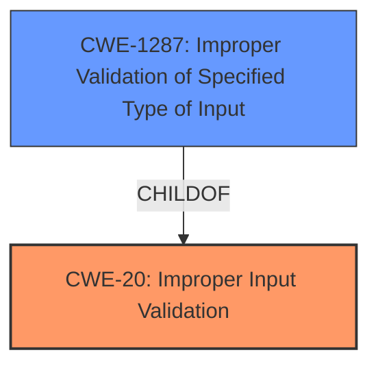

# Analysis for CVE-2021-44356

# Summary
| CWE ID | CWE Name | Confidence | CWE Abstraction Level | CWE Vulnerability Mapping Label | CWE-Vulnerability Mapping Notes |
|---|---|---|---|---|---|
| CWE-20 | Improper Input Validation | 0.9 | Class | Primary | Discouraged |
| CWE-1287 | Improper Validation of Specified Type of Input | 0.7 | Base | Secondary | Allowed |

## Evidence and Confidence

*   **Confidence Score:** 0.8
*   **Evidence Strength:** HIGH

## Relationship Analysis
The primary relationship that influenced the decision was the parent-child relationship between CWE-20 and CWE-1287. CWE-1287 is a more specific type of input validation issue, dealing with the type of the input, whereas CWE-20 is a more general case of improper input validation. Since the vulnerability description specifically mentions the lack of validation of the JSON element type, CWE-1287 is a suitable match and a child of CWE-20.

## Vulnerability Chain
The vulnerability chain begins with the **improper input validation** of the JSON element type, leading to an assertion failure, which in turn causes the `cgiserver.cgi` process to terminate and eventually reboot the device, resulting in a **denial of service**.

## Summary of Analysis
Initially, CWE-20 was considered as the primary weakness due to the general nature of the vulnerability description and the "Top CWEs" listing for similar CVE descriptions. However, the CVE Reference Links Content Summary provided more specific information, stating that "The `SetAudioAlarm`'s JSON `param` parser assumes that the `param` JSON element is an object, accessing it using subscription operator, but the code **does not validate the type of the JSON element** leading to an assertion failure and **denial of service**." This points to a more specific weakness: **improper validation of the input type**.

Therefore, CWE-1287 (Improper Validation of Specified Type of Input) was selected as a secondary CWE to provide more granularity. CWE-20 is still the primary as it's the main problem, and CWE-1287 is a specific instance of it.

The evidence supporting this decision is the root cause analysis from the CVE Reference Links Content Summary.

CWE-20: "The product receives input or data, but it does not validate or incorrectly validates that the input has the properties that are required to process the data safely and correctly."

CWE-1287: "The product receives input that is expected to be of a certain type, but it does not validate or incorrectly validates that the input is actually of the expected type."

The selection of CWEs at the optimal level of specificity ensures that the vulnerability is accurately represented while providing sufficient detail about the root cause.

Relevant CWE Information:

# Enhanced Context (25 CWEs)

## CWE-1289: Improper Validation of Unsafe Equivalence in Input
**Abstraction Level**: Base
**Similarity Score**: 0.78
**Source**: dense

**Description**:
The product receives an input value that is used as a resource identifier or other type of reference, but it does not validate or incorrectly validates that the input is equivalent to a potentially-unsafe value.
*This CWE was considered but deemed less relevant as the core issue is the type validation, not equivalence.*

## CWE-807: Reliance on Untrusted Inputs in a Security Decision
**Abstraction Level**: Base
**Similarity Score**: 0.77
**Source**: dense

**Description**:
The product uses a protection mechanism that relies on the existence or values of an input, but the input can be modified by an untrusted actor in a way that bypasses the protection mechanism.
*This CWE was considered but deemed less relevant as the primary issue is the initial lack of input validation rather than reliance on the input after a security decision.*

## CWE-74: Improper Neutralization of Special Elements in Output Used by a Downstream Component ('Injection')
**Abstraction Level**: Class
**Similarity Score**: 0.76
**Source**: dense

**Description**:
The product constructs all or part of a command, data structure, or record using externally-influenced input from an upstream component, but it does not neutralize or incorrectly neutralizes special elements that could modify how it is parsed or interpreted when it is sent to a downstream component.
*This CWE was considered but deemed less relevant as the core issue is not about neutralizing special elements but validating the type of input.*

## CWE-184: Incomplete List of Disallowed Inputs
**Abstraction Level**: Base
**Similarity Score**: 0.76
**Source**: dense

**Description**:
The product implements a protection mechanism that relies on a list of inputs (or properties of inputs) that are not allowed by policy or otherwise require other action to neutralize before additional processing takes place, but the list is incomplete.
*This CWE was considered but deemed less relevant as the issue is not about an incomplete list of disallowed inputs but the lack of type validation.*

## CWE-138: Improper Neutralization of Special Elements
**Abstraction Level**: Class
**Similarity Score**: 0.75
**Source**: dense

**Description**:
The product receives input from an upstream component, but it does not neutralize or incorrectly neutralizes special elements that could be interpreted as control elements or syntactic markers when they are sent to a downstream component.
*This CWE was considered but deemed less relevant as the core issue is not about neutralizing special elements but validating the type of input.*

## CWE-303: Incorrect Implementation of Authentication Algorithm
**Abstraction Level**: Base
**Similarity Score**: 0.75
**Source**: dense

**Description**:
The requirements for the product dictate the use of an established authentication algorithm, but the implementation of the algorithm is incorrect.
*This CWE was considered but deemed irrelevant as the vulnerability has nothing to do with authentication algorithms.*

## CWE-345: Insufficient Verification of Data Authenticity
**Abstraction Level**: Class
**Similarity Score**: 0.75
**Source**: dense

**Description**:
The product does not sufficiently verify the origin or authenticity of data, in a way that causes it to accept invalid data.
*This CWE was considered but deemed less relevant as the issue is not about data authenticity but the lack of type validation.*

## CWE-799: Improper Control of Interaction Frequency
**Abstraction Level**: Class
**Similarity Score**: 0.74
**Source**: dense

**Description**:
The product does not properly limit the number or frequency of interactions that it has with an actor, such as the number of incoming requests.
*This CWE was considered but deemed irrelevant as the vulnerability has nothing to do with interaction frequency.*

## CWE-472: External Control of Assumed-Immutable Web Parameter
**Abstraction Level**: Base
**Similarity Score**: 0.74
**Source**: dense

**Description**:
The web application does not sufficiently verify inputs that are assumed to be immutable but are actually externally controllable, such as hidden form fields.
*This CWE was considered but deemed less relevant as the issue is not about externally controllable parameters that are assumed to be immutable.*

## CWE-252: Unchecked Return Value
**Abstraction Level**: Base
**Similarity Score**: 0.74
**Source**: dense

**Description**:
The product does not check the return value from a method or function, which can prevent it from detecting unexpected states and conditions.
*This CWE was considered but deemed irrelevant as the vulnerability has nothing to do with unchecked return values.*

## CWE-1284: Improper Validation of Specified Quantity in Input
**Abstraction Level**: Base
**Similarity Score**: 8130.03
**Source**: sparse

**Description**:
The product receives input that is expected to specify a quantity (such as size or length), but it does not validate or incorrectly validates that the quantity has the required properties.
*This CWE was considered but deemed less relevant as the issue is not about validating quantities but the type of the input.*

## CWE-190: Integer Overflow or Wraparound
**Abstraction Level**: Base
**Similarity Score**: 8128.18
**Source**: sparse

**Description**:
The product performs a calculation that can produce an integer overflow or wraparound when the logic assumes that the resulting value will always be larger than the original value.
*This CWE was considered but deemed irrelevant as the vulnerability has nothing to do with integer overflows.*

## CWE-125: Out-of-bounds Read
**Abstraction Level**: Base
**Similarity Score**: 8086.84
**Source**: sparse

**Description**:
The product reads data past the end, or before the beginning, of the intended buffer.
*This CWE was considered but deemed irrelevant as the vulnerability has nothing to do with out-of-bounds reads.*

## CWE-22: Improper Limitation of a Pathname to a Restricted Directory