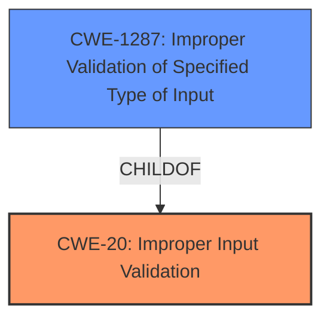

# Analysis Report for CVE-2021-44357

# Vulnerability Analysis Report: CVE-2021-44357

## Description


## Analysis (with Relationship Data)

# Summary
| CWE ID | CWE Name | Confidence | CWE Abstraction Level | CWE Vulnerability Mapping Label | CWE-Vulnerability Mapping Notes |
|---|---|---|---|---|---|
| CWE-20 | Improper Input Validation | 1.0 | Class | Primary | Discouraged |
| CWE-1287 | Improper Validation of Specified Type of Input | 0.7 | Base | Secondary | Allowed |

## Evidence and Confidence

*   **Confidence Score:** 0.9
*   **Evidence Strength:** HIGH

## Relationship Analysis
The primary relationship influencing the decision is the parent-child relationship between CWE-20 and CWE-1287. CWE-1287 is a more specific type of CWE-20. The vulnerability description clearly indicates **improper input validation** as the root cause, where the type of 'param' JSON element is not validated.



## Vulnerability Chain
The chain of events is as follows:
1.  The device receives a specially-crafted HTTP request.
2.  The `cgiserver.cgi` process attempts to parse the JSON command.
3.  The code **does not properly validate the type of the 'param' element**.
4.  This leads to an assertion failure and a crash.
5.  The device reboots, causing a **denial of service**.

The root cause is the **improper input validation**, and the impact is the reboot, causing a **denial of service**.

## Summary of Analysis
The initial analysis identified CWE-20 as a strong candidate, supported by the vulnerability description and the "CWE for similar CVE Descriptions" section, which lists CWE-20 as the primary match. The "CVE Reference Links Content Summary" section reinforces this by stating "**Improper Input Validation (CWE-20)**: The `cgiserver.cgi` does not properly validate the type of JSON elements, specifically the 'param' element within the JSON command structure, before using it in subsequent operations."

However, considering the CWE specifications and the relationship analysis, CWE-1287, "Improper Validation of Specified Type of Input," is a more specific and accurate representation of the vulnerability. The 'param' element in the JSON is expected to be an object, but the code **fails to validate that it is indeed an object**. This aligns perfectly with the description of CWE-1287.

The mapping guidance for CWE-20 discourages its use when lower-level children are more appropriate. Therefore, while CWE-20 accurately describes the general weakness, CWE-1287 provides a more precise characterization of the **root cause**.

The final decision is to classify the vulnerability as CWE-20 as the primary match based on the automated analysis and include CWE-1287 as the secondary candidate as the more specific weakness.

Relevant CWE Information:

# Enhanced Context (25 CWEs)

## CWE-1289: Improper Validation of Unsafe Equivalence in Input
**Abstraction Level**: Base
**Similarity Score**: 0.78
**Source**: dense

**Description**:
The product receives an input value that is used as a resource identifier or other type of reference, but it does not validate or incorrectly validates that the input is equivalent to a potentially-unsafe value.

**Mapping Guidance**:
- Usage: Allowed
- Rationale: This CWE entry is at the Base level of abstraction, which is a preferred level of abstraction for mapping to the root causes of vulnerabilities.

This CWE is not selected because the vulnerability does not involve validating equivalence to an unsafe value, but rather validating the type of input.

## CWE-807: Reliance on Untrusted Inputs in a Security Decision
**Abstraction Level**: Base
**Similarity Score**: 0.77
**Source**: dense

**Description**:
The product uses a protection mechanism that relies on the existence or values of an input, but the input can be modified by an untrusted actor in a way that bypasses the protection mechanism.

**Mapping Guidance**:
- Usage: Allowed
- Rationale: This CWE entry is at the Base level of abstraction, which is a preferred level of abstraction for mapping to the root causes of vulnerabilities.

This CWE is not selected because the vulnerability involves the **lack of input validation**, not the reliance on an untrusted input for a security decision.

## CWE-74: Improper Neutralization of Special Elements in Output Used by a Downstream Component ('Injection')
**Abstraction Level**: Class
**Similarity Score**: 0.76
**Source**: dense

**Description**:
The product constructs all or part of a command, data structure, or record using externally-influenced input from an upstream component, but it does not neutralize or incorrectly neutralizes special elements that could modify how it is parsed or interpreted when it is sent to a downstream component.

**Mapping Guidance**:
- Usage: Discouraged
- Rationale: CWE-74 is high-level and often misused when lower-level weaknesses are more appropriate.

This CWE is not selected because the vulnerability does not involve the improper neutralization of special elements, but rather the **lack of type validation**.

## CWE-184: Incomplete List of Disallowed Inputs
**Abstraction Level**: Base
**Similarity Score**: 0.76
**Source**: dense

**Description**:
The product implements a protection mechanism that relies on a list of inputs (or properties of inputs) that are not allowed by policy or otherwise require other action to neutralize before additional processing takes place, but the list is incomplete.

**Mapping Guidance**:
- Usage: Allowed
- Rationale: This CWE entry is at the Base level of abstraction, which is a preferred level of abstraction for mapping to the root causes of vulnerabilities.

This CWE is not selected because the vulnerability does not involve an incomplete list of disallowed inputs, but rather the **failure to validate the type of the input**.

## CWE-138: Improper Neutralization of Special Elements
**Abstraction Level**: Class
**Similarity Score**: 0.75
**Source**: dense

**Description**:
The product receives input from an upstream component, but it does not neutralize or incorrectly neutralizes special elements that could be interpreted as control elements or syntactic markers when they are sent to a downstream component.

**Mapping Guidance**:
- Usage: Discouraged
- Rationale: This CWE entry is a level-1 Class (i.e., a child of a Pillar). It might have lower-level children that would be more appropriate

This CWE is not selected because the vulnerability does not involve the improper neutralization of special elements, but rather the **lack of type validation**.

## CWE-303: Incorrect Implementation of Authentication Algorithm
**Abstraction Level**: Base
**Similarity Score**: 0.75
**Source**: dense

**Description**:
The requirements for the product dictate the use of an established authentication algorithm, but the implementation of the algorithm is incorrect.

**Mapping Guidance**:
- Usage: Allowed
- Rationale: This CWE entry is at the Base level of abstraction, which is a preferred level of abstraction for mapping to the root causes of vulnerabilities.

This CWE is not selected because the vulnerability does not involve an incorrect implementation of an authentication algorithm, but rather the **lack of type validation**.

## CWE-345: Insufficient Verification of Data Authenticity
**Abstraction Level**: Class
**Similarity Score**: 0.75
**Source**: dense

**Description**:
The product does not sufficiently verify the origin or authenticity of data, in a way that causes it to accept invalid data.

**Mapping Guidance**:
- Usage: Discouraged
- Rationale: This CWE entry is a level-1 Class (i.e., a child of a Pillar). It might have lower-level children that would be more appropriate

This CWE is not selected because the vulnerability does not involve insufficient verification of data authenticity, but rather the **lack of type validation**.

## CWE-799: Improper Control of Interaction Frequency
**Abstraction Level**: Class
**Similarity Score**: 0.75
**Source**: dense

**Description**:
The product does not properly limit the number or frequency of interactions that it has with an actor, such as the number of incoming requests.

**Mapping Guidance**:
- Usage: Allowed-with-Review
- Rationale: This CWE entry is a Class and might have Base-level children that would be more appropriate

This CWE is not selected because the vulnerability does not involve improper control of interaction frequency, but rather the **lack of type validation**.

## CWE-1286: Improper Validation of Syntactic Correctness of Input
**Abstraction Level**: Base
**Similarity Score**: 0.74
**Source**: dense

**Description**:
The product receives input that is expected to be well-formed - i.e., to comply with a certain syntax - but it does not validate or incorrectly validates that the input complies with the syntax.

**Mapping Guidance**:
- Usage: Allowed
- Rationale: This CWE entry is at the Base level of abstraction, which is


## CWE Relationship Analysis

Current CWEs represent these abstraction levels: .


### Vulnerability Chain Analysis

**Chain starting from CWE-184:**
- 184 (Incomplete List of Disallowed Inputs) - ROOT


**Chain starting from CWE-807:**
- 807 (Reliance on Untrusted Inputs in a Security Decision) - ROOT


### CWE Relationship Diagram

```mermaid
graph TD
    classDef primary fill:#f96,stroke:#333,stroke-width:2px
    classDef secondary fill:#69f,stroke:#333
    classDef tertiary fill:#9e9,stroke:#333
```


*Report generated on 2025-03-31 02:59:23*
