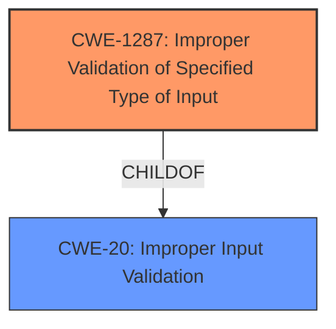

# Analysis for CVE-2021-44358

# Summary
| CWE ID | CWE Name | Confidence | CWE Abstraction Level | CWE Vulnerability Mapping Label | CWE-Vulnerability Mapping Notes |
|---|---|---|---|---|---|
| CWE-1287 | Improper Validation of Specified Type of Input | 1 | Base | Allowed | Primary CWE |
| CWE-20 | Improper Input Validation | 0.7 | Class | Discouraged | Secondary Candidate |

## Evidence and Confidence

*   **Confidence Score:** 0.9
*   **Evidence Strength:** HIGH

## Relationship Analysis
The primary CWE, CWE-1287, is a child of CWE-20, indicating a more specific type of input validation issue. While CWE-20 is a general class, CWE-1287 more accurately captures the vulnerability's root cause: the **improper validation of the type of input**. The vulnerability occurs because the code assumes the `param` field is a JSON object without checking its actual type.

## Vulnerability Chain
The chain of events is as follows:
1.  The application receives a specially-crafted HTTP request with a `SetRec` command.
2.  The `cgiserver.cgi` JSON command parser **fails to validate the type** of the `param` field (CWE-1287).
3.  The parser attempts to use the subscription operator on the `param` field, assuming it is a JSON object.
4.  A failed assertion occurs due to the type mismatch, leading to process termination.
5.  The `cgiserver.cgi` process terminates.
6.  The device reboots, resulting in a denial of service.

## Summary of Analysis
Initially, CWE-20 was considered due to the general nature of the vulnerability description indicating an **input validation issue**. However, after reviewing the "CVE Reference Links Content Summary", it became clear that the core issue is the **improper validation of the type** of the `param` field. This makes CWE-1287 a more precise and appropriate classification.

Evidence from the "CVE Reference Links Content Summary" section:
- "The vulnerability stems from **improper input validation** within the `cgiserver.cgi` JSON command parser of the Reolink RLC-410W camera. Specifically, the `SetRec` command's JSON parameter parser incorrectly assumes the `param` field will always be a JSON object."
- "**Improper Input Validation (CWE-20):** The `cgiserver.cgi` does not properly validate the type of the JSON `param` field before attempting to access its members."
- "**Type Confusion:** The code assumes the `param` field is a JSON object, leading to a type mismatch when it is a different type."

The "Retriever Results" listed CWE-1287 as the top candidate with a score of 0.711. The "Complete CWE Specifications" for CWE-1287 states, "The product receives input that is expected to be of a certain type, but it does not validate or incorrectly validates that the input is actually of the expected type," which aligns perfectly with the vulnerability description. The mapping guidance for CWE-1287 allows its usage because it is at the Base level of abstraction.

Although CWE-20 is listed as the primary match in the "CWE for similar CVE Descriptions" section, the detailed analysis of the vulnerability reveals that it's specifically the *type* of the input that is not being validated. The MITRE mapping guidance discourages the use of CWE-20 when lower-level CWEs are available. Therefore, CWE-1287 is a better fit.