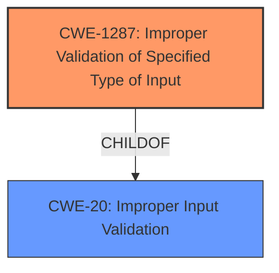

# Analysis Report for CVE-2021-44362

# Vulnerability Analysis Report: CVE-2021-44362

## Description


## Analysis (with Relationship Data)

# Summary
| CWE ID | CWE Name | Confidence | CWE Abstraction Level | CWE Vulnerability Mapping Label | CWE-Vulnerability Mapping Notes |
|---|---|---|---|---|---|
| CWE-1287 | Improper Validation of Specified Type of Input | 0.9 | Base | Primary | Allowed |
| CWE-20 | Improper Input Validation | 0.6 | Class | Secondary | Discouraged |

## Evidence and Confidence

*   **Confidence Score:** 0.9
*   **Evidence Strength:** HIGH

## Relationship Analysis
The primary CWE, CWE-1287, is a child of CWE-20. This relationship indicates that CWE-1287 is a more specific type of input validation issue. Since the vulnerability involves specifically the type of the input not being validated, CWE-1287 is more appropriate.



## Vulnerability Chain
The chain of events is as follows:
1.  **Root Cause:** The application **does not validate the type** of the `param` JSON element (CWE-1287).
2.  When a non-object (e.g., a string) is provided as the `param`, the program attempts to access it using the subscription operator
3.  This leads to an assertion failure.
4.  The device subsequently reboots.
5.  **Impact:** Denial of service.

## Summary of Analysis
The initial analysis focused on the **improper input validation** due to the application's failure to validate the type of the `param` JSON element. The `cgiserver.cgi` program incorrectly assumes that the `param` JSON element within a command will always be an object. When a non-object (e.g., a string) is provided as the `param`, the program attempts to access it using the subscription operator, leading to an assertion failure and a subsequent device reboot.

The evidence from the CVE Reference Links Content Summary is: "The `cgiserver.cgi` program incorrectly assumes that the `param` JSON element within a command will always be an object. When a non-object (e.g., a string) is provided as the `param`, the program attempts to access it using the subscription operator, leading to an assertion failure and a subsequent device reboot."

The graph relationships confirm that CWE-1287 is a more specific instance of CWE-20, making it a better fit.

The selected CWEs are at the optimal level of specificity, with CWE-1287 being a Base level CWE that directly addresses the **lack of type validation**.

CWE-20 was considered initially, as it is a general class of **improper input validation**, but CWE-1287 provides a more precise description of the vulnerability. Other CWEs like CWE-787 (Out-of-bounds Write) and CWE-120 (Buffer Copy without Checking Size of Input) were considered but deemed irrelevant as the vulnerability is not related to buffer overflows or out-of-bounds writes but rather to the **incorrect handling of input types**.

Relevant CWE Information:

# Enhanced Context (25 CWEs)
The following CWEs were identified as potentially relevant to this vulnerability:

## CWE-131: Incorrect Calculation of Buffer Size
**Abstraction Level**: Base
**Similarity Score**: 0.76

## CWE-805: Buffer Access with Incorrect Length Value
**Abstraction Level**: Base
**Similarity Score**: 0.76

## CWE-124: Buffer Underwrite ('Buffer Underflow')
**Abstraction Level**: Base
**Similarity Score**: 0.75

## CWE-126: Buffer Over-read
**Abstraction Level**: Variant
**Similarity Score**: 0.75

## CWE-191: Integer Underflow (Wrap or Wraparound)
**Abstraction Level**: Base
**Similarity Score**: 0.75

## CWE-193: Off-by-one Error
**Abstraction Level**: Base
**Similarity Score**: 0.75

## CWE-125: Out-of-bounds Read
**Abstraction Level**: Base
**Similarity Score**: 0.74

## CWE-130: Improper Handling of Length Parameter Inconsistency
**Abstraction Level**: Base
**Similarity Score**: 0.74

## CWE-119: Improper Restriction of Operations within the Bounds of a Memory Buffer
**Abstraction Level**: Class
**Similarity Score**: 0.74

## CWE-789: Memory Allocation with Excessive Size Value
**Abstraction Level**: Variant
**Similarity Score**: 0.74

## CWE-190: Integer Overflow or Wraparound
**Abstraction Level**: Base
**Similarity Score**: 7971.54

## CWE-1284: Improper Validation of Specified Quantity in Input
**Abstraction Level**: Base
**Similarity Score**: 7930.89

## CWE-125: Out-of-bounds Read
**Abstraction Level**: Base
**Similarity Score**: 7913.19

## CWE-22: Improper Limitation of a Pathname to a Restricted Directory ('Path Traversal')
**Abstraction Level**: Base
**Similarity Score**: 7664.14

## CWE-789: Memory Allocation with Excessive Size Value
**Abstraction Level**: Variant
**Similarity Score**: 7627.42

## CWE-41: Improper Resolution of Path Equivalence
**Abstraction Level**: base
**Similarity Score**: 5.03

## CWE-843: Access of Resource Using Incompatible Type ('Type Confusion')
**Abstraction Level**: base
**Similarity Score**: 5.03

## CWE-120: Buffer Copy without Checking Size of Input ('Classic Buffer Overflow')
**Abstraction Level**: base
**Similarity Score**: 4.82

## CWE-22: Improper Limitation of a Pathname to a Restricted Directory ('Path Traversal')
**Abstraction Level**: base
**Similarity Score**: 4.33

## CWE-770: Allocation of Resources Without Limits or Throttling
**Abstraction Level**: base
**Similarity Score**: 4.33

## CWE-73: External Control of File Name or Path
**Abstraction Level**: base
**Similarity Score**: 4.33

## CWE-1284: Improper Validation of Specified Quantity in Input
**Abstraction Level**: base
**Similarity Score**: 4.33

## CWE-123: Write-what-where Condition
**Abstraction Level**: base
**Similarity Score**: 4.33

## CWE-787: Out-of-bounds Write
**Abstraction Level**: base
**Similarity Score**: 4.33

## CWE-825: Expired Pointer Dereference
**Abstraction Level**: base
**Similarity Score**: 4.33


## CWE Relationship Analysis

Current CWEs represent these abstraction levels: .


### Vulnerability Chain Analysis

**Chain starting from CWE-41:**
- 41 (Improper Resolution of Path Equivalence) - ROOT


**Chain starting from CWE-119:**
- 119 (Improper Restriction of Operations within the Bounds of a Memory Buffer) - ROOT


### CWE Relationship Diagram

```mermaid
graph TD
    classDef primary fill:#f96,stroke:#333,stroke-width:2px
    classDef secondary fill:#69f,stroke:#333
    classDef tertiary fill:#9e9,stroke:#333
```


*Report generated on 2025-03-31 00:44:55*
