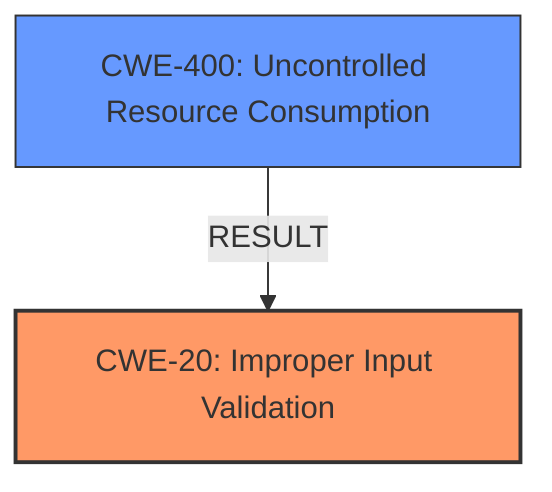

# Analysis for CVE-2021-44364

# Summary
| CWE ID  | CWE Name                                                                              | Confidence | CWE Abstraction Level | CWE Vulnerability Mapping Label | CWE-Vulnerability Mapping Notes |
| :-------- | :------------------------------------------------------------------------------------ | :----------- | :---------------------- | :------------------------------ | :-------------------------------- |
| CWE-20  | Improper Input Validation                                                         | 1          | Class                   | Allowed                       | Primary CWE                       |
| CWE-400 | Uncontrolled Resource Consumption                                                              | 0.6          | Class                  | Allowed-with-Review                         | Secondary                       |

## Evidence and Confidence

*   **Confidence Score:** 1
*   **Evidence Strength:** HIGH

## Relationship Analysis
The primary CWE is CWE-20, which represents a broad class of input validation issues. While the provided information strongly supports **improper input validation**, the specific type of invalid input is not explicitly detailed, suggesting that CWE-20 is the most appropriate fit.

CWE-400 is included as a secondary weakness because the reboot indicates **resource consumption**, however the evidence only indicates a single crash, not necessarily uncontrolled.

## Vulnerability Chain
The vulnerability chain starts with **improper input validation** (CWE-20), where the `cgiserver.cgi` program fails to validate the type of the `param` JSON element in API requests. When the program encounters a string instead of an object, it attempts to access it using the subscription operator, which leads to an assertion failure. This assertion failure causes the `cgiserver.cgi` process to crash, resulting in a device reboot and a **denial-of-service** (resource consumption) condition (CWE-400).

## Summary of Analysis
The analysis identifies CWE-20 as the primary weakness due to the **improper input validation** in the `cgiserver.cgi` program. The program **does not properly** validate that the `param` element is a JSON object before attempting to access its members using the subscription operator. This is clearly supported by the "CVE Reference Links Content Summary" that says "**Root cause of vulnerability**: The `cgiserver.cgi` program incorrectly assumes that the `param` JSON element within API requests is always an object. When a string is provided instead, the program attempts to access it using the subscription operator, leading to an assertion failure and subsequent device reboot."

CWE-400 is included as a secondary weakness because the crash leads to reboot, meaning there is some **resource consumption**, however the evidence only indicates a single crash, not necessarily uncontrolled.

The selected CWEs are at the optimal level of specificity, with CWE-20 representing the root cause of the vulnerability and CWE-400 representing the result.

Relevant CWE Information:

# Enhanced Context (25 CWEs)

## CWE-805: Buffer Access with Incorrect Length Value
**Abstraction Level**: Base
**Similarity Score**: 0.78
**Source**: dense

**Description**:
The product uses a sequential operation to read or write a buffer, but it uses an incorrect length value that causes it to access memory that is outside of the bounds of the buffer.
*Not Selected*: This CWE is not appropriate because there's no explicit evidence of incorrect buffer length usage.

## CWE-131: Incorrect Calculation of Buffer Size
**Abstraction Level**: Base
**Similarity Score**: 0.78
**Source**: dense

**Description**:
The product does not correctly calculate the size to be used when allocating a buffer, which could lead to a buffer overflow.
*Not Selected*: There is no indication of buffer size calculation issues.

## CWE-125: Out-of-bounds Read
**Abstraction Level**: Base
**Similarity Score**: 0.77
**Source**: dense

**Description**:
The product reads data past the end, or before the beginning, of the intended buffer.
*Not Selected*: The vulnerability is related to incorrect type validation, not reading out of bounds.

## CWE-191: Integer Underflow (Wrap or Wraparound)
**Abstraction Level**: Base
**Similarity Score**: 0.77
**Source**: dense

**Description**:
The product subtracts one value from another, such that the result is less than the minimum allowable integer value, which produces a value that is not equal to the correct result.
*Not Selected*: Integer underflow is not related to the described vulnerability.

## CWE-130: Improper Handling of Length Parameter Inconsistency
**Abstraction Level**: Base
**Similarity Score**: 0.77
**Source**: dense

**Description**:
The product parses a formatted message or structure, but it does not handle or incorrectly handles a length field that is inconsistent with the actual length of the associated data.
*Not Selected*: The issue is not about handling inconsistent length parameters.

## CWE-126: Buffer Over-read
**Abstraction Level**: Variant
**Similarity Score**: 0.77
**Source**: dense

**Description**:
The product reads from a buffer using buffer access mechanisms such as indexes or pointers that reference memory locations after the targeted buffer.
*Not Selected*: The vulnerability is related to incorrect type validation, not reading out of bounds.

## CWE-124: Buffer Underwrite ('Buffer Underflow')
**Abstraction Level**: Base
**Similarity Score**: 0.77
**Source**: dense

**Description**:
The product writes to a buffer using an index or pointer that references a memory location prior to the beginning of the buffer.
*Not Selected*: The vulnerability is related to incorrect type validation, not writing out of bounds.

## CWE-193: Off-by-one Error
**Abstraction Level**: Base
**Similarity Score**: 0.76
**Source**: dense

**Description**:
A product calculates or uses an incorrect maximum or minimum value that is 1 more, or 1 less, than the correct value.
*Not Selected*: There's no indication of off-by-one errors in the vulnerability description.

## CWE-226: Sensitive Information in Resource Not Removed Before Reuse
**Abstraction Level**: Base
**Similarity Score**: 0.76
**Source**: dense

**Description**:
The product releases a resource such as memory or a file so that it can be made available for reuse, but it does not clear or "zeroize" the information contained in the resource before the product performs a critical state transition or makes the resource available for reuse by other entities.
*Not Selected*: This CWE doesn't fit the vulnerability scenario.

## CWE-404: Improper Resource Shutdown or Release
**Abstraction Level**: Class
**Similarity Score**: 0.76
**Source**: dense

**Description**:
The product does not release or incorrectly releases a resource before it is made available for re-use.
*Not Selected*: This is too general; CWE-400 is a better fit if any.

## CWE-125: Out-of-bounds Read
**Abstraction Level**: Base
**Similarity Score**: 6628.95
**Source**: sparse

**Description**:
The product reads data past the end, or before the beginning, of the intended buffer.
*Not Selected*: The vulnerability is related to incorrect type validation, not reading out of bounds.

## CWE-190: Integer Overflow or Wraparound
**Abstraction Level**: Base
**Similarity Score**: 6580.04
**Source**: sparse

**Description**:
The product performs a calculation that can
         produce an integer overflow or wraparound when the logic
         assumes that the resulting value will always be larger than
         the original value. This occurs when an integer value is
         incremented to a value that is too large to store in the
         associated representation. When this occurs, the value may
         become a very small or negative number.
*Not Selected*: Integer overflow/wraparound is not related to the vulnerability.

## CWE-1284: Improper Validation of Specified Quantity in Input
**Abstraction Level**: Base
**Similarity Score**: 6531.85
**Source**: sparse

**Description**:
The product receives input that is expected to specify a quantity (such as size or length), but it does not validate or incorrectly validates that the quantity has the required properties.
*Not Selected*: The vulnerability relates to data type, not quantity.

## CWE-184: Incomplete List of Disallowed Inputs
**Abstraction Level**: Base
**Similarity Score**: 6471.38
**Source**: sparse

**Description**:
The product implements a protection mechanism that relies on a list of inputs (or properties of inputs) that are not allowed by policy or otherwise require other action to neutralize before additional processing takes place, but the list is incomplete.
*Not Selected*: This CWE doesn't fit the described scenario.

## CWE-22: Improper Limitation of a Pathname to a Restricted Directory ('Path Traversal')
**Abstraction Level