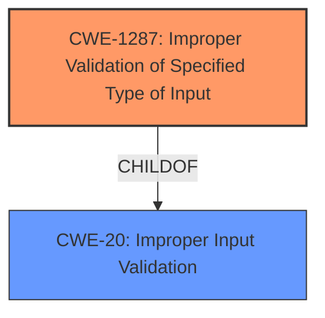

# Analysis Report for CVE-2021-44365

# Vulnerability Analysis Report: CVE-2021-44365

## Description


## Analysis (with Relationship Data)

# Summary
| CWE ID | CWE Name | Confidence | CWE Abstraction Level | CWE Vulnerability Mapping Label | CWE-Vulnerability Mapping Notes |
|---|---|---|---|---|---|
| CWE-1287 | Improper Validation of Specified Type of Input | 0.9 | Base | Allowed | Primary CWE |
| CWE-20 | Improper Input Validation | 0.6 | Class | Discouraged | Secondary Candidate |

## Evidence and Confidence

*   **Confidence Score:** 0.9
*   **Evidence Strength:** HIGH

## Relationship Analysis
The primary CWE selected is CWE-1287, which is a Base level CWE and a child of CWE-20. CWE-20 is a class-level CWE that represents a more general case of improper input validation. The relationship between these CWEs indicates that CWE-1287 is a more specific type of input validation issue, focusing on the validation of the input type.
Here's the Mermaid diagram:


## Vulnerability Chain
The vulnerability chain starts with the **improper validation** of the input type, specifically the "param" field in the JSON command. This leads to an attempt to access the field as an object, resulting in an assertion failure and the subsequent reboot of the device, which is a denial of service.

## Summary of Analysis
The initial assessment identified CWE-20 as a potential candidate due to the **improper input validation**. However, after further analysis, CWE-1287 was chosen as the primary CWE because it more accurately represents the specific weakness: the **improper validation of the *type* of input**.

The evidence supporting this decision comes from the "CVE Reference Links Content Summary," which states that the `cgiserver.cgi` process incorrectly assumes that the "param" field within a JSON command will always be a JSON object. When a string or other non-object type is provided, the program attempts to access it as an object, leading to a crash.

The relationship between CWE-1287 and CWE-20, where CWE-1287 is a child of CWE-20, also supports this choice. CWE-1287 is a more specific and detailed representation of the vulnerability than the more general CWE-20. The mapping guidance for CWE-20 discourages its use when lower-level CWEs are available.

The selected CWEs are at the optimal level of specificity because CWE-1287 directly addresses the root cause of the vulnerability which is **the lack of type validation of the "param" field**.

Relevant CWE Information:

# Enhanced Context (25 CWEs)
The following CWEs were identified as potentially relevant to this vulnerability:

## CWE-1287: Improper Validation of Specified Type of Input
**Abstraction Level**: Base
**Similarity Score**: 0.677
**Source**: sparse

**Description**:
The product receives input that is expected to be of a certain type, but it does not validate or incorrectly validates that the input is actually of the expected type.

**Mapping Guidance**:
- Usage: Allowed
- Rationale: This CWE entry is at the Base level of abstraction, which is a preferred level of abstraction for mapping to the root causes of vulnerabilities.

## CWE-20: Improper Input Validation
**Abstraction Level**: Class
**Similarity Score**: 0.291
**Source**: sparse

**Description**:
The product receives input or data, but it does
        not validate or incorrectly validates that the input has the
        properties that are required to process the data safely and
        correctly.

**Mapping Guidance**:
- Usage: Discouraged
- Rationale: CWE-20 is commonly misused in low-information vulnerability reports when lower-level CWEs could be used instead, or when more details about the vulnerability are available [REF-1287]. It is not useful for trend analysis. It is also a level-1 Class (i.e., a child of a Pillar).

### Technical Explanation for CWE-1287:
*   **How the vulnerability's details match the CWE's characteristics:** The vulnerability occurs because the `cgiserver.cgi` component does not validate that the "param" field in a JSON command is of the expected type (JSON object). When it receives a string or other non-object type, it attempts to access it as an object, leading to a crash. This perfectly aligns with the CWE-1287 description, which states that the product receives input that is expected to be of a certain type, but it does not validate or incorrectly validates that the input is actually of the expected type.
*   **The security implications and potential impact:** The security implication is a denial of service. An attacker can send a specially crafted HTTP request with an invalid "param" field to cause the device to reboot, disrupting its normal operation.
*   **Any parent-child relationships or chain patterns that influenced your mapping:** CWE-1287 is a child of CWE-20 (Improper Input Validation). The relationship supports the decision to choose CWE-1287, as it is a more specific type of input validation issue.
*   **Whether the weakness is primary or secondary in the vulnerability:** CWE-1287 is the primary weakness, as it is the root cause of the vulnerability.
*   **How the official MITRE mapping guidance influenced your decision:** The mapping guidance for CWE-1287 states that it is at the Base level of abstraction, which is a preferred level for mapping root causes. It also advises ensuring that the mapping is an appropriate fit, which it is in this case.

### Technical Explanation for CWE-20:
*   **How the vulnerability's details match the CWE's characteristics:** While the vulnerability does involve improper input validation, CWE-20 is too general. The specific issue is the lack of validation of the *type* of the input, which is better captured by CWE-1287.
*   **The security implications and potential impact:** The security implication is a denial of service. An attacker can send a specially crafted HTTP request with an invalid "param" field to cause the device to reboot, disrupting its normal operation.
*   **Any parent-child relationships or chain patterns that influenced your mapping:** CWE-20 is a parent of CWE-1287. The relationship influenced the decision to consider CWE-20 initially, but ultimately choose the more specific child.
*   **Whether the weakness is primary or secondary in the vulnerability:** CWE-20 is a secondary weakness as it is a more general case of improper input validation.
*   **How the official MITRE mapping guidance influenced your decision:** The mapping guidance for CWE-20 discourages its use when lower-level CWEs are available.

### Other CWEs Considered but Not Used:
CWE-772 (Missing Release of Resource after Effective Lifetime), CWE-306 (Missing Authentication for Critical Function), CWE-120 (Buffer Copy without Checking Size of Input ('Classic Buffer Overflow')), CWE-674 (Uncontrolled Recursion), CWE-78 (Improper Neutralization of Special Elements used in an OS Command ('OS Command Injection')), CWE-170 (Improper Null Termination), CWE-134 (Use of Externally-Controlled Format String), CWE-89 (Improper Neutralization of Special Elements used in an SQL Command ('SQL Injection')) were considered but not used because they did not accurately represent the specific vulnerability described in the report, which is related to input type validation. They were too broad or focused on different types of weaknesses.


## CWE Relationship Analysis

Current CWEs represent these abstraction levels: .


### Vulnerability Chain Analysis

**Chain starting from CWE-89:**
- 89 (Improper Neutralization of Special Elements used in an SQL Command ('SQL Injection')) - ROOT


**Chain starting from CWE-170:**
- 170 (Improper Null Termination) - ROOT


### CWE Relationship Diagram

```mermaid
graph TD
    classDef primary fill:#f96,stroke:#333,stroke-width:2px
    classDef secondary fill:#69f,stroke:#333
    classDef tertiary fill:#9e9,stroke:#333
```


*Report generated on 2025-03-30 23:07:29*
