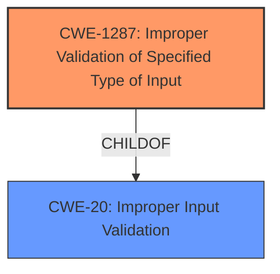

# Analysis Report for CVE-2021-44370

# Vulnerability Analysis Report: CVE-2021-44370

## Description


## Analysis (with Relationship Data)

# Summary
| CWE ID  | CWE Name                                                                        | Confidence | CWE Abstraction Level | CWE Vulnerability Mapping Label | CWE-Vulnerability Mapping Notes |
| :-------- | :------------------------------------------------------------------------------ | :--------- | :---------------------- | :------------------------------ | :------------------------------ |
| CWE-1287 | Improper Validation of Specified Type of Input                               | 0.9        | Base                    | Primary                         | Allowed                       |
| CWE-20  | Improper Input Validation                                                        | 0.6        | Class                   | Secondary                       | Discouraged                    |

## Evidence and Confidence

*   **Confidence Score:** 0.9
*   **Evidence Strength:** HIGH

## Relationship Analysis
The primary CWE, CWE-1287, is a child of CWE-20, which indicates a hierarchical relationship where CWE-1287 is a more specific case of improper input validation. The selection of CWE-1287 is favored because it directly addresses the specific type of input validation failure (type validation), rather than just general input validation.



## Vulnerability Chain
The vulnerability chain starts with **improper input validation** of the "param" JSON element, specifically failing to validate its type, which leads to an attempt to access it as an object when it is not. This results in an assertion failure, causing the `cgiserver.cgi` process to crash and the device to reboot, leading to a denial-of-service condition.

## Summary of Analysis
The initial assessment identified a denial-of-service vulnerability due to **improper input validation** in the `cgiserver.cgi` JSON command parser. The system does not check if the "param" element is a JSON object. When it is not, the code attempts to treat it as such, leading to a crash and reboot.

The vulnerability description states, "A specially-crafted HTTP request can lead to a reboot. SetFtp param is not object." This indicates a **failure to validate the type of the "param" input**.

The CVE Reference Links Content Summary further supports this by stating: "The `cgiserver.cgi` JSON command parser in Reolink RLC-410W does not properly validate the type of the "param" JSON element. It assumes that the "param" element is always a JSON object, but if a string or other non-object type is provided, the code will attempt to access it as an object, leading to an assertion failure."

Based on this evidence, CWE-1287 (Improper Validation of Specified Type of Input) is the most appropriate CWE. It directly addresses the root cause of the vulnerability, which is the **failure to validate the type of the input**.

CWE-20 (Improper Input Validation) was also considered, as the summary explicitly mentions improper input validation. However, it is a more general classification. Since the vulnerability stems from failing to validate the *type* of the input, CWE-1287 is more specific and therefore more appropriate. While CWE-20 is a parent of CWE-1287, it's best to choose the lowest level of abstraction, which is the Base level (CWE-1287).

Relevant CWE Information:

# Enhanced Context (25 CWEs)
The following CWEs were identified as potentially relevant to this vulnerability:

## CWE-1289: Improper Validation of Unsafe Equivalence in Input
**Abstraction Level**: Base
**Similarity Score**: 0.80

## CWE-184: Incomplete List of Disallowed Inputs
**Abstraction Level**: Base
**Similarity Score**: 0.79

## CWE-183: Permissive List of Allowed Inputs
**Abstraction Level**: Base
**Similarity Score**: 0.78

## CWE-1288: Improper Validation of Consistency within Input
**Abstraction Level**: Base
**Similarity Score**: 0.77

## CWE-807: Reliance on Untrusted Inputs in a Security Decision
**Abstraction Level**: Base
**Similarity Score**: 0.77

## CWE-138: Improper Neutralization of Special Elements
**Abstraction Level**: Class
**Similarity Score**: 0.77

## CWE-115: Misinterpretation of Input
**Abstraction Level**: Base
**Similarity Score**: 0.76

## CWE-606: Unchecked Input for Loop Condition
**Abstraction Level**: Base
**Similarity Score**: 0.76

## CWE-74: Improper Neutralization of Special Elements in Output Used by a Downstream Component ('Injection')
**Abstraction Level**: Class
**Similarity Score**: 0.76

## CWE-134: Use of Externally-Controlled Format String
**Abstraction Level**: Base
**Similarity Score**: 0.76

## CWE-1284: Improper Validation of Specified Quantity in Input
**Abstraction Level**: Base
**Similarity Score**: 7884.56

## CWE-190: Integer Overflow or Wraparound
**Abstraction Level**: Base
**Similarity Score**: 7883.64

## CWE-125: Out-of-bounds Read
**Abstraction Level**: Base
**Similarity Score**: 7868.40

## CWE-184: Incomplete List of Disallowed Inputs
**Abstraction Level**: Base
**Similarity Score**: 7764.31

## CWE-22: Improper Limitation of a Pathname to a Restricted Directory ('Path Traversal')
**Abstraction Level**: Base
**Similarity Score**: 7724.91

## CWE-78: Improper Neutralization of Special Elements used in an OS Command ('OS Command Injection')
**Abstraction Level**: base
**Similarity Score**: 5.03

## CWE-843: Access of Resource Using Incompatible Type ('Type Confusion')
**Abstraction Level**: base
**Similarity Score**: 5.03

## CWE-22: Improper Limitation of a Pathname to a Restricted Directory ('Path Traversal')
**Abstraction Level**: base
**Similarity Score**: 4.33

## CWE-770: Allocation of Resources Without Limits or Throttling
**Abstraction Level**: base
**Similarity Score**: 4.33

## CWE-190: Integer Overflow or Wraparound
**Abstraction Level**: base
**Similarity Score**: 4.33

## CWE-120: Buffer Copy without Checking Size of Input ('Classic Buffer Overflow')
**Abstraction Level**: base
**Similarity Score**: 4.33

## CWE-79: Improper Neutralization of Input During Web Page Generation ('Cross-site Scripting')
**Abstraction Level**: base
**Similarity Score**: 4.33

## CWE-123: Write-what-where Condition
**Abstraction Level**: base
**Similarity Score**: 4.33

## CWE-131: Incorrect Calculation of Buffer Size
**Abstraction Level**: base
**Similarity Score**: 4.33

## CWE-434: Unrestricted Upload of File with Dangerous Type
**Abstraction Level**: base
**Similarity Score**: 4.33


## CWE Relationship Analysis

Current CWEs represent these abstraction levels: .


### Vulnerability Chain Analysis

**Chain starting from CWE-807:**
- 807 (Reliance on Untrusted Inputs in a Security Decision) - ROOT


**Chain starting from CWE-1288:**
- 1288 (Improper Validation of Consistency within Input) - ROOT


### CWE Relationship Diagram

```mermaid
graph TD
    classDef primary fill:#f96,stroke:#333,stroke-width:2px
    classDef secondary fill:#69f,stroke:#333
    classDef tertiary fill:#9e9,stroke:#333
```


*Report generated on 2025-03-31 08:54:26*
