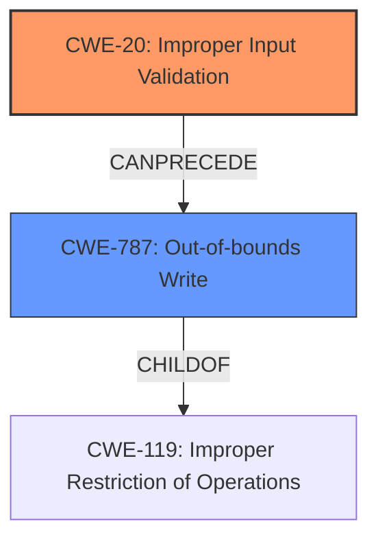

# Raw Analyzer Response for CVE-2021-44378

# Summary
| CWE ID | CWE Name | Confidence | CWE Abstraction Level | CWE Vulnerability Mapping Label | CWE-Vulnerability Mapping Notes |
|---|---|---|---|---|---|
| CWE-20 | Improper Input Validation | 1.0 | Base | Allowed | Primary CWE |
| CWE-787 | Out-of-bounds Write | 0.4 | Base | Allowed | Secondary Candidate |

## Evidence and Confidence

*   **Confidence Score:** 0.9
*   **Evidence Strength:** HIGH

## Relationship Analysis
The primary relationship is that **CWE-787 (Out-of-bounds Write)** is a ChildOf **CWE-119 (Improper Restriction of Operations within the Bounds of a Memory Buffer)**. **CWE-20 (Improper Input Validation)** can CanPrecede **CWE-787 (Out-of-bounds Write)**. The abstraction levels influenced the selection by preferring the Base level CWEs for the primary weakness.

## Vulnerability Chain
The vulnerability chain starts with **CWE-20 (Improper Input Validation)**, where the application fails to validate the input type. This leads to a crash of the `cgiserver.cgi` process, causing a **denial of service** because the code attempts to access members of the JSON `param` element as an object, but it receives a non-object value (empty string). In some scenarios, this could also lead to **CWE-787 (Out-of-bounds Write)** if the invalid input is mishandled and written to memory outside the intended buffer, although the evidence is insufficient to confirm this.

## Summary of Analysis
The initial assessment identified **CWE-20 (Improper Input Validation)** as the primary weakness, supported by strong evidence from the "CVE Reference Links Content Summary" section. This section explicitly states that the root cause is **improper input validation** in the `cgiserver.cgi` JSON command parser. The code doesn't validate the type of the JSON element provided as "param" before accessing its members, leading to an assertion failure and subsequent crash.

The retriever results suggested other CWEs, including **CWE-787 (Out-of-bounds Write)**, but the evidence for those is weaker. While an out-of-bounds write *could* occur due to the mishandling of the invalid input, the description focuses on the type validation failure as the direct cause of the crash. Therefore, **CWE-20 (Improper Input Validation)** is the most accurate and specific representation of the vulnerability based on the available evidence. **CWE-787 (Out-of-bounds Write)** is only a possibility.

The choice of **CWE-20 (Improper Input Validation)** is at the optimal level of specificity because it directly addresses the **root cause** identified in the vulnerability description.

Relevant CWE Information:

# Enhanced Context (25 CWEs)

## CWE-131: Incorrect Calculation of Buffer Size
**Abstraction Level**: Base
**Similarity Score**: 0.78
**Source**: dense

**Description**:
The product does not correctly calculate the size to be used when allocating a buffer, which could lead to a buffer overflow.

**Why it was not selected**: The vulnerability description does not indicate an incorrect calculation of buffer size, but rather a lack of input validation on the type of the JSON parameter.

## CWE-805: Buffer Access with Incorrect Length Value
**Abstraction Level**: Base
**Similarity Score**: 0.77
**Source**: dense

**Description**:
The product uses a sequential operation to read or write a buffer, but it uses an incorrect length value that causes it to access memory that is outside of the bounds of the buffer.

**Why it was not selected**: The vulnerability description does not indicate an incorrect length value being used to access a buffer, but rather a lack of input validation on the type of the JSON parameter.

## CWE-125: Out-of-bounds Read
**Abstraction Level**: Base
**Similarity Score**: 0.77
**Source**: dense

**Description**:
The product reads data past the end, or before the beginning, of the intended buffer.

**Why it was not selected**: The vulnerability description does not indicate an out-of-bounds read, but rather a lack of input validation on the type of the JSON parameter.

## CWE-191: Integer Underflow (Wrap or Wraparound)
**Abstraction Level**: Base
**Similarity Score**: 0.77
**Source**: dense

**Description**:
The product subtracts one value from another, such that the result is less than the minimum allowable integer value, which produces a value that is not equal to the correct result.

**Why it was not selected**: The vulnerability description does not indicate an integer underflow, but rather a lack of input validation on the type of the JSON parameter.

## CWE-130: Improper Handling of Length Parameter Inconsistency
**Abstraction Level**: Base
**Similarity Score**: 0.77
**Source**: dense

**Description**:
The product parses a formatted message or structure, but it does not handle or incorrectly handles a length field that is inconsistent with the actual length of the associated data.

**Why it was not selected**: The vulnerability description does not indicate an inconsistency in the length parameter, but rather a lack of input validation on the type of the JSON parameter.

## CWE-126: Buffer Over-read
**Abstraction Level**: Variant
**Similarity Score**: 0.76
**Source**: dense

**Description**:
The product reads from a buffer using buffer access mechanisms such as indexes or pointers that reference memory locations after the targeted buffer.

**Why it was not selected**: The vulnerability description does not indicate an out-of-bounds read, but rather a lack of input validation on the type of the JSON parameter.

## CWE-124: Buffer Underwrite ('Buffer Underflow')
**Abstraction Level**: Base
**Similarity Score**: 0.76
**Source**: dense

**Description**:
The product writes to a buffer using an index or pointer that references a memory location prior to the beginning of the buffer.

**Why it was not selected**: The vulnerability description does not indicate a buffer underwrite, but rather a lack of input validation on the type of the JSON parameter.

## CWE-404: Improper Resource Shutdown or Release
**Abstraction Level**: Class
**Similarity Score**: 0.76
**Source**: dense

**Description**:
The product does not release or incorrectly releases a resource before it is made available for re-use.

**Why it was not selected**: The vulnerability description does not indicate a resource not being released, but rather a lack of input validation on the type of the JSON parameter.

## CWE-226: Sensitive Information in Resource Not Removed Before Reuse
**Abstraction Level**: Base
**Similarity Score**: 0.76
**Source**: dense

**Description**:
The product releases a resource such as memory or a file so that it can be made available for reuse, but it does not clear or "zeroize" the information contained in the resource before the product performs a critical state transition or makes the resource available for reuse by other entities.

**Why it was not selected**: The vulnerability description does not indicate sensitive information in a resource not being removed before reuse, but rather a lack of input validation on the type of the JSON parameter.

## CWE-193: Off-by-one Error
**Abstraction Level**: Base
**Similarity Score**: 0.76
**Source**: dense

**Description**:
A product calculates or uses an incorrect maximum or minimum value that is 1 more, or 1 less, than the correct value.

**Why it was not selected**: The vulnerability description does not indicate an off-by-one error, but rather a lack of input validation on the type of the JSON parameter.

## CWE-1284: Improper Validation of Specified Quantity in Input
**Abstraction Level**: Base
**Similarity Score**: 6660.67
**Source**: sparse

**Description**:
The product receives input that is expected to specify a quantity (such as size or length), but it does not validate or incorrectly validates that the quantity has the required properties.

**Why it was not selected**: The vulnerability description does not indicate a quantity check problem but a type validation problem with the `param` field being an object.

## CWE-184: Incomplete List of Disallowed Inputs
**Abstraction Level**: Base
**Similarity Score**: 6593.58
**Source**: sparse

**Description**:
The product implements a protection mechanism that relies on a list of inputs (or properties of inputs) that are not allowed