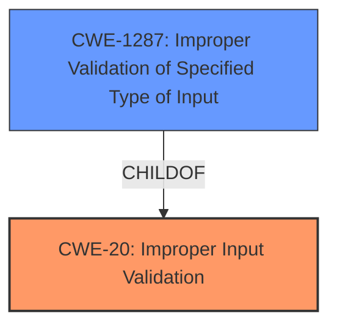

# Analysis Report for CVE-2021-44379

# Vulnerability Analysis Report: CVE-2021-44379

## Description


## Analysis (with Relationship Data)

# Summary
| CWE ID | CWE Name | Confidence | CWE Abstraction Level | CWE Vulnerability Mapping Label | CWE-Vulnerability Mapping Notes |
|---|---|---|---|---|---|
| CWE-20 | Improper Input Validation | 1.0 | Class | Primary | Discouraged |
| CWE-1287 | Improper Validation of Specified Type of Input | 0.8 | Base | Secondary | Allowed |

## Evidence and Confidence

*   **Confidence Score:** 0.9
*   **Evidence Strength:** HIGH

## Relationship Analysis
The primary CWE is CWE-20, which is a class-level CWE. While broad, it captures the essence of the **improper input validation**. The retriever results suggested the more specific CWE-1287, which is a base-level CWE. The relationship between CWE-20 and CWE-1287 is a ChildOf relationship, meaning CWE-1287 is a more specific type of input validation issue.



## Vulnerability Chain
The vulnerability chain starts with the lack of proper input validation (CWE-20), specifically the **improper validation of the specified type of input** (CWE-1287). This leads to a denial-of-service condition when the application attempts to process the unexpected input.

## Summary of Analysis
The initial analysis pointed towards CWE-20 due to the **lack of validation of the input**. The retriever tool suggested CWE-1287, which is more specific and describes the **improper validation of the input type**.

The "CVE Reference Links Content Summary" section contains the following evidence:
- **Weaknesses/vulnerabilities present**: Improper input validation (CWE-20). The application lacks proper checks to ensure that the "param" field is a JSON object before attempting to access its members.

The "Vulnerability Description Key Phrases" section contains the following evidence:
- **rootcause:** **A denial of service vulnerability exists in the cgiserver.cgi JSON command parser functionality**

The graph relationships and the retriever results helped refine the selection to include the more specific CWE-1287. The evidence strongly supports both CWE-20 and CWE-1287. Choosing both CWEs provides a more complete picture of the vulnerability.

CWE-20 is selected because the application does not validate the input. CWE-1287 is also selected to give a more detailed explanation of the input validation **weakness**. The application expects a JSON object but receives an empty string, leading to an error.

Other CWEs Considered and Rejected:

*   CWE-772: Missing Release of Resource after Effective Lifetime - While a reboot occurs, it is a consequence of the crash and not directly related to a resource leak.
*   CWE-120: Buffer Copy without Checking Size of Input ('Classic Buffer Overflow') - There is no buffer copy mentioned in the description.
*   CWE-674: Uncontrolled Recursion - There is no recursion involved in the description.
*   CWE-306: Missing Authentication for Critical Function - While the attacker can exploit it unauthenticated, the vulnerability is related to input validation.
*   CWE-78: Improper Neutralization of Special Elements used in an OS Command ('OS Command Injection') - No OS command injection is involved.
*   CWE-134: Use of Externally-Controlled Format String - This is not a format string vulnerability.
*   CWE-89: Improper Neutralization of Special Elements used in an SQL Command ('SQL Injection') - There is no SQL command involved.


## CWE Relationship Analysis

Current CWEs represent these abstraction levels: .


### Vulnerability Chain Analysis

**Chain starting from CWE-89:**
- 89 (Improper Neutralization of Special Elements used in an SQL Command ('SQL Injection')) - ROOT


**Chain starting from CWE-306:**
- 306 (Missing Authentication for Critical Function) - ROOT


### CWE Relationship Diagram

```mermaid
graph TD
    classDef primary fill:#f96,stroke:#333,stroke-width:2px
    classDef secondary fill:#69f,stroke:#333
    classDef tertiary fill:#9e9,stroke:#333
```


*Report generated on 2025-03-30 20:31:15*
