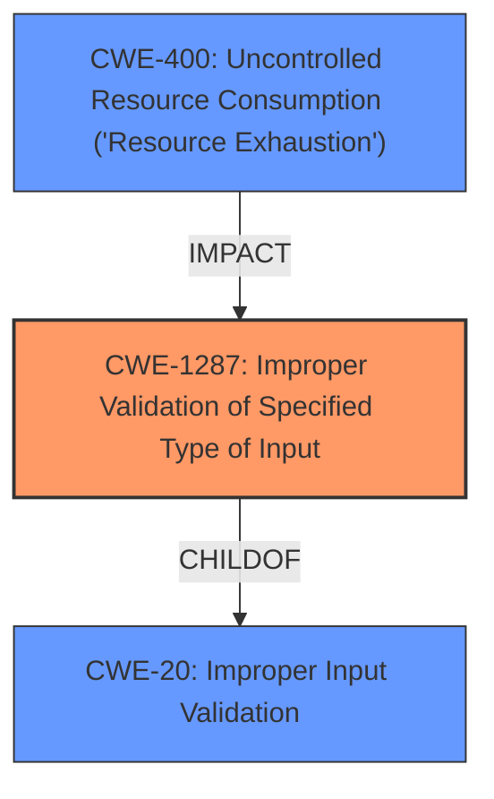

# Enhanced Analysis for CVE-2021-44380

# Summary
| CWE ID  | CWE Name                                                    | Confidence | CWE Abstraction Level | CWE Vulnerability Mapping Label | CWE-Vulnerability Mapping Notes |
| :-------- | :---------------------------------------------------------- | :--------- | :-------------------- | :------------------------------ | :------------------------------ |
| CWE-1287  | Improper Validation of Specified Type of Input             | 0.95       | Base                  | Primary CWE                  | Allowed                       |
| CWE-400 | Uncontrolled Resource Consumption ('Resource Exhaustion') | 0.75       | Class                  | Secondary CWE                  | Allowed                       |

## Evidence and Confidence

*   **Confidence Score:** 0.85
*   **Evidence Strength:** HIGH

## Relationship Analysis
The primary CWE is CWE-1287, as the root cause lies in the **improper validation of the type of input**. This is a base-level CWE, providing sufficient specificity. CWE-1287 is a child of CWE-20, Improper Input Validation, but CWE-1287 is more specific to the type of the input instead of the input in general, making it a better fit. CWE-400 is a Class level that describes the resulting resource consumption.



## Vulnerability Chain
The vulnerability chain starts with the **improper validation of input type** (CWE-1287). Specifically, the JSON command parser in `cgiserver.cgi` does not validate that the "param" JSON element in the `SetTime` API is an object, leading to a crash and reboot of the device, which results in a denial of service (CWE-400).
  - Root Cause: CWE-1287 (**Improper Validation of Specified Type of Input**)
  - Impact: CWE-400 (Uncontrolled Resource Consumption ('Resource Exhaustion'))

## Summary of Analysis
The initial assessment identified the vulnerability stemming from the JSON command parser's failure to validate the type of the "param" element. The evidence strongly supports this, as the "CVE Reference Links Content Summary" explicitly mentions the **lack of type checking on the "param" JSON element** as the root cause.

The retriever results also highlight CWE-1287 (**Improper Validation of Specified Type of Input**) as the top candidate CWE with a score of 0.753. This further reinforces the selection of CWE-1287 as the primary CWE.

The vulnerability chain clearly demonstrates that the **improper validation** leads to a crash and reboot, which results in a denial of service. Therefore, CWE-400 (Uncontrolled Resource Consumption ('Resource Exhaustion')) is added as a secondary CWE to represent the impact.

The selection of CWE-1287 is at the optimal level of specificity, as it directly addresses the root cause of the vulnerability: the failure to validate the type of input. Using a more general CWE like CWE-20 (**Improper Input Validation**) would be less precise and would not capture the specific nature of the weakness.

Relevant CWE Information:

# Enhanced Context (25 CWEs)
The following CWEs were identified as potentially relevant to this vulnerability:

## CWE-1289: Improper Validation of Unsafe Equivalence in Input
**Abstraction Level**: Base
**Similarity Score**: 0.76

This CWE was considered but deemed less appropriate because the core issue is not about validating equivalence to an unsafe value, but rather validating the type of the input.

## CWE-625: Permissive Regular Expression
**Abstraction Level**: Base
**Similarity Score**: 0.75

This CWE was considered but is not applicable since the vulnerability doesn't involve regular expressions.

## CWE-799: Improper Control of Interaction Frequency
**Abstraction Level**: Class
**Similarity Score**: 0.74

This CWE was considered but is not applicable since the vulnerability is not related to interaction frequency.

## CWE-407: Inefficient Algorithmic Complexity
**Abstraction Level**: Class
**Similarity Score**: 0.74

This CWE was considered but is not applicable since the vulnerability is not related to algorithmic complexity.

## CWE-138: Improper Neutralization of Special Elements
**Abstraction Level**: Class
**Similarity Score**: 0.73

This CWE was considered but is not applicable since the vulnerability doesn't involve neutralization of special elements.

## CWE-184: Incomplete List of Disallowed Inputs
**Abstraction Level**: Base
**Similarity Score**: 0.73

This CWE was considered but is not applicable since the vulnerability doesn't involve a list of disallowed inputs.

## CWE-74: Improper Neutralization of Special Elements in Output Used by a Downstream Component ('Injection')
**Abstraction Level**: Class
**Similarity Score**: 0.73

This CWE was considered but is not applicable since the vulnerability doesn't involve injection.

## CWE-606: Unchecked Input for Loop Condition
**Abstraction Level**: Base
**Similarity Score**: 0.73

This CWE was considered but is not applicable since the vulnerability is not related to loop conditions.

## CWE-185: Incorrect Regular Expression
**Abstraction Level**: Class
**Similarity Score**: 0.73

This CWE was considered but is not applicable since the vulnerability doesn't involve regular expressions.

## CWE-1333: Inefficient Regular Expression Complexity
**Abstraction Level**: Base
**Similarity Score**: 0.73

This CWE was considered but is not applicable since the vulnerability doesn't involve regular expressions.

## CWE-1284: Improper Validation of Specified Quantity in Input
**Abstraction Level**: Base
**Similarity Score**: 8100.62

This CWE was considered but it deals with quantity and not type of the input.

## CWE-190: Integer Overflow or Wraparound
**Abstraction Level**: Base
**Similarity Score**: 8031.79

This CWE was considered but is not applicable since the vulnerability is not related to integer overflow.

## CWE-125: Out-of-bounds Read
**Abstraction Level**: Base
**Similarity Score**: 8015.46

This CWE was considered but is not applicable since the vulnerability is not related to out-of-bounds read.

## CWE-789: Memory Allocation with Excessive Size Value
**Abstraction Level**: Variant
**Similarity Score**: 7863.89

This CWE was considered but is not applicable since the vulnerability is not related to memory allocation size.

## CWE-88: Improper Neutralization of Argument Delimiters in a Command ('Argument Injection')
**Abstraction Level**: Base
**Similarity Score**: 7832.96

This CWE was considered but is not applicable since the vulnerability is not related to argument injection.

## CWE-170: Improper Null Termination
**Abstraction Level**: base
**Similarity Score**: 5.03

This CWE was considered but is not applicable since the vulnerability is not related to improper null termination.

## CWE-843: Access of Resource Using Incompatible Type ('Type Confusion')
**Abstraction Level**: base
**Similarity Score**: 5.03

This CWE was considered but the root cause is the **improper validation** and not the access with incompatible type.

## CWE-22: Improper Limitation of a Pathname to a Restricted Directory ('Path Traversal')
**Abstraction Level**: base
**Similarity Score**: 4.33

This CWE was considered but is not applicable since the vulnerability is not related to path traversal.

## CWE-770: Allocation of Resources Without Limits or Throttling
**Abstraction Level**: base
**Similarity Score**: 4.33

This CWE was considered but is not applicable since the vulnerability is not related to resource allocation without limits.

## CWE-73: External Control of File Name or Path
**Abstraction Level**: base
**Similarity Score**: 4.33

This CWE was considered but is not applicable since the vulnerability is not related to external control of file name or path.

## CWE-190: Integer Overflow or Wraparound
**Abstraction Level**: base
**Similarity Score**: 4.33

This CWE was considered but is not applicable since the vulnerability is not related to integer overflow.

## CWE-1284: Improper Validation of Specified Quantity in Input
**Abstraction Level**: base
**Similarity Score**: 4.33

This CWE was considered but it deals with quantity and not type of the input.

## CWE-120: Buffer Copy without Checking Size of Input ('Classic Buffer Overflow')
**Abstraction Level**: base
**Similarity Score**: 4.33

This CWE


## CWE Relationship Analysis

Current CWEs represent these abstraction levels: .


### Vulnerability Chain Analysis

**Chain starting from CWE-138:**
- 138 (Improper Neutralization of Special Elements) - ROOT


**Chain starting from CWE-1287:**
- 1287 (Improper Validation of Specified Type of Input) - ROOT


### CWE Relationship Diagram

```mermaid
graph TD
    classDef primary fill:#f96,stroke:#333,stroke-width:2px
    classDef secondary fill:#69f,stroke:#333
    classDef tertiary fill:#9e9,stroke:#333
```