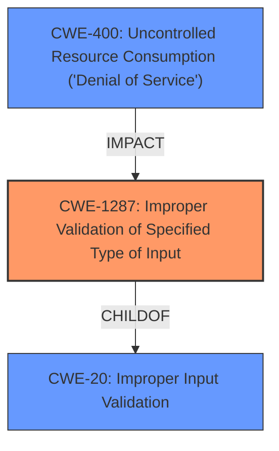

# Analysis Report for CVE-2021-44381

# Vulnerability Analysis Report: CVE-2021-44381

## Description


## Analysis (with Relationship Data)

# Summary
| CWE ID    | CWE Name                                                        | Confidence | CWE Abstraction Level | CWE Vulnerability Mapping Label | CWE-Vulnerability Mapping Notes |
| --------- | --------------------------------------------------------------- | ---------- | ----------------------- | ------------------------------- | ------------------------------- |
| CWE-1287  | Improper Validation of Specified Type of Input | 0.90       | Base                    | Allowed                       | Primary CWE                     |
| CWE-20    | Improper Input Validation                                         | 0.70       | Class                     | Discouraged                      | Secondary Candidate             |
| CWE-400   | Uncontrolled Resource Consumption ('Denial of Service')         | 0.60       | Class                     | Allowed                      | Secondary Candidate             |

## Evidence and Confidence

*   **Confidence Score:** 0.80
*   **Evidence Strength:** HIGH

## Relationship Analysis
The primary weakness is **CWE-1287 (Improper Validation of Specified Type of Input)**, which is a child of **CWE-20 (Improper Input Validation)**. The attack leads to a **denial of service**, and as such **CWE-400** is a possible related weakness.


## Vulnerability Chain
The chain of events is as follows:
1.  **Improper Input Validation (CWE-1287)**: The `cgiserver.cgi` process does not validate the type of the `param` JSON element.
2.  **Type Confusion**: The code assumes `param` is always an object, but it can be a string or other JSON type.
3.  **Assertion Failure**: Accessing the incorrect type with the subscription operator triggers an assertion failure.
4.  **Denial of Service (CWE-400)**: The assertion failure leads to process termination and device reboot.

## Summary of Analysis
Initially, **CWE-20 (Improper Input Validation)** was considered because the description mentions that the code doesn't validate the type of the `param` JSON element. However, **CWE-20** is a high-level class and the retriever results pointed to **CWE-1287 (Improper Validation of Specified Type of Input)** which is a base level CWE. The content summary provides sufficient evidence, "**The `cgiserver.cgi` process does not properly validate the `param` JSON element, assuming it is always an object, when parsing API requests.**"

**CWE-1287 (Improper Validation of Specified Type of Input)** is more specific because it directly addresses the **lack of type validation** on the input. The description of **CWE-1287** matches the vulnerability details: "The product receives input that is expected to be of a certain type, but it does not validate or incorrectly validates that the input is actually of the expected type."

**CWE-400 (Uncontrolled Resource Consumption ('Denial of Service'))** is relevant because the **impact** of the vulnerability is a device reboot, leading to a denial of service. However, it is not the root cause but a consequence of the **improper input validation**.

The final decision is to select **CWE-1287** as the primary CWE because it represents the root cause of the vulnerability, with a confidence of 0.90. **CWE-20** is a secondary candidate, as a broader classification, with a confidence of 0.70. **CWE-400** is also a secondary candidate with a confidence of 0.60, related to the impact.

Relevant CWE Information:

# Enhanced Context (25 CWEs)
The following CWEs were identified as potentially relevant to this vulnerability:

## CWE-1289: Improper Validation of Unsafe Equivalence in Input
**Abstraction Level**: Base
**Similarity Score**: 0.80
**Source**: dense

**Description**:
The product receives an input value that is used as a resource identifier or other type of reference, but it does not validate or incorrectly validates that the input is equivalent to a potentially-unsafe value.

**Mapping Guidance**:
- Usage: Allowed
- Rationale: This CWE entry is at the Base level of abstraction, which is a preferred level of abstraction for mapping to the root causes of vulnerabilities.

## CWE-184: Incomplete List of Disallowed Inputs
**Abstraction Level**: Base
**Similarity Score**: 0.78
**Source**: dense

**Description**:
The product implements a protection mechanism that relies on a list of inputs (or properties of inputs) that are not allowed by policy or otherwise require other action to neutralize before additional processing takes place, but the list is incomplete.

**Mapping Guidance**:
- Usage: Allowed
- Rationale: This CWE entry is at the Base level of abstraction, which is a preferred level of abstraction for mapping to the root causes of vulnerabilities.

## CWE-183: Permissive List of Allowed Inputs
**Abstraction Level**: Base
**Similarity Score**: 0.78
**Source**: dense

**Description**:
The product implements a protection mechanism that relies on a list of inputs (or properties of inputs) that are explicitly allowed by policy because the inputs are assumed to be safe, but the list is too permissive - that is, it allows an input that is unsafe, leading to resultant weaknesses.

**Mapping Guidance**:
- Usage: Allowed
- Rationale: This CWE entry is at the Base level of abstraction, which is a preferred level of abstraction for mapping to the root causes of vulnerabilities.

## CWE-138: Improper Neutralization of Special Elements
**Abstraction Level**: Class
**Similarity Score**: 0.77
**Source**: dense

**Description**:
The product receives input from an upstream component, but it does not neutralize or incorrectly neutralizes special elements that could be interpreted as control elements or syntactic markers when they are sent to a downstream component.

**Mapping Guidance**:
- Usage: Discouraged
- Rationale: This CWE entry is a level-1 Class (i.e., a child of a Pillar). It might have lower-level children that would be more appropriate

## CWE-807: Reliance on Untrusted Inputs in a Security Decision
**Abstraction Level**: Base
**Similarity Score**: 0.77
**Source**: dense

**Description**:
The product uses a protection mechanism that relies on the existence or values of an input, but the input can be modified by an untrusted actor in a way that bypasses the protection mechanism.

**Mapping Guidance**:
- Usage: Allowed
- Rationale: This CWE entry is at the Base level of abstraction, which is a preferred level of abstraction for mapping to the root causes of vulnerabilities.

## CWE-1288: Improper Validation of Consistency within Input
**Abstraction Level**: Base
**Similarity Score**: 0.77
**Source**: dense

**Description**:
The product receives a complex input with multiple elements or fields that must be consistent with each other, but it does not validate or incorrectly validates that the input is actually consistent.

**Mapping Guidance**:
- Usage: Allowed
- Rationale: This CWE entry is at the Base level of abstraction, which is a preferred level of abstraction for mapping to the root causes of vulnerabilities.

## CWE-606: Unchecked Input for Loop Condition
**Abstraction Level**: Base
**Similarity Score**: 0.76
**Source**: dense

**Description**:
The product does not properly check inputs that are used for loop conditions, potentially leading to a denial of service or other consequences because of excessive looping.

**Mapping Guidance**:
- Usage: Allowed
- Rationale: This CWE entry is at the Base level of abstraction, which is a preferred level of abstraction for mapping to the root causes of vulnerabilities.

## CWE-74: Improper Neutralization of Special Elements in Output Used by a Downstream Component ('Injection')
**Abstraction Level**: Class
**Similarity Score**: 0.76
**Source**: dense

**Description**:
The product constructs all or part of a command, data structure, or record using externally-influenced input from an upstream component, but it does not neutralize or incorrectly neutralizes special elements that could modify how it is parsed or interpreted when it is sent to a downstream component.

**Mapping Guidance**:
- Usage: Discouraged
- Rationale: CWE-74 is high-level and often misused when lower-level weaknesses are more appropriate.

## CWE-134: Use of Externally-Controlled Format String
**Abstraction Level**: Base
**Similarity Score**: 0.76
**Source**: dense

**Description**:
The product uses a function that accepts a format string as an argument, but the format string originates from


## CWE Relationship Analysis

Current CWEs represent these abstraction levels: .


### Vulnerability Chain Analysis

**Chain starting from CWE-400:**
- 400 (Uncontrolled Resource Consumption) - ROOT


**Chain starting from CWE-184:**
- 184 (Incomplete List of Disallowed Inputs) - ROOT


### CWE Relationship Diagram

```mermaid
graph TD
    classDef primary fill:#f96,stroke:#333,stroke-width:2px
    classDef secondary fill:#69f,stroke:#333
    classDef tertiary fill:#9e9,stroke:#333
```


*Report generated on 2025-03-30 14:19:45*
