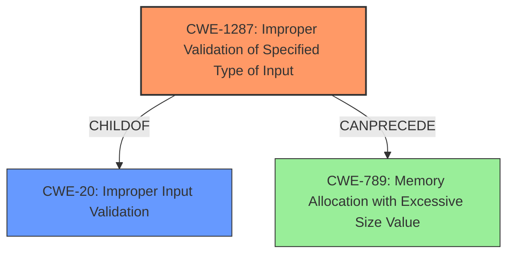

# Analysis Report for CVE-2021-44383

# Vulnerability Analysis Report: CVE-2021-44383

## Description


## Analysis (with Relationship Data)

# Summary
| CWE ID    | CWE Name                                                                              | Confidence | CWE Abstraction Level | CWE Vulnerability Mapping Label | CWE-Vulnerability Mapping Notes |
| :-------- | :------------------------------------------------------------------------------------ | :--------- | :-------------------- | :------------------------------ | :------------------------------ |
| CWE-1287 | Improper Validation of Specified Type of Input                 | 0.9      | Base                  | Allowed                      | Primary CWE                      |
| CWE-20     | Improper Input Validation                                                                | 0.7       | Class                  | Discouraged                      | Secondary Candidate               |

## Evidence and Confidence

*   **Confidence Score:** 0.8
*   **Evidence Strength:** HIGH

## Relationship Analysis
The primary CWE, CWE-1287, is a child of CWE-20, indicating a more specific type of input validation issue. CWE-20 is a class-level CWE that is discouraged for direct mapping when a more specific base-level CWE like CWE-1287 is applicable. CWE-1287's peer relationship with CWE-843 (Access of Resource Using Incompatible Type) suggests that type confusion vulnerabilities are related to the improper validation of input types. The graph shows that `CWE-1287` is a child of `CWE-20`, and can precede `CWE-789`.



## Vulnerability Chain
The vulnerability chain starts with the lack of proper input type validation in the `cgiserver.cgi` JSON command parser. This leads to a crash when a non-object type is provided for the `param` field, which results in a denial of service due to device reboot.

Improper Input Type Validation (CWE-1287) -> Process Crash -> Denial of Service

## Summary of Analysis
The initial analysis identified the **rootcause** as an **improper input validation** issue where the `cgiserver.cgi` JSON command parser does not validate the type of the `param` field. The vulnerability description clearly states that the parser expects a JSON object for the `param` field but does not validate the input type. When it receives a different type, the code crashes, leading to a denial of service.

The evidence from the "CVE Reference Links Content Summary" section supports this:

*   "**Root Cause:** Improper Input Validation in the `cgiserver.cgi` JSON command parser. The parser expects a JSON object for the `param` field of a command, but it does not validate the input type and crashes when it's not an object."
*   "**Weakness:** The code assumes that the JSON `param` element is always a JSON object. When it receives a different type (e.g., string) it will attempt to access it as an object using the subscription operator, leading to a program assert."

The retriever results identified CWE-1287 (**Improper Validation of Specified Type of Input**) as the top candidate. This CWE precisely matches the vulnerability description, as the **weakness** lies in the **lack of validation** of the **input type**. CWE-20 (**Improper Input Validation**) was also considered, but CWE-1287 is a more specific, base-level CWE that is more appropriate.

CWE-1287 is at the optimal level of specificity because it directly addresses the **root cause** of the vulnerability: the **failure to validate the type** of the input. This leads to a crash and denial of service. The mapping guidance for CWE-1287 recommends it as the preferred level of abstraction for mapping to the **root causes** of vulnerabilities.

Relevant CWE Information:

# Enhanced Context (25 CWEs)
The following CWEs were identified as potentially relevant to this vulnerability:

## CWE-1287: Improper Validation of Specified Type of Input
**Abstraction Level**: Base
**Similarity Score**: 0.76
**Source**: dense

**Description**:
The product receives input that is expected to be of a certain type, but it does not validate or incorrectly validates that the input is actually of the expected type.

**Mapping Guidance**:
- Usage: Allowed
- Rationale: This CWE entry is at the Base level of abstraction, which is a preferred level of abstraction for mapping to the root causes of vulnerabilities.

## CWE-20: Improper Input Validation
**Abstraction Level**: Class
**Similarity Score**: 0.74
**Source**: dense

**Description**:
The product receives input or data, but it does
        not validate or incorrectly validates that the input has the
        properties that are required to process the data safely and
        correctly.

**Mapping Guidance**:
- Usage: Discouraged
- Rationale: CWE-20 is commonly misused in low-information vulnerability reports when lower-level CWEs could be used instead, or when more details about the vulnerability are available.


## CWE Relationship Analysis

Current CWEs represent these abstraction levels: .


### Vulnerability Chain Analysis

**Chain starting from CWE-843:**
- 843 (Access of Resource Using Incompatible Type ('Type Confusion')) - ROOT


**Chain starting from CWE-20:**
- 20 (Improper Input Validation) - ROOT


### CWE Relationship Diagram

```mermaid
graph TD
    classDef primary fill:#f96,stroke:#333,stroke-width:2px
    classDef secondary fill:#69f,stroke:#333
    classDef tertiary fill:#9e9,stroke:#333
```


*Report generated on 2025-03-30 14:04:46*
