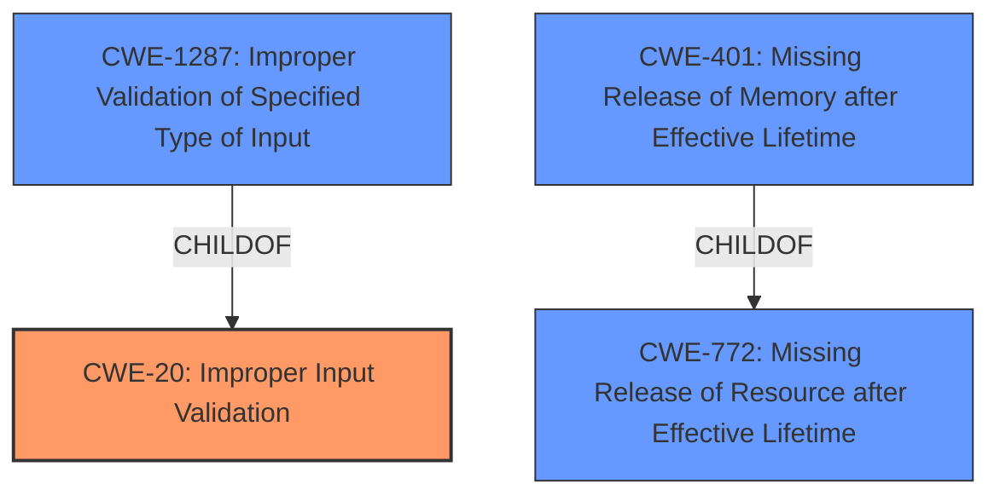

# Analysis for CVE-2021-44386

# Summary
| CWE ID | CWE Name | Confidence | CWE Abstraction Level | CWE Vulnerability Mapping Label | CWE-Vulnerability Mapping Notes |
|---|---|---|---|---|---|
| CWE-20 | Improper Input Validation | 0.9 | Class | Primary | Allowed-with-Review |
| CWE-1287 | Improper Validation of Specified Type of Input | 0.7 | Base | Secondary | Allowed |
| CWE-400 | Missing Release of Memory after Effective Lifetime | 0.6 | Variant | Secondary | Allowed |

## Evidence and Confidence

*   **Confidence Score:** 0.8
*   **Evidence Strength:** HIGH

## Relationship Analysis
The primary CWE selected is CWE-20, which is a Class-level CWE. While it is discouraged, the specific nature of the input validation failure (type validation) can be further specified by CWE-1287, which is a Base-level CWE and a child of CWE-20. The description also indicates that memory leaks leading to a denial of service, which would be CWE-401, a Variant of CWE-772 (Missing Release of Resource after Effective Lifetime).

## Vulnerability Chain
The chain of events starts with **Improper Input Validation (CWE-20)**, specifically the **Improper Validation of Specified Type of Input (CWE-1287)**, which leads to objects being processed incorrectly. This leads to a **Missing Release of Memory after Effective Lifetime (CWE-401)**, ultimately resulting in a denial-of-service condition.

## Summary of Analysis
Initially, the analysis focused on the **Improper Input Validation (CWE-20)** due to the `cgiserver.cgi` JSON command parser not validating the type of the JSON `param` field before attempting to parse it. The "**rootcause:** If the JSON data does not conform to the schema, then the corresponding Python objects cannot be further processed, leading to memory leak and eventually denial of service." reinforces this. The CVE Reference Links Content Summary supports this with "The `cgiserver.cgi` does not validate the type of the JSON `param` field before attempting to parse it. It assumes that the `param` field will always be a JSON object."

The selection of CWE-20 is further supported by the "CWE for similar CVE Descriptions" which lists CWE-20 as the Primary CWE Match and the Top CWE.

However, the description goes further and says "If the JSON data does not conform to the schema, then the corresponding Python objects cannot be further processed, leading to memory leak and eventually denial of service." which indicates memory is leaked and the denial of service is an impact. Therefore, the **Missing Release of Memory after Effective Lifetime (CWE-401)** is also a relevant CWE.

CWE-20 is the primary weakness because it is the initial error. The subsequent memory leak is a consequence of this initial weakness, and the denial of service is a further impact. Selecting both CWE-20 and CWE-401 provides a more complete picture of the vulnerability.

The final selections are at the optimal level of specificity. While CWE-20 is a Class-level CWE and normally discouraged, in this case, there isn't a more specific child CWE that fully captures the essence of the **improper input validation**. However, CWE-1287, "Improper Validation of Specified Type of Input", a child of CWE-20, further clarifies what type of input validation is missing. CWE-401 is a Variant-level CWE, which is a preferred level of abstraction.

Relevant CWE Information:

# Enhanced Context (25 CWEs)
The following CWEs were identified as potentially relevant to this vulnerability:

## CWE-1289: Improper Validation of Unsafe Equivalence in Input
**Abstraction Level**: Base
**Similarity Score**: 0.80
**Source**: dense

**Description**:
The product receives an input value that is used as a resource identifier or other type of reference, but it does not validate or incorrectly validates that the input is equivalent to a potentially-unsafe value.

**Mapping Guidance**:
- Usage: Allowed
- Rationale: This CWE entry is at the Base level of abstraction, which is a preferred level of abstraction for mapping to the root causes of vulnerabilities.

## CWE-184: Incomplete List of Disallowed Inputs
**Abstraction Level**: Base
**Similarity Score**: 0.78
**Source**: dense

**Description**:
The product implements a protection mechanism that relies on a list of inputs (or properties of inputs) that are not allowed by policy or otherwise require other action to neutralize before additional processing takes place, but the list is incomplete.

**Mapping Guidance**:
- Usage: Allowed
- Rationale: This CWE entry is at the Base level of abstraction, which is a preferred level of abstraction for mapping to the root causes of vulnerabilities.

## CWE-183: Permissive List of Allowed Inputs
**Abstraction Level**: Base
**Similarity Score**: 0.77
**Source**: dense

**Description**:
The product implements a protection mechanism that relies on a list of inputs (or properties of inputs) that are explicitly allowed by policy because the inputs are assumed to be safe, but the list is too permissive - that is, it allows an input that is unsafe, leading to resultant weaknesses.

**Mapping Guidance**:
- Usage: Allowed
- Rationale: This CWE entry is at the Base level of abstraction, which is a preferred level of abstraction for mapping to the root causes of vulnerabilities.

## CWE-138: Improper Neutralization of Special Elements
**Abstraction Level**: Class
**Similarity Score**: 0.77
**Source**: dense

**Description**:
The product receives input from an upstream component, but it does not neutralize or incorrectly neutralizes special elements that could be interpreted as control elements or syntactic markers when they are sent to a downstream component.

**Mapping Guidance**:
- Usage: Discouraged
- Rationale: This CWE entry is a level-1 Class (i.e., a child of a Pillar). It might have lower-level children that would be more appropriate

## CWE-807: Reliance on Untrusted Inputs in a Security Decision
**Abstraction Level**: Base
**Similarity Score**: 0.77
**Source**: dense

**Description**:
The product uses a protection mechanism that relies on the existence or values of an input, but the input can be modified by an untrusted actor in a way that bypasses the protection mechanism.

**Mapping Guidance**:
- Usage: Allowed
- Rationale: This CWE entry is at the Base level of abstraction, which is a preferred level of abstraction for mapping to the root causes of vulnerabilities.

## CWE-74: Improper Neutralization of Special Elements in Output Used by a Downstream Component ('Injection')
**Abstraction Level**: Class
**Similarity Score**: 0.77
**Source**: dense

**Description**:
The product constructs all or part of a command, data structure, or record using externally-influenced input from an upstream component, but it does not neutralize or incorrectly neutralizes special elements that could modify how it is parsed or interpreted when it is sent to a downstream component.

**Mapping Guidance**:
- Usage: Discouraged
- Rationale: CWE-74 is high-level and often misused when lower-level weaknesses are more appropriate.

## CWE-1288: Improper Validation of Consistency within Input
**Abstraction Level**: Base
**Similarity Score**: 0.76
**Source**: dense

**Description**:
The product receives a complex input with multiple elements or fields that must be consistent with each other, but it does not validate or incorrectly validates that the input is actually consistent.

**Mapping Guidance**:
- Usage: Allowed
- Rationale: This CWE entry is at the Base level of abstraction, which is a preferred level of abstraction for mapping to the root causes of vulnerabilities.

## CWE-1286: Improper Validation of Syntactic Correctness of Input
**Abstraction Level**: Base
**Similarity Score**: 0.76
**Source**: dense

**Description**:
The product receives input that is expected to be well-formed - i.e., to comply with a certain syntax - but it does not validate or incorrectly validates that the input complies with the syntax.

**Mapping Guidance**:
- Usage: Allowed
- Rationale: This CWE entry is at the Base level of abstraction, which is a preferred level of abstraction for mapping to the root causes of vulnerabilities.

## CWE-115