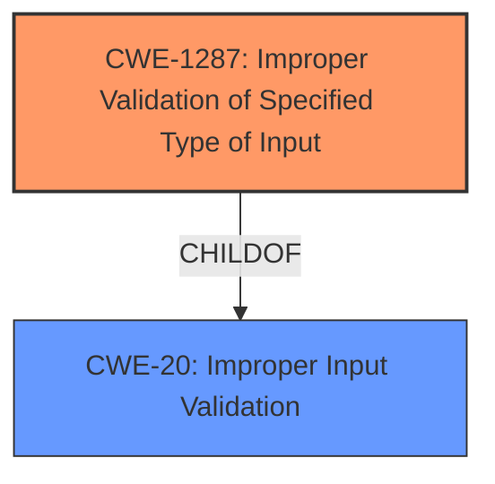

# Analysis for CVE-2021-44391

# Summary
| CWE ID  | CWE Name                                                                                                   | Confidence | CWE Abstraction Level | CWE Vulnerability Mapping Label | CWE-Vulnerability Mapping Notes |
| :-------- | :--------------------------------------------------------------------------------------------------------- | :--------- | :---------------------- | :------------------------------ | :-------------------------------- |
| CWE-1287  | Improper Validation of Specified Type of Input                                                           | 0.9        | Base                    | Primary                         | Allowed                           |
| CWE-20    | Improper Input Validation                                                                                  | 0.7        | Class                   | Secondary                       | Discouraged                       |

## Evidence and Confidence

*   **Confidence Score:** 0.8
*   **Evidence Strength:** HIGH

## Relationship Analysis
The primary CWE, CWE-1287 (Improper Validation of Specified Type of Input), is a child of CWE-20 (Improper Input Validation). This indicates a hierarchical relationship where CWE-1287 is a more specific case of the general input validation issue described by CWE-20. The choice of CWE-1287 is based on the specific detail that the input's type (object vs. non-object) is not validated, making it a more accurate representation of the vulnerability than just a general lack of input validation.

## Vulnerability Chain
The vulnerability chain starts with the Reolink RLC-410W IP camera **failing to validate the type of the "param" field** in the JSON input. This **lack of validation (CWE-1287)** allows an attacker to send a non-object value where an object is expected. When the code attempts to use the subscription operator on this non-object value, it leads to an assertion failure. This failure causes the `cgiserver.cgi` process to crash, resulting in a device reboot and a denial of service.

## Summary of Analysis
The initial assessment focused on the **improper input validation** as the root cause, which is supported by the "CVE Reference Links Content Summary". The summary states that the Reolink RLC-410W IP cameras **do not properly validate the JSON input** for the "param" field, leading to the crash.

The selection of CWE-1287 is based on the evidence that the code **assumes the "param" value will always be a JSON object** and **attempts to use the subscription operator on it**. When it receives a non-object value, like an empty string, it leads to an assertion failure. This indicates a specific type validation issue, aligning well with CWE-1287.
The Retriever results also list CWE-1287 as the top candidate with the highest similarity score.
The use of CWE-20 is a secondary consideration, as it is a broader category, and the guidance discourages its use when a more specific CWE is available.
The evidence clearly supports the **lack of type validation**, making CWE-1287 the more appropriate and specific choice. The crash and reboot stem directly from this **failure to validate the input type**.

Relevant CWE Information:

# Enhanced Context (25 CWEs)
The following CWEs were identified as potentially relevant to this vulnerability:

## CWE-1287: Improper Validation of Specified Type of Input
**Abstraction Level**: Base
**Similarity Score**: 0.85
**Source**: sparse

**Description**:
The product receives input that is expected to be of a certain type, but it does not validate or incorrectly validates that the input is actually of the expected type.

## CWE-20: Improper Input Validation
**Abstraction Level**: Class
**Similarity Score**: 0.353
**Source**: sparse

**Description**:
The product receives input or data, but it does
        not validate or incorrectly validates that the input has the
        properties that are required to process the data safely and
        correctly.