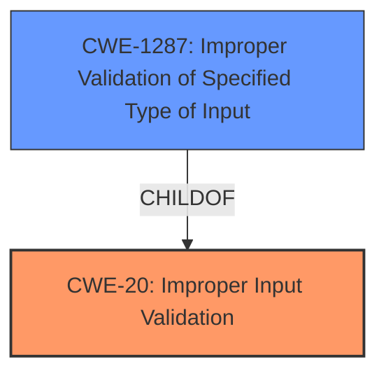

# Enhanced Analysis for CVE-2021-44392

# Summary
| CWE ID | CWE Name | Confidence | CWE Abstraction Level | CWE Vulnerability Mapping Label | CWE-Vulnerability Mapping Notes |
|---|---|---|---|---|---|
| CWE-20 | Improper Input Validation | 0.9 | Class | Primary | Discouraged |
| CWE-1287 | Improper Validation of Specified Type of Input | 0.8 | Base | Secondary | Allowed |

## Evidence and Confidence

*   **Confidence Score:** 0.9
*   **Evidence Strength:** HIGH

## Relationship Analysis
The primary relationship influencing my decision is the ChildOf relationship between CWE-1287 (Improper Validation of Specified Type of Input) and CWE-20 (Improper Input Validation). CWE-1287 is a more specific type of CWE-20, dealing with the specific case where the type of input is not validated. While CWE-20 is a Class-level CWE and generally discouraged, it is the most appropriate high-level classification. CWE-1287 provides a more specific Base-level classification and is included as a secondary CWE.



## Vulnerability Chain
The vulnerability chain begins with the **improper input validation** in the `cgiserver.cgi` JSON command parser. Specifically, the parser **fails to validate** that the "param" JSON element is an object. This **lack of validation** leads to an assertion failure and subsequent device reboot, resulting in a denial of service.

## Summary of Analysis
The initial analysis identified CWE-20 as the primary weakness, as the core issue is the **improper handling of input**. The "CVE Reference Links Content Summary" explicitly states that **improper input validation** is the root cause. The "Vulnerability Description Key Phrases" also point to the **denial of service vulnerability** stemming from the JSON command parser.

The retriever results further reinforce the relevance of CWE-20, although it's listed with a "Discouraged" usage. However, the retriever also lists CWE-1287 which provides a more specific match as the parser **fails to validate the TYPE of the input** ("param" JSON element).

The graph relationships indicate that CWE-1287 is a child of CWE-20, making them related, but CWE-1287 is at a lower level of abstraction. Given the specific nature of the **validation failure** (type validation), CWE-1287 is included as a secondary, more specific CWE.

My assessment is based primarily on the "CVE Reference Links Content Summary," which states: "Weaknesses/vulnerabilities present: **Improper input validation (CWE-20)** in the JSON command parser of the `cgiserver.cgi` application. Specifically, the code **does not properly handle cases where the "param" JSON element is not an object**."

I am selecting both CWEs because the evidence supports the general case of **improper input validation** (CWE-20) and the more specific case of **improper validation of specified type of input** (CWE-1287). While the guidance discourages the use of CWE-20, in this case, the vulnerability is a clear case of improper input validation, and no other more specific CWEs directly address the **failure to validate the type of the input**. Both CWEs are at the optimal level of specificity, with CWE-1287 providing a more granular description of the vulnerability.

Relevant CWE Information:
- CWE-20: Improper Input Validation
- CWE-1287: Improper Validation of Specified Type of Input


## CWE Relationship Analysis

Current CWEs represent these abstraction levels: .


### Vulnerability Chain Analysis

**Chain starting from CWE-20:**
- 20 (Improper Input Validation) - ROOT


**Chain starting from CWE-1287:**
- 1287 (Improper Validation of Specified Type of Input) - ROOT


### CWE Relationship Diagram

```mermaid
graph TD
    classDef primary fill:#f96,stroke:#333,stroke-width:2px
    classDef secondary fill:#69f,stroke:#333
    classDef tertiary fill:#9e9,stroke:#333
```