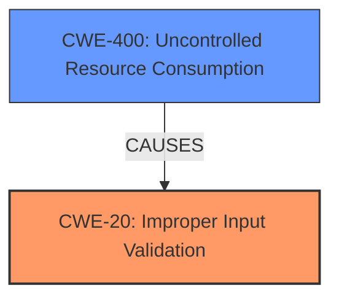

# Analysis for CVE-2021-44396

# Summary
| CWE ID | CWE Name | Confidence | CWE Abstraction Level | CWE Vulnerability Mapping Label | CWE-Vulnerability Mapping Notes |
|---|---|---|---|---|---|
| CWE-20 | Improper Input Validation | 1.0 | Base | Allowed | Primary CWE |
| CWE-400 | Uncontrolled Resource Consumption | 0.7 | Class | Allowed-with-Review | Secondary CWE |

## Evidence and Confidence

*   **Confidence Score:** 0.9
*   **Evidence Strength:** HIGH

## Relationship Analysis
The primary relationship is that CWE-20 **(Improper Input Validation)** can lead to other weaknesses, including **denial of service**. CWE-400 **(Uncontrolled Resource Consumption)**, which is a Class-level CWE, represents the denial-of-service impact. Since the root cause is **improper input validation**, CWE-20 is the most specific and relevant base-level CWE.

## Vulnerability Chain
The vulnerability chain starts with the **improper input validation** (CWE-20) of the `param` JSON element in the `Preview` API, leading to an assertion failure and a device reboot, resulting in a **denial of service**.

## Summary of Analysis
The initial analysis correctly identifies CWE-20 **(Improper Input Validation)** as the primary weakness. The `cgiserver.cgi` application **does not properly validate** the structure of the JSON input for the `param` field, leading to a crash. This is supported by the CVE Reference Links Content Summary: "The `cgiserver.cgi` application **does not properly validate** the structure of the JSON input for the `param` field in the `Preview` API call. It expects a JSON object but **does not verify it**, leading to a crash if it's not."

The reboot of the device results in **denial of service**, which can be represented by CWE-400 **(Uncontrolled Resource Consumption)**.

The selection of CWE-20 is based on direct evidence from the vulnerability description, which clearly states the **improper input validation** as the root cause. The relationship analysis confirms that **improper input validation** can lead to **denial of service**.

The selected CWEs are at the optimal level of specificity, with CWE-20 being a Base-level CWE that accurately represents the **root cause** and CWE-400 representing the resulting impact.

Relevant CWE Information:

# Enhanced Context (25 CWEs)

## CWE-131: Incorrect Calculation of Buffer Size
**Abstraction Level**: Base
**Similarity Score**: 0.78

This CWE is not applicable because the vulnerability is not related to buffer size calculation. The issue is related to the JSON parser **not validating** the input.

## CWE-805: Buffer Access with Incorrect Length Value
**Abstraction Level**: Base
**Similarity Score**: 0.78

This CWE is not applicable because the vulnerability is not related to buffer access or length value.

## CWE-125: Out-of-bounds Read
**Abstraction Level**: Base
**Similarity Score**: 0.77

This CWE is not applicable because the vulnerability is not related to reading out of bounds.

## CWE-191: Integer Underflow (Wrap or Wraparound)
**Abstraction Level**: Base
**Similarity Score**: 0.77

This CWE is not applicable because the vulnerability is not related to integer underflow.

## CWE-130: Improper Handling of Length Parameter Inconsistency
**Abstraction Level**: Base
**Similarity Score**: 0.77

This CWE is not applicable because the vulnerability is not related to length parameter inconsistency.

## CWE-126: Buffer Over-read
**Abstraction Level**: Variant
**Similarity Score**: 0.77

This CWE is not applicable because the vulnerability is not related to reading out of bounds.

## CWE-124: Buffer Underwrite ('Buffer Underflow')
**Abstraction Level**: Base
**Similarity Score**: 0.76

This CWE is not applicable because the vulnerability is not related to writing out of bounds.

## CWE-193: Off-by-one Error
**Abstraction Level**: Base
**Similarity Score**: 0.76

This CWE is not applicable because the vulnerability is not related to off-by-one errors.

## CWE-404: Improper Resource Shutdown or Release
**Abstraction Level**: Class
**Similarity Score**: 0.76

This CWE is not specific enough. The problem is caused by **improper input validation**, not necessarily resource shutdown.

## CWE-226: Sensitive Information in Resource Not Removed Before Reuse
**Abstraction Level**: Base
**Similarity Score**: 0.76

This CWE is not applicable because the vulnerability is not related to sensitive information in resources.

## CWE-125: Out-of-bounds Read
**Abstraction Level**: Base
**Similarity Score**: 6825.35

This CWE is not applicable because the vulnerability is not related to reading out of bounds.

## CWE-190: Integer Overflow or Wraparound
**Abstraction Level**: Base
**Similarity Score**: 6771.77

This CWE is not applicable because the vulnerability is not related to integer overflow.

## CWE-1284: Improper Validation of Specified Quantity in Input
**Abstraction Level**: Base
**Similarity Score**: 6745.68

This CWE is not applicable because the vulnerability is not related to quantity input.

## CWE-184: Incomplete List of Disallowed Inputs
**Abstraction Level**: Base
**Similarity Score**: 6643.51

This CWE is not applicable because the vulnerability is not related to a list of disallowed inputs.

## CWE-88: Improper Neutralization of Argument Delimiters in a Command ('Argument Injection')
**Abstraction Level**: Base
**Similarity Score**: 6596.85

This CWE is not applicable because the vulnerability is not related to argument injection.

## CWE-78: Improper Neutralization of Special Elements used in an OS Command ('OS Command Injection')
**Abstraction Level**: base
**Similarity Score**: 5.03

This CWE is not applicable because the vulnerability is not related to OS command injection.

## CWE-843: Access of Resource Using Incompatible Type ('Type Confusion')
**Abstraction Level**: base
**Similarity Score**: 5.03

This CWE is not applicable because the vulnerability is not related to type confusion.

## CWE-22: Improper Limitation of a Pathname to a Restricted Directory ('Path Traversal')
**Abstraction Level**: base
**Similarity Score**: 4.33

This CWE is not applicable because the vulnerability is not related to path traversal.

## CWE-190: Integer Overflow or Wraparound
**Abstraction Level**: base
**Similarity Score**: 4.33

This CWE is not applicable because the vulnerability is not related to integer overflow.

## CWE-120: Buffer Copy without Checking Size of Input ('Classic Buffer Overflow')
**Abstraction Level**: base
**Similarity Score**: 4.33

This CWE is not applicable because the vulnerability is not related to buffer overflow.

## CWE-79: Improper Neutralization of Input During Web Page Generation ('Cross-site Scripting')
**Abstraction Level**: base
**Similarity Score**: 4.33

This CWE is not applicable because the vulnerability is not related to cross-site scripting.

## CWE-123: Write-what-where Condition
**Abstraction Level**: base
**Similarity Score**: 4.33

This CWE is not applicable because the vulnerability is not related to write-what-where condition.

## CWE-434: Unrestricted Upload of File with Dangerous Type
**Abstraction Level**: base
**Similarity Score**: 4.33

This CWE is not applicable because the vulnerability is not related to unrestricted file upload.

## CWE-98: Improper Control of Filename for Include/Require Statement in PHP Program ('PHP Remote File Inclusion')
**Abstraction Level**: variant
**Similarity Score**: 3.89

This CWE is not applicable because the vulnerability is not related to PHP remote file inclusion.

## CWE-1284: Improper Validation of Specified Quantity in Input
**Abstraction Level**: base
**Similarity Score**: 3.89

This CWE is not applicable because the vulnerability is not related to quantity input.